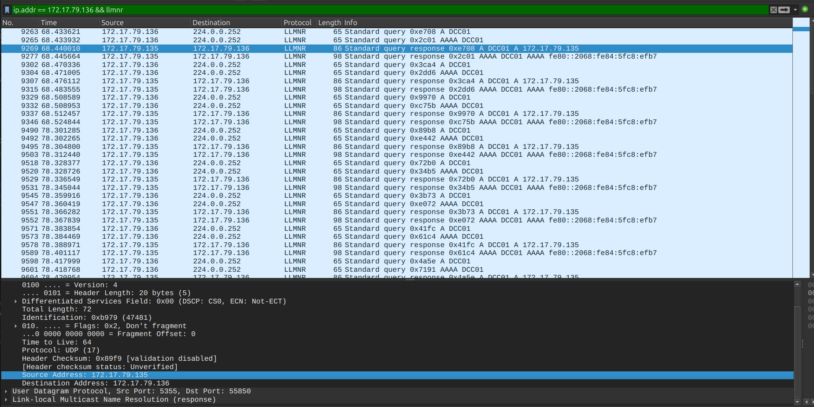
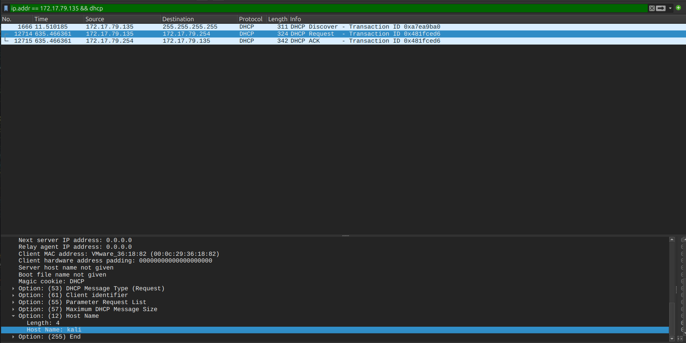
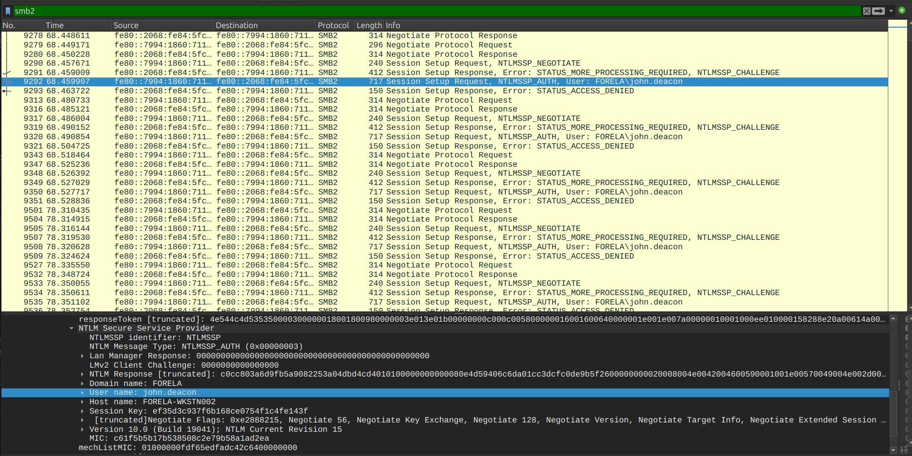
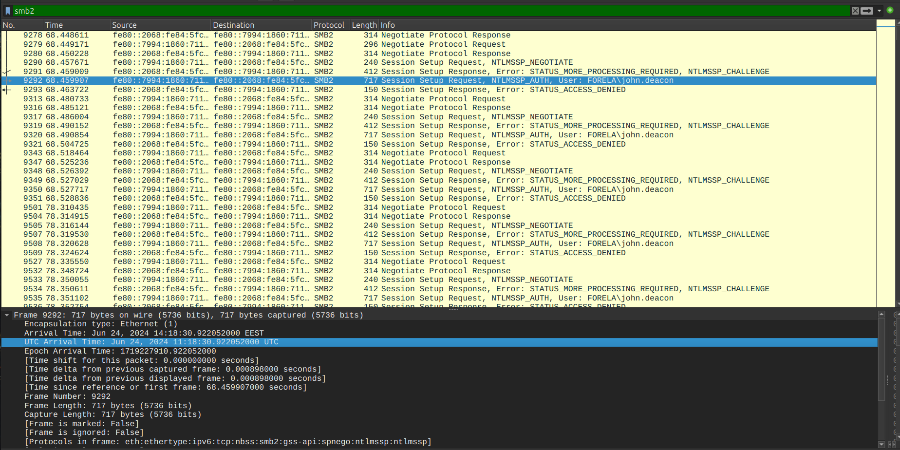
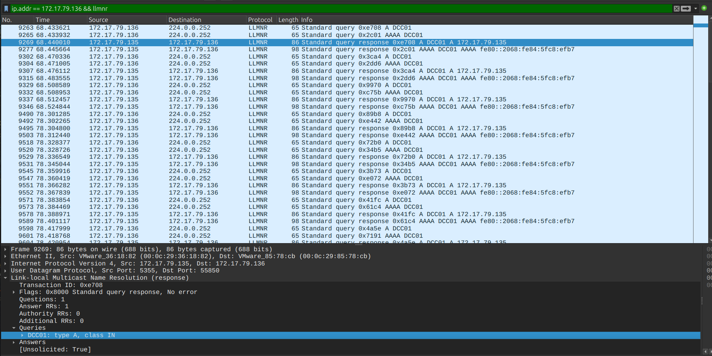
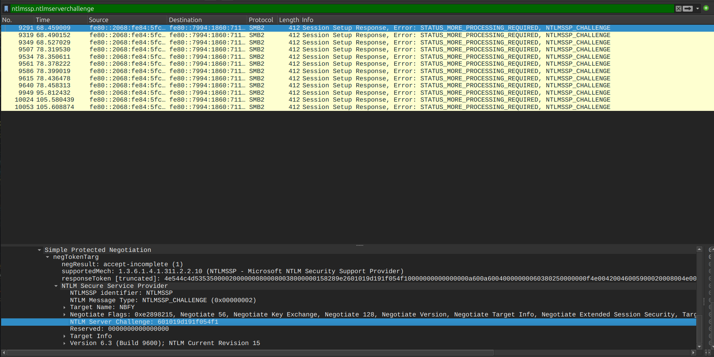
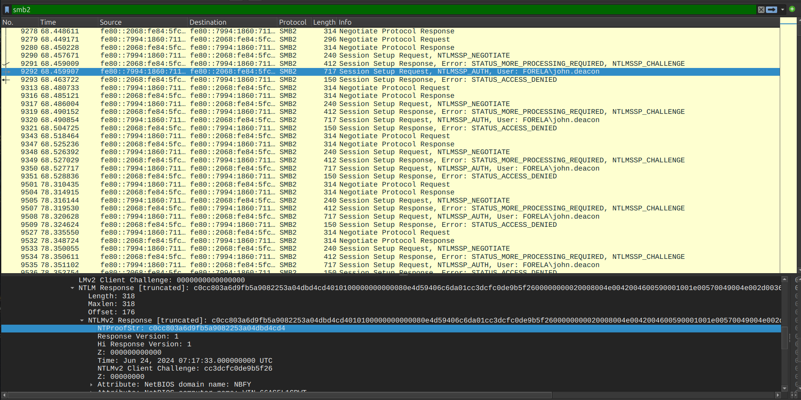
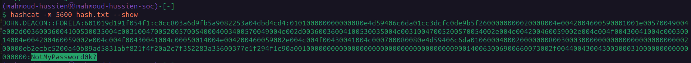
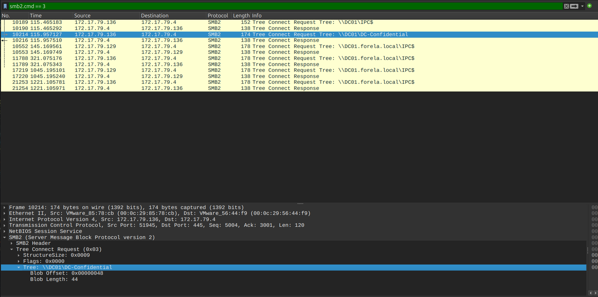

# Noxious — CTF Writeup

---

## Scenario Overview

An IDS alert triggered on anomalous LLMNR traffic directed toward `Forela-WKstn002` (`172.17.79.136`). LLMNR traffic is unusual in a properly configured Active Directory environment — its presence strongly indicates either misconfiguration or active exploitation. The PCAP analysis confirmed a rogue device running **Responder** on the internal AD VLAN, successfully capturing NTLMv2 credentials via LLMNR poisoning.

---

## Attack Chain Overview

```
[1] Victim Typo
    └─ john.deacon types "DCC01" instead of "DC01"
    └─ DNS fails → Windows falls back to LLMNR broadcast (port 5355/UDP)

[2] LLMNR Poisoning
    └─ Rogue device (172.17.79.135 / kali) listens on LLMNR
    └─ Responds: "I am DCC01" → victim trusts the response

[3] NTLMv2 Credential Capture
    └─ Victim initiates SMB authentication to attacker
    └─ NTLMv2 hash captured: FORELA\john.deacon
    └─ Server Challenge: 601019d191f054f1
    └─ NTProofStr: c0cc803a6d9fb5a9082253a04dbd4cd4

[4] Offline Password Crack
    └─ hashcat -m 5600 → NotMyPassword0K?

[5] Original Destination (from legitimate SMB traffic)
    └─ \\DC01\DC-Confidential
```

---

## Question 1 — What is the malicious IP address of the rogue machine?

### Wireshark Filter

```
ip.addr == 172.17.79.136 && llmnr
```

### Investigation

Filtering for LLMNR traffic involving the victim workstation (`172.17.79.136`) reveals the LLMNR name resolution broadcast sent when `DCC01` failed DNS. The response packet — which should not exist in a legitimate environment — came from:

```
172.17.79.135
```

A legitimate DNS server would resolve `DCC01` if it existed, or return `NXDOMAIN`. The fact that a non-DNS host responded to an LLMNR multicast with a positive answer is the definitive indicator of LLMNR poisoning.

**MITRE ATT&CK:** T1557.001 — Adversary-in-the-Middle: LLMNR/NBT-NS Poisoning and SMB Relay

### Answer

```
172.17.79.135
```


---

## Question 2 — What is the hostname of the rogue machine?

### Wireshark Filter

```
ip.addr == 172.17.79.135 && dhcp
```

### Investigation

Filtering for DHCP traffic from the rogue IP reveals the initial DHCP discovery/request packets where the rogue machine registered itself on the network. The DHCP packet's **Hostname** option (Option 12) field contains:

```
Hostname: kali
MAC Address: 00:0c:29:36:18:82
```

`kali` is the default hostname for Kali Linux — a penetration testing distribution commonly used to run Responder for LLMNR poisoning attacks. The MAC OUI `00:0c:29` identifies this as a VMware virtual machine.

**MITRE ATT&CK:** T1200 — Hardware Additions (rogue device on internal VLAN)

### Answer

```
kali
```


---

## Question 3 — What is the username whose hash was captured?

### Wireshark Filter

```
smb2
```

### Investigation

Filtering for SMB2 traffic and following the authentication stream between the victim (`172.17.79.136`) and the rogue device (`172.17.79.135`), the NTLMSSP authentication packets contain the username field in plaintext within the `NTLMSSP_AUTH` message:

```
Domain: FORELA
Username: john.deacon
```

The victim's Windows machine automatically attempted NTLM authentication to the rogue host after receiving the spoofed LLMNR response — transmitting the NTLMv2 hash in the process.

**MITRE ATT&CK:** T1557.001 — LLMNR Poisoning Credential Capture

### Answer

```
john.deacon
```


---

## Question 4 — When were the hashes captured for the first time?

### Wireshark Filter

```
smb2
```

### Investigation

Reviewing SMB2 traffic and locating the first `NTLMSSP_AUTH` packet from `172.17.79.136` to `172.17.79.135` — the packet where the NTLMv2 hash is transmitted. The Wireshark frame timestamp for this first capture event:

```
Frame: NTLMSSP_AUTH (first occurrence)
Timestamp: 2024-06-24 11:18:30 UTC
```

Note that the victim's credentials were **relayed multiple times** to the attacker — the IDS correctly flagged repeated NTLM authentication attempts. The question asks for the **first** capture time.

### Answer

```
2024-06-24 11:18:30
```


---

## Question 5 — What typo did the victim make when navigating to the file share?

### Wireshark Filter

```
ip.addr == 172.17.79.136 && llmnr
```

### Investigation

Filtering for LLMNR requests from the victim workstation reveals the name query that triggered the poisoning chain. The LLMNR broadcast packet contains the queried hostname that failed DNS resolution:

```
LLMNR Query: DCC01
```

The victim intended to type `\\DC01\DC-Confidential` but accidentally typed `\\DCC01\DC-Confidential` — the extra `C` caused `DCC01` to fail DNS lookup, triggering the fallback LLMNR broadcast that the attacker intercepted.

**This single typo initiated the entire attack chain.**

### Answer

```
DCC01
```


---

## Question 6 — What is the NTLM server challenge value?

### Wireshark Filter

```
ntlmssp.ntlmserverchallenge
```

### Investigation

Filtering specifically for packets containing the NTLM Server Challenge field isolates the `NTLMSSP_CHALLENGE` message (Frame 9291) sent by the rogue device to the victim. Expanding:

```
NTLMSSP → NTLM Server Challenge: 601019d191f054f1
```

The Server Challenge is a random 8-byte nonce generated by the server during NTLM negotiation. The client uses this value combined with its own nonce to compute the NTLMv2 response — making the Server Challenge a critical component needed to crack the captured hash offline.

### Answer

```
601019d191f054f1
```


---

## Question 7 — What is the NTProofStr value?

### Wireshark Filter

```
smb2
```

### Investigation

The NTProofStr (NT Proof String) is extracted from the `NTLMSSP_AUTH` packet (Frame 9292) — the victim's authentication response. Expanding:

```
SMB2 → NTLMSSP_AUTH → NTLMv2 Response → NTProofStr: c0cc803a6d9fb5a9082253a04dbd4cd4
```

**What is NTProofStr?**

NTProofStr is the first 16 bytes of the NTLMv2 response — specifically, the HMAC-MD5 of:
```
HMAC-MD5(NT_Hash, Server_Challenge || Blob)
```

It is the component that makes the NTLMv2 hash verifiable and is required alongside the Server Challenge to construct the hashcat-compatible format for offline cracking.

### Answer

```
c0cc803a6d9fb5a9082253a04dbd4cd4
```


---

## Question 8 — What is the cracked plaintext password?

### Commands

```bash
# Construct NTLMv2 hash for hashcat (format: user::domain:serverchallenge:NTProofStr:blob)
# Hash file (hash.txt):
john.deacon::FORELA:601019d191f054f1:c0cc803a6d9fb5a9082253a04dbd4cd4:<NTLMv2_blob>

# Crack with hashcat (mode 5600 = NetNTLMv2)
hashcat -m 5600 hash.txt rockyou.txt

# Show result after cracking
hashcat -m 5600 hash.txt --show
```

### Investigation

The NTLMv2 hash was constructed from the PCAP artifacts:

| Component | Value |
|---|---|
| Username | `john.deacon` |
| Domain | `FORELA` |
| Server Challenge | `601019d191f054f1` |
| NTProofStr | `c0cc803a6d9fb5a9082253a04dbd4cd4` |
| NTLMv2 Blob | Extracted from NTLMSSP_AUTH packet |

**Hashcat mode 5600** (NetNTLMv2) processes this format and attempts offline dictionary attack against `rockyou.txt`. The password was found in the wordlist:

```
john.deacon::FORELA:601019d191f054f1:c0cc803a6d9fb5a9082253a04dbd4cd4:<blob>:NotMyPassword0K?
```

**MITRE ATT&CK:** T1110.002 — Brute Force: Password Cracking

### Answer

```
NotMyPassword0K?
```


---

## Question 9 — What was the actual file share the victim was trying to access?

### Wireshark Filter

```
smb2.cmd == 3
```

### Investigation

SMB2 command code `3` = **Tree Connect** — the operation used to mount a network share. Filtering for legitimate Tree Connect requests from the victim workstation (excluding the rogue device traffic) reveals the actual intended destination in Frame 10214:

```
SMB2 Tree Connect Request → Path: \\DC01\DC-Confidential
```

This confirms the victim was attempting to access a **sensitive confidential share** on the domain controller — explaining why the attacker was particularly interested in capturing these credentials.

### Answer

```
\\DC01\DC-Confidential
```


---

## Full Attack Timeline

| Time (UTC) | Event |
|---|---|
| Pre-incident | Rogue `kali` VM (`172.17.79.135`) connects to internal AD VLAN via DHCP |
| Pre-incident | Responder tool launched — listening for LLMNR broadcasts |
| `2024-06-24 ~11:18` | `john.deacon` on `172.17.79.136` attempts `\\DCC01\DC-Confidential` (typo) |
| `2024-06-24 ~11:18` | `DCC01` fails DNS resolution → LLMNR broadcast sent (port 5355/UDP) |
| `2024-06-24 ~11:18` | Rogue `172.17.79.135` responds to LLMNR: "I am DCC01" |
| `2024-06-24 11:18:30` | **First NTLMv2 hash captured** — FORELA\john.deacon |
| Post-capture | Server Challenge: `601019d191f054f1` / NTProofStr: `c0cc803a6d9fb5a9082253a04dbd4cd4` |
| Offline | Hashcat cracks hash → `NotMyPassword0K?` |

---

## Indicators of Compromise (IOCs)

| Type | Value | Description |
|---|---|---|
| IP | `172.17.79.135` | Rogue attacker machine |
| Hostname | `kali` | Rogue device hostname (Kali Linux) |
| MAC | `00:0c:29:36:18:82` | Rogue device NIC (VMware) |
| IP | `172.17.79.136` | Victim workstation (Forela-WKstn002) |
| Account | `FORELA\john.deacon` | Compromised domain account |
| Password | `NotMyPassword0K?` | Cracked plaintext credential |
| NTLM Challenge | `601019d191f054f1` | Server challenge value |
| NTProofStr | `c0cc803a6d9fb5a9082253a04dbd4cd4` | NTLMv2 proof string |
| Target Share | `\\DC01\DC-Confidential` | Sensitive share victim was accessing |
| Typo | `DCC01` | Mistyped hostname triggering LLMNR fallback |

---

## Wireshark Filters Reference

```
-- Find rogue device (LLMNR poisoner)
ip.addr == 172.17.79.136 && llmnr

-- Identify rogue hostname via DHCP
ip.addr == 172.17.79.135 && dhcp

-- Username and credential capture
smb2

-- NTLM Server Challenge extraction
ntlmssp.ntlmserverchallenge

-- NTProofStr and authentication details
smb2

-- Actual intended file share (Tree Connect)
smb2.cmd == 3
```

---

## Hashcat Command Reference

```bash
# Crack NTLMv2 hash (mode 5600)
hashcat -m 5600 hash.txt rockyou.txt

# Display cracked result
hashcat -m 5600 hash.txt --show

# Hash format for hashcat:
# username::domain:ServerChallenge:NTProofStr:NTLMv2_Blob
# john.deacon::FORELA:601019d191f054f1:c0cc803a6d9fb5a9082253a04dbd4cd4:<blob>
```

---

## MITRE ATT&CK Mapping

| Phase | Technique ID | Technique Name |
|---|---|---|
| Initial Access | T1200 | Hardware Additions (rogue device) |
| Credential Access | T1557.001 | LLMNR/NBT-NS Poisoning and SMB Relay |
| Credential Access | T1110.002 | Password Cracking (Hashcat) |
| Collection | T1040 | Network Sniffing (Responder) |
| Discovery | T1135 | Network Share Discovery |

---

## Recommendations

1. **Disable LLMNR and NBT-NS via GPO** — This is the root cause of the attack. Apply `Computer Configuration → Administrative Templates → Network → DNS Client → Turn off multicast name resolution = Enabled` across all domain assets. Without LLMNR, the poisoning attack has no vector.
2. **Enforce mandatory SMB Signing** — Require SMB signing on all servers and workstations via GPO to prevent relay attacks even if LLMNR remains temporarily active.
3. **Implement Network Access Control (NAC)** — Use 802.1X authentication to prevent unauthorized devices (like the rogue `kali` VM) from connecting to the internal AD VLAN without approved credentials.
4. **Immediate credential reset for john.deacon** — The plaintext password `NotMyPassword0K?` is now known to the attacker. Force immediate reset and audit all access to `\\DC01\DC-Confidential` from this account.
5. **Audit DC-Confidential share access logs** — Review Windows Security Event ID 5140 (Network Share Access) on `DC01` for any access attempts using `john.deacon` credentials after `11:18:30 UTC` on `2024-06-24`.
6. **Deploy honeypot LLMNR listeners** — A canary LLMNR responder on the internal network can alert the SOC whenever LLMNR poisoning tools like Responder are active.

---

*Writeup produced as part of SOC Analyst training — HackTheBox Sherlock: Noxious*