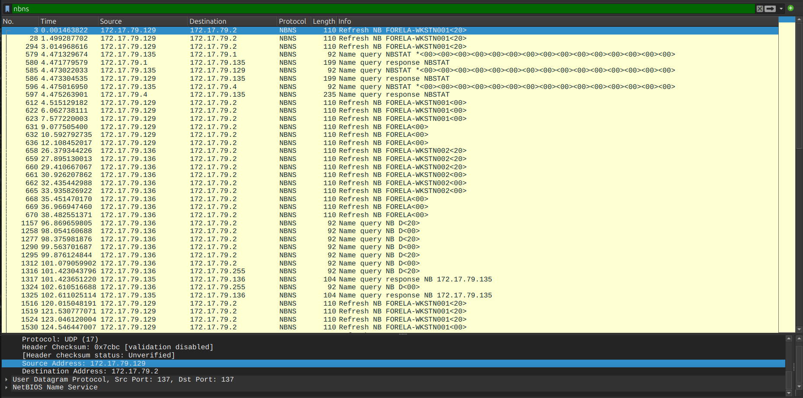
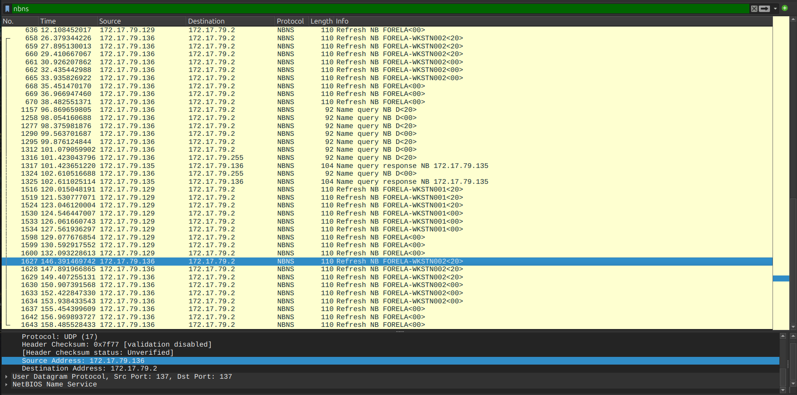
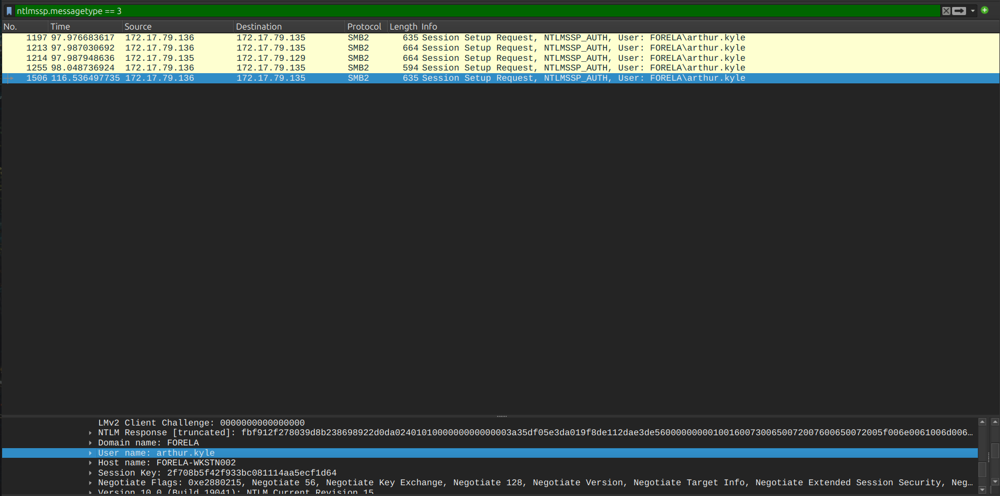
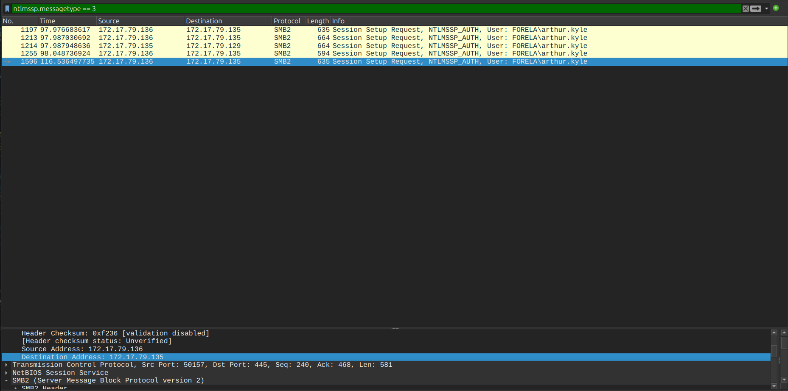
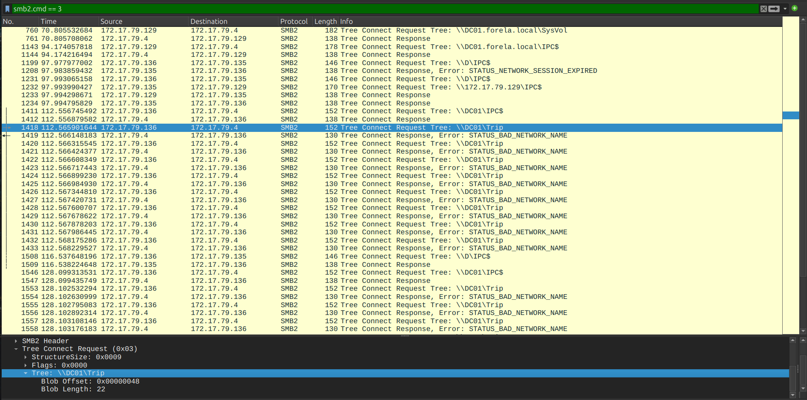
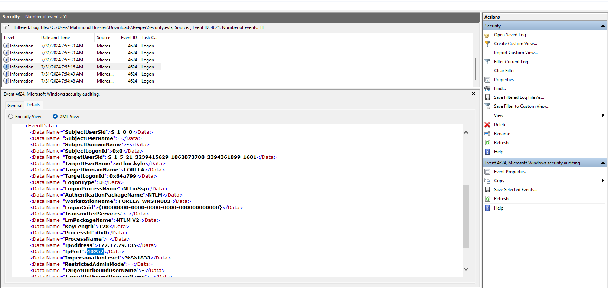
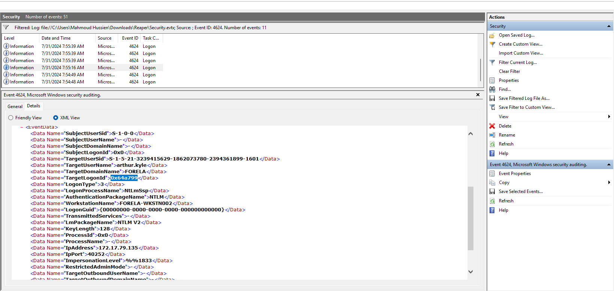
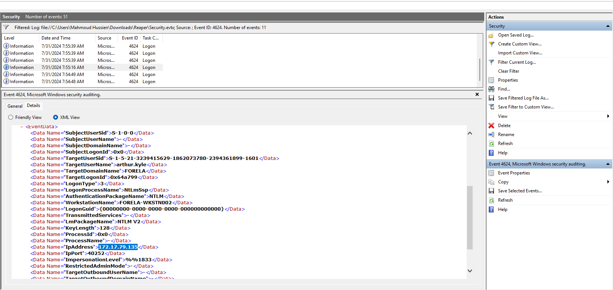
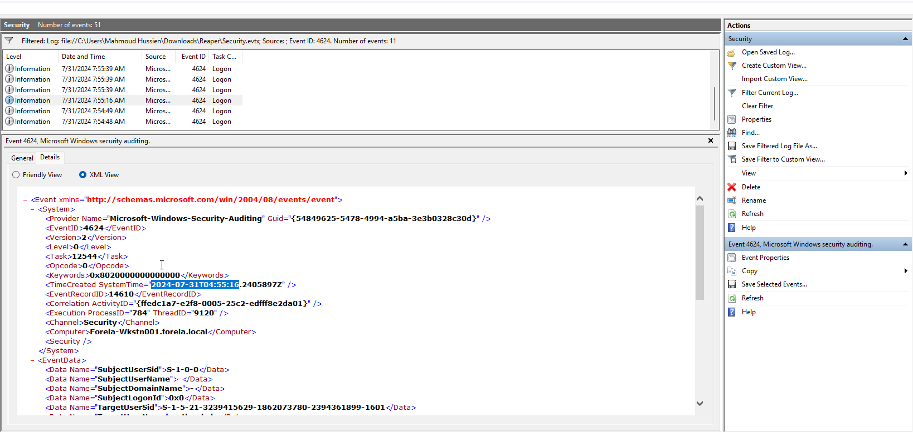
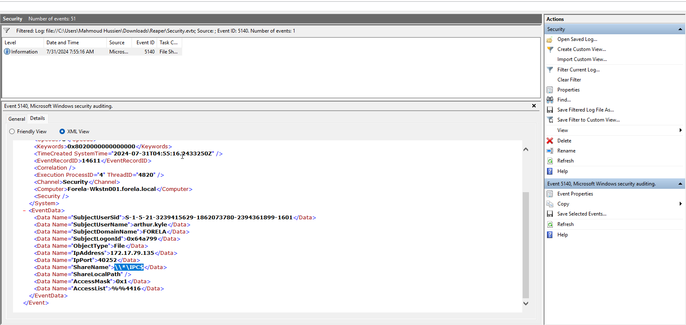

# Reaper — CTF Writeup

---

## Scenario Overview

The SIEM alerted on a suspicious logon event where the **IP Address and Source Workstation name were mismatched** — a strong indicator of NTLM relay or credential replay attack. Network capture and event logs from the incident timeframe were correlated to identify the attacker's rogue device, the compromised account, and the malicious session details.

---

## Attack Chain Overview

```
[1] Network Setup
    └─ Forela-Wkstn001: 172.17.79.129
    └─ Forela-Wkstn002: 172.17.79.136
    └─ Rogue Attacker Device: 172.17.79.135

[2] Credential Interception
    └─ arthur.kyle navigates to \\DC01\Trip
    └─ Attacker intercepts NTLM authentication
    └─ NTLMv2 hash captured from 172.17.79.135

[3] Credential Relay / Replay
    └─ Attacker replays stolen credentials
    └─ Logon Event: Source = FORELA-WKSTN002 | IP = 172.17.79.135
    └─ Mismatch detected by SIEM

[4] SMB Share Access
    └─ IPC$ accessed as part of authentication process
    └─ Standard relay tool enumeration pattern
```

---

## Question 1 — What is the IP Address for Forela-Wkstn001?

### Wireshark Filter

```
nbns
```

### Investigation

Filtering for **NBNS (NetBIOS Name Service)** traffic reveals broadcast name registration and query packets from workstations on the network. NBNS packets contain the hostname and the registering IP address.

Filtering and reviewing the NBNS registrations:

```
NBNS Registration: FORELA-WKSTN001 → 172.17.79.129
```

### Answer

```
172.17.79.129
```


---

## Question 2 — What is the IP Address for Forela-Wkstn002?

### Wireshark Filter

```
nbns
```

### Investigation

From the same NBNS traffic analysis, the second workstation's registration:

```
NBNS Registration: FORELA-WKSTN002 → 172.17.79.136
```

| Workstation | IP Address |
|---|---|
| FORELA-WKSTN001 | `172.17.79.129` |
| FORELA-WKSTN002 | `172.17.79.136` |

### Answer

```
172.17.79.136
```


---

## Question 3 — What is the username of the account whose hash was stolen?

### Wireshark Filter

```
ntlmssp.messagetype == 3
```

### Investigation

**NTLMSSP Message Type 3** is the `AUTHENTICATE_MESSAGE` — the final NTLM handshake packet where the client sends its username, domain, and NTLMv2 response hash to the server. Filtering for these packets reveals the compromised account:

```
NTLMSSP → AUTHENTICATE_MESSAGE
UserName: arthur.kyle
DomainName: FORELA
Workstation: FORELA-WKSTN001
```

The authentication packet exposes the username in plaintext even though the password hash is encrypted.

**MITRE ATT&CK:** T1557.001 — Adversary-in-the-Middle: LLMNR/NBT-NS Poisoning

### Answer

```
arthur.kyle
```


---

## Question 4 — What is the IP Address of the unknown device used to intercept credentials?

### Wireshark Filter

```
ntlmssp.messagetype == 3
```

### Investigation

Examining the IP layer of the `AUTHENTICATE_MESSAGE` packet identified in Question 3, the **destination IP** of the authentication packet reveals where the credentials were sent — the attacker's rogue device that positioned itself as a man-in-the-middle:

```
Source IP: 172.17.79.129 (Forela-Wkstn001 — victim)
Destination IP: 172.17.79.135 (Rogue attacker device)
```

`172.17.79.135` is neither `Wkstn001` nor `Wkstn002` — it is an unknown unauthorized device on the network intercepting NTLM authentication traffic.

### Answer

```
172.17.79.135
```


---

## Question 5 — What was the file share navigated by the victim user?

### Wireshark Filter

```
smb2.cmd == 3
```

### Investigation

**SMB2 command code 3** = **Tree Connect** — the operation used to connect to a network share. Filtering for Tree Connect requests from the victim's workstation (`172.17.79.136`) reveals the share path that triggered the credential interception:

```
SMB2 Tree Connect Request (Frame 1418)
Source: 172.17.79.136 (arthur.kyle / Forela-Wkstn002)
Destination: 172.17.79.4 (DC01)
Tree: \\DC01\Trip
```

When `arthur.kyle` attempted to access `\\DC01\Trip` from `Forela-Wkstn002` (`172.17.79.136`), the name resolution was intercepted and the NTLM authentication was redirected to the attacker's device at `172.17.79.135`. The server responded repeatedly with `STATUS_BAD_NETWORK_NAME` — confirming the share path was being relayed to an unauthorized destination.

### Answer

```
\\DC01\Trip
```


---

## Question 6 — What is the source port used to logon to the target workstation using the compromised account?

### Investigation

Examining the Windows Security Event logs for the malicious logon event (Event ID 4624), the `SourcePort` field in the Network Information section of the logon event records the ephemeral source port used by the attacker's connection:

```
Event ID: 4624
LogonType: 3 (Network)
Source IP: 172.17.79.135
Source Port: 40252
TargetUserName: arthur.kyle
```

The source port `40252` is an ephemeral high port assigned by the attacker's TCP stack for the malicious session.

### Answer

```
40252
```


---

## Question 7 — What is the Logon ID for the malicious session?

### Investigation

From the same Windows Security Event ID 4624 (Successful Logon) for the malicious session, the **Logon ID** field provides a unique hexadecimal identifier that links this specific logon session to all subsequent activity (file access, process creation, etc.) during the attacker's session:

```
Event ID: 4624
LogonID: 0x64A799
TargetUserName: arthur.kyle
Source IP: 172.17.79.135
```

The Logon ID `0x64A799` can be used to pivot across Windows Security logs to find all activity performed under this stolen session.

### Answer

```
0x64A799
```


---

## Question 8 — What is the workstation name and source IP from which the malicious logon occurred?

### Investigation

This is the **key SIEM detection indicator** — the mismatch between the reported workstation name and the actual source IP:

From the Event ID 4624 logon event:

```
WorkstationName: FORELA-WKSTN002   ← Claimed hostname (from NTLM packet)
Source IP: 172.17.79.135           ← Actual IP of the connecting device
```

**Why this is the detection:**

- `FORELA-WKSTN002` legitimately has IP `172.17.79.136`
- But the connection claiming to be `FORELA-WKSTN002` came from `172.17.79.135` (the rogue device)
- The SIEM correlated NBNS registrations with event log data and flagged this IP/hostname mismatch

The attacker's relay tool spoofed the workstation name `FORELA-WKSTN002` in the NTLM authentication packet while the actual connection originated from `172.17.79.135` — a classic indicator of NTLM credential relay.

**MITRE ATT&CK:** T1557 — Adversary-in-the-Middle

### Answer

```
FORELA-WKSTN002, 172.17.79.135
```


---

## Question 9 — At what UTC time did the malicious logon occur?

### Investigation

From the Windows Security Event ID 4624 for the malicious logon session (Logon ID: `0x64A799`), the event timestamp in UTC:

```
Event ID: 4624
TimeCreated: 2024-07-31T04:55:16.000Z UTC
LogonID: 0x64A799
TargetUserName: arthur.kyle
```

### Answer

```
2024-07-31 04:55:16
```


---

## Question 10 — What is the share name accessed as part of the authentication process by the malicious tool?

### Investigation Source: Windows Event Log (Event Viewer)

**Event ID 5140** (Network Share Object Accessed) was filtered from `Security.evtx` on `Forela-Wkstn001.forela.local`. The XML view of the event reveals all relevant fields in a single log entry:

```xml
<EventID>5140</EventID>
<TimeCreated SystemTime="2024-07-31T04:55:16.2433250Z" />
<Computer>Forela-Wkstn001.forela.local</Computer>

<EventData>
  <Data Name="SubjectUserName">arthur.kyle</Data>
  <Data Name="SubjectDomainName">FORELA</Data>
  <Data Name="SubjectLogonId">0x64a799</Data>
  <Data Name="IpAddress">172.17.79.135</Data>
  <Data Name="IpPort">40252</Data>
  <Data Name="ShareName">\\*\IPC$</Data>
  <Data Name="ShareLocalPath" />
</EventData>
```

**Event 5140** confirms the share accessed by the attacker's relay tool during the authentication process. The `ShareName` field explicitly shows `\\*\IPC$` — the wildcard UNC pattern used by NTLM relay tools to authenticate to any reachable SMB server.

> **Note:** This event also cross-validates Q6 (port `40252`), Q7 (Logon ID `0x64a799`), Q9 (timestamp `04:55:16`) and the attacker IP (`172.17.79.135`) — all confirmed from a single Windows Security Event Log entry.

**MITRE ATT&CK:** T1135 — Network Share Discovery | T1557 — Adversary-in-the-Middle

### Answer

```
\\*\IPC$
```


---

## Full Attack Timeline

| Time (UTC) | Event |
|---|---|
| Pre-incident | Rogue device `172.17.79.135` deployed on internal network |
| Pre-incident | Attacker tool running (Responder/ntlmrelayx equivalent) |
| ~04:55:10 | `arthur.kyle` on `172.17.79.136` (Forela-Wkstn002) navigates to `\\DC01\Trip` |
| ~04:55:10 | Name resolution intercepted by `172.17.79.135` |
| ~04:55:12 | NTLM authentication redirected to rogue device |
| ~04:55:14 | `AUTHENTICATE_MESSAGE` (Type 3) captured — `arthur.kyle` hash stolen |
| ~04:55:15 | Attacker relays credentials — SMB `\\*\IPC$` accessed |
| `2024-07-31 04:55:16` | **Malicious logon event** (Event 4624) recorded — Logon ID `0x64A799` |
| `2024-07-31 04:55:16` | SIEM detects hostname/IP mismatch: `FORELA-WKSTN002` vs `172.17.79.135` |

---

## Indicators of Compromise (IOCs)

| Type | Value | Description |
|---|---|---|
| IP | `172.17.79.135` | Rogue attacker device |
| IP | `172.17.79.136` | Forela-Wkstn002 (victim workstation — arthur.kyle) |
| IP | `172.17.79.129` | Forela-Wkstn001 |
| IP | `172.17.79.136` | Forela-Wkstn002 (legitimate) |
| Account | `arthur.kyle` | Compromised domain account |
| Share | `\\DC01\Trip` | File share navigated by victim |
| Share | `\\*\IPC$` | Share accessed by relay tool |
| Logon ID | `0x64A799` | Malicious session identifier |
| Source Port | `40252` | Ephemeral port of malicious connection |
| Timestamp | `2024-07-31 04:55:16 UTC` | Malicious logon timestamp |
| Detection | `FORELA-WKSTN002 / 172.17.79.135` | Hostname/IP mismatch |

---

## Wireshark Filters Reference

```
-- Identify workstation IPs via NBNS registrations
nbns

-- Find stolen credentials (NTLM Auth packets)
ntlmssp.messagetype == 3

-- File share access (Tree Connect)
smb2.cmd == 3

-- Full NTLM handshake sequence
ntlmssp

-- SMB traffic from rogue device
ip.addr == 172.17.79.135 && smb2

-- Correlation of relay activity
ip.src == 172.17.79.135 && ntlmssp.messagetype == 1
```

---

## MITRE ATT&CK Mapping

| Phase | Technique ID | Technique Name |
|---|---|---|
| Credential Access | T1557.001 | Adversary-in-the-Middle: LLMNR/NBT-NS Poisoning |
| Credential Access | T1557 | Adversary-in-the-Middle (NTLM Relay) |
| Lateral Movement | T1021.002 | Remote Services: SMB/Windows Admin Shares |
| Discovery | T1135 | Network Share Discovery (IPC$) |
| Defense Evasion | T1036 | Masquerading (Spoofed workstation name) |

---

## Recommendations

1. **Disable LLMNR and NBT-NS via GPO** — The root cause enabling credential interception. Disable both protocols to eliminate the name poisoning attack surface.
2. **Enforce SMB Signing** — Mandatory SMB signing prevents NTLM relay attacks even when credentials are captured, as relayed packets cannot be modified without detection.
3. **Reset `arthur.kyle` credentials immediately** — The captured NTLMv2 hash may be crackable offline. Force immediate password reset and audit all systems where this account has authenticated since `04:55:16 UTC` on `2024-07-31`.
4. **Network Access Control (NAC)** — Implement 802.1X authentication on the internal VLAN to prevent the rogue `172.17.79.135` device from connecting without authorization.
5. **Block `172.17.79.135` and investigate the device** — Identify and isolate the physical or virtual machine at this IP. If it is unauthorized, remove it from the network immediately.
6. **SIEM rule: IP/Hostname Mismatch** — The detection that caught this attack should be standardized. Create a persistent rule that cross-references Event ID 4624 `WorkstationName` against NBNS/DHCP registration data and alerts on any mismatch.
7. **Restrict access to `\\DC01\Trip`** — Review who legitimately needs access to this share and minimize the access list. Sensitive shares should have compensating controls even if they are legitimate.

---

*Writeup produced as part of SOC Analyst training — HackTheBox Sherlock: Reaper*