# BlackSun Ransomware Investigation (Endpoint & Splunk Analysis)

---

## Scenario Overview

TryNotHackMe MSSP received a client request to investigate suspicious activity on **Keegan's machine** (`DESKTOP-TBV8NEF`). The client reported that some files had unusual extensions, raising concerns about a ransomware attempt. Splunk was used to trace every step of the attack, which was confirmed as a full **BlackSun Ransomware** infection involving PowerShell delivery, scheduled task persistence, file encryption, shadow copy deletion, and desktop wallpaper replacement.

---

## Victim Profile

| Field | Value |
|---|---|
| Hostname | `DESKTOP-TBV8NEF` |
| IP Address | `192.168.10.167` |
| User | `Keegan` |
| Malware Family | BlackSun Ransomware |
| Incident Date | Monday, May 16th, 2022 |

---

## Attack Summary

```
[1] Discovery     → High-volume traffic to 3.17.7.232:443 (206 events)
[2] Delivery      → PowerShell downloads OUTSTANDING_GUTTER.exe via ngrok
[3] Defense Eva.  → Windows Defender disabled via Set-MpPreference
[4] Persistence   → Scheduled Task created to run as SYSTEM
[5] Execution     → BlackSun.ps1 runs, encrypts files, deletes VSS
[6] Impact        → Ransom note + wallpaper dropped to disk
```

---

## Question 1 — What was the name of the suspicious binary?

### Splunk Query

```spl
index=* DestinationPort=443
| stats count by DestinationIp
| sort - count
```

### Investigation

Starting with network traffic analysis, filtering for HTTPS traffic (port 443) and sorting by destination IP reveals a single external IP with an abnormally high event count — **206 events** to `3.17.7.232`. Drilling into those events identifies the process responsible for all the traffic.

### Answer

```
OUTSTANDING_GUTTER.exe
```
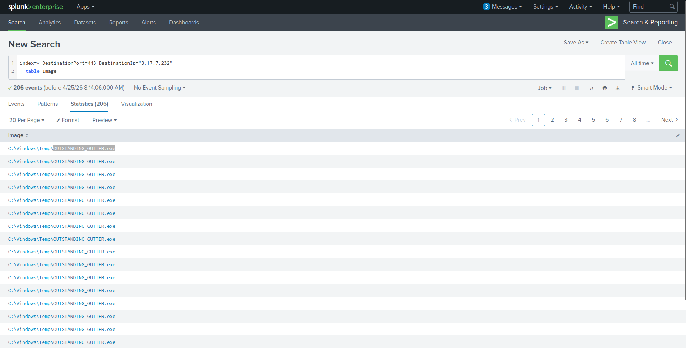

---

## Question 2 — What address was the binary downloaded from?

### Splunk Query

```spl
index=* powershell
| dedup CommandLine
| table CommandLine ParentCommandLine
```

### Investigation

Reviewing deduplicated PowerShell command lines reveals an encoded download cradle. After decoding the Base64 payload, the delivery URL used to fetch the binary is visible. The attacker used an **ngrok tunnel** to proxy the download through a legitimate-looking domain, bypassing URL reputation filters.

### Answer (Defanged)

```
hxxp[://]886e-181-215-214-32[.]ngrok[.]io
```
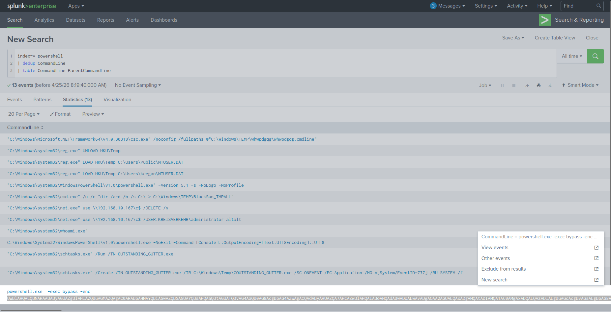
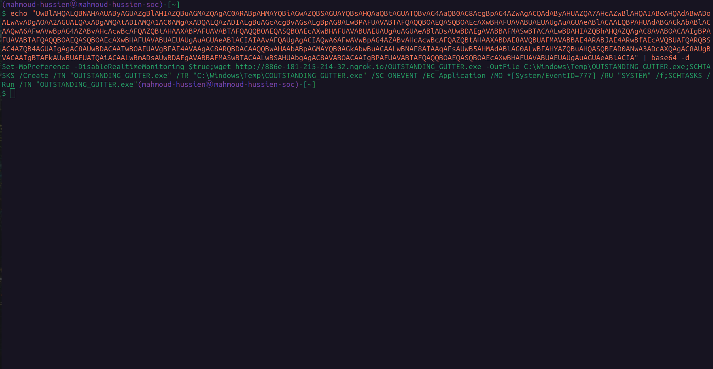
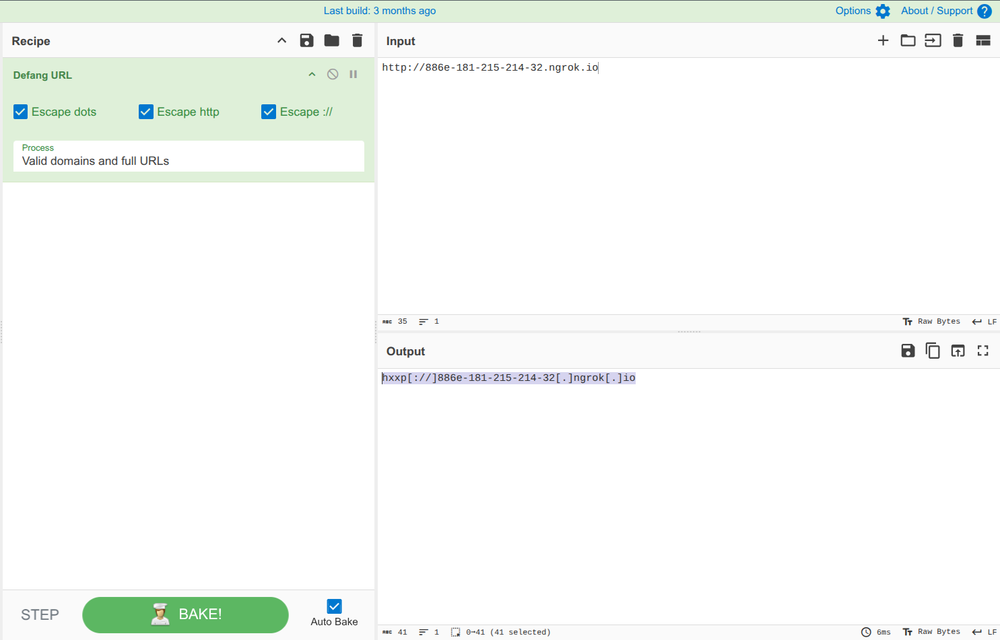

---

## Question 3 — What Windows executable was used to download the binary?

### Investigation

From the same PowerShell log analysis, the parent process and command structure confirm which native Windows binary was used as the download cradle. PowerShell's built-in web client capabilities make it the standard living-off-the-land download tool.

### Answer

```
C:\Windows\System32\WindowsPowerShell\v1.0\powershell.exe
```
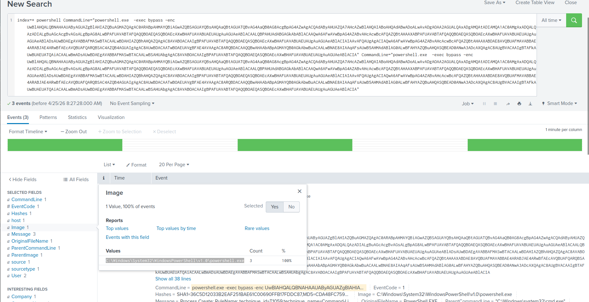

---

## Question 4 — What command was executed to configure the binary to run with elevated privileges?

### Splunk Query

```spl
index=* "schtasks.exe"
| table User CommandLine
```

### Investigation

Filtering for `schtasks.exe` activity captures the exact command the attacker used to register a **scheduled task** for the ransomware binary. The task was configured to trigger on a custom Application event (EventID 777) and run under the SYSTEM account — granting the highest possible privileges without requiring interactive admin authentication.

### Answer

```
SCHTASKS /Create /TN "OUTSTANDING_GUTTER.exe" /TR "C:\Windows\Temp\OUTSTANDING_GUTTER.exe" /SC ONEVENT /EC Application /MO *[System/EventID=777] /RU "SYSTEM" /f
```
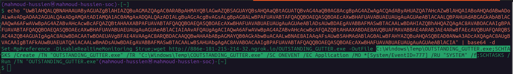

---

## Question 5 — What permissions will the binary run as, and what was the command to run it with elevated privileges?

### Investigation

From the scheduled task configuration, the `/RU "SYSTEM"` flag specifies the execution context. The task was subsequently triggered manually to launch the binary immediately under the `NT AUTHORITY\SYSTEM` identity.

### Answer

```
NT AUTHORITY\SYSTEM;"C:\Windows\system32\schtasks.exe" /Run /TN OUTSTANDING_GUTTER.exe
```
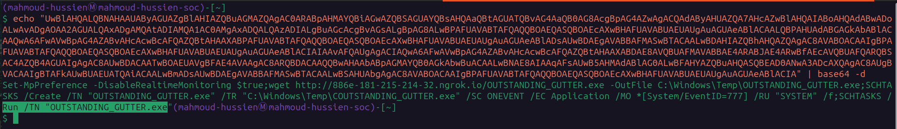

---

## Question 6 — What address did the suspicious binary connect to for C2?

### Investigation

Separate from the delivery URL, the executed binary established its own outbound C2 channel using a different ngrok tunnel — a common technique to separate the staging infrastructure from the command-and-control infrastructure, making takedowns harder.

### Answer (Defanged)

```
hxxp[://]9030-181-215-214-32[.]ngrok[.]io
```
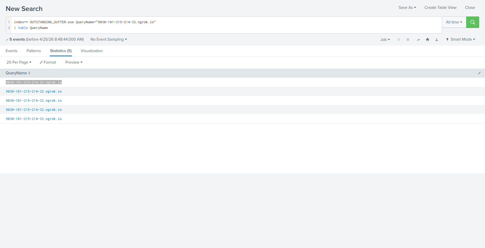
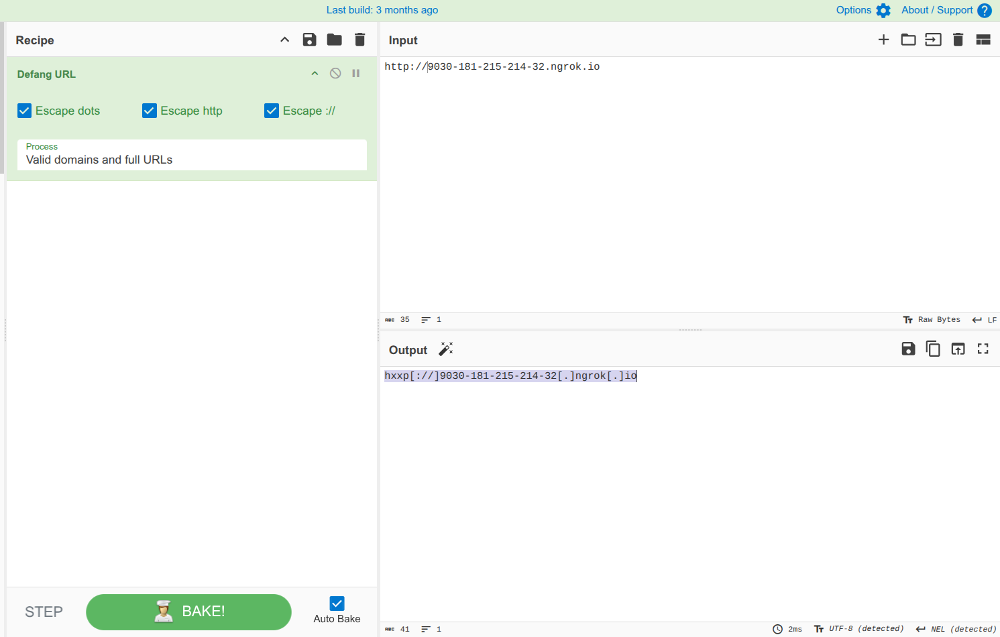

---

## Question 7 — What was the name of the PowerShell script downloaded to the same location?

### Investigation

Reviewing file creation events in the `C:\Windows\Temp\` directory (the same drop location as the binary) reveals a secondary `.ps1` file downloaded alongside the executable. This script handles the actual ransomware logic — encryption, shadow copy deletion, and wallpaper modification.

### Answer

```
script.ps1
```
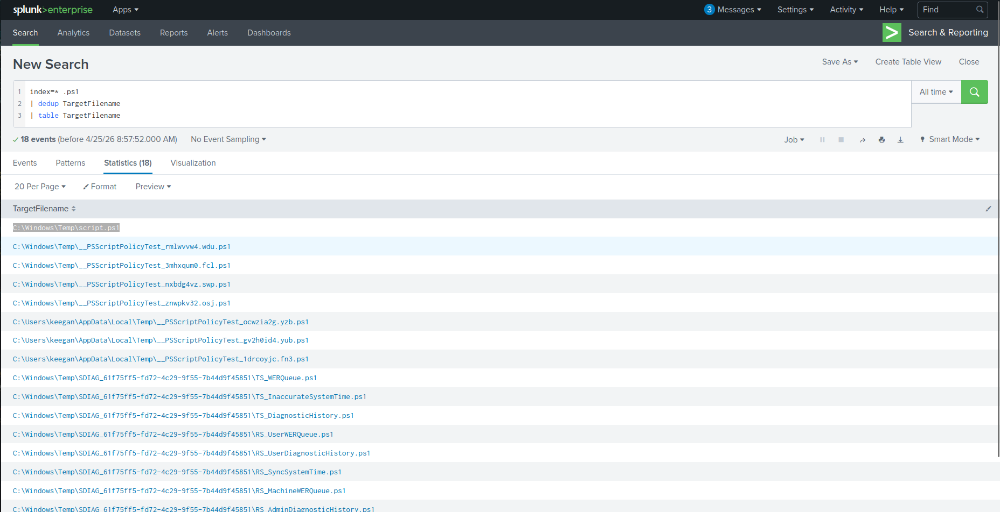

---

## Question 8 — What was the actual name of the malicious script?

### Investigation

The file was saved with an innocuous name (`script.ps1`) to avoid triggering filename-based detection rules. Submitting the file hash to VirusTotal and reviewing threat intelligence reports reveals the true identity of the script — part of the **BlackSun ransomware** family.

**SHA-256:**
```
e5429f2e44990b3d4e249c566fbf19741e671c0e40b809f87248d9ec9114bef9
```

**Confirmed behaviors from sandbox analysis:**
- Encrypts user files and appends a custom extension
- Deletes Volume Shadow Copies via WMI to prevent recovery
- Drops ransom note and replaces desktop wallpaper

### Answer

```
BlackSun.ps1
```
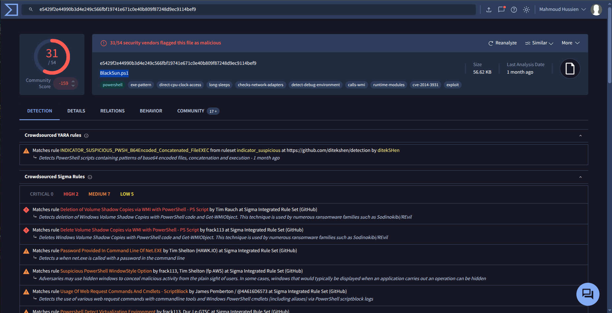

---

## Question 9 — What is the full path to which the ransom note was saved?

### Splunk Query

```spl
index=* .txt
| table TargetFilename
```

### Investigation

Filtering Sysmon file creation events (Event ID 11) for `.txt` files and reviewing `TargetFilename` values reveals the ransom note dropped by the ransomware. The note was saved inside a randomly named subfolder within Keegan's Downloads directory.

### Answer

```
C:\Users\keegan\Downloads\vasg6b0wmw029hd\BlackSun_README.txt
```
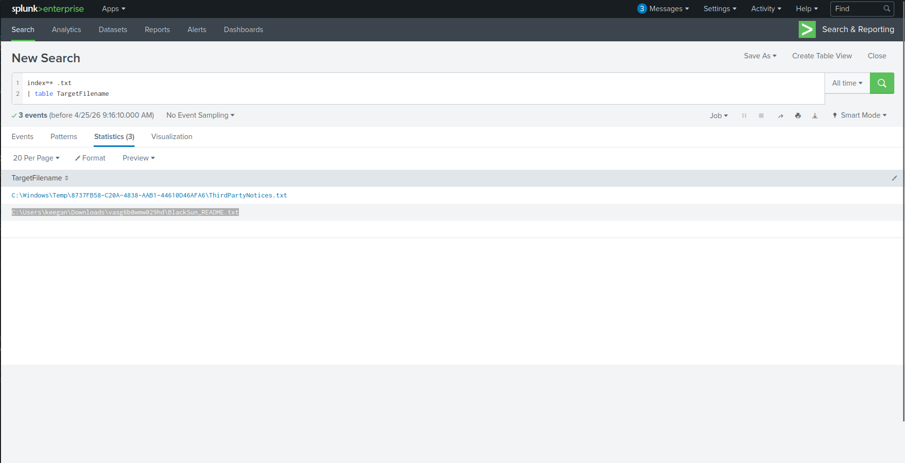

---

## Question 10 — What is the full path of the wallpaper image saved to disk?

### Splunk Query

```spl
index=* .jpg
| table TargetFilename
```

### Investigation

Filtering for `.jpg` file creation events reveals the ransomware dropped a branded wallpaper image to the Public Pictures folder — a common tactic to maximize visibility of the ransom message to anyone using the machine, even across user profiles.

### Answer

```
C:\Users\Public\Pictures\blacksun.jpg
```
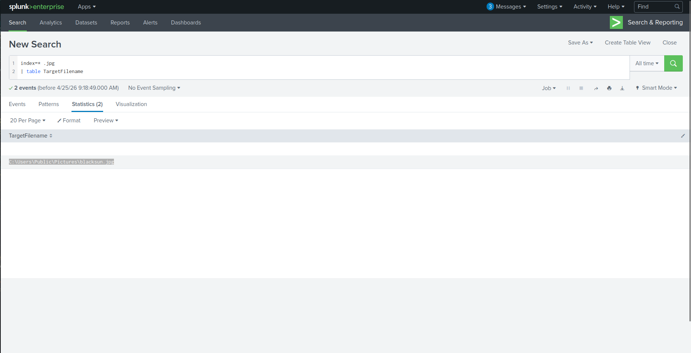

---

## Full Attack Chain Reconstruction

```
[1] Network Anomaly Detection
    └─ 206 events to 3.17.7.232:443
    └─ Process: OUTSTANDING_GUTTER.exe

[2] Delivery (PowerShell Download Cradle)
    └─ Disabled Windows Defender:
       Set-MpPreference -DisableRealtimeMonitoring $true
    └─ Downloaded binary from:
       hxxp[://]886e-181-215-214-32[.]ngrok[.]io
    └─ Saved to: C:\Windows\Temp\OUTSTANDING_GUTTER.exe

[3] Persistence (Scheduled Task)
    └─ SCHTASKS /Create /TN "OUTSTANDING_GUTTER.exe"
    └─ Trigger: Application EventID=777
    └─ RunAs: NT AUTHORITY\SYSTEM

[4] C2 Communication
    └─ Connected to: hxxp[://]9030-181-215-214-32[.]ngrok[.]io
    └─ Downloaded: script.ps1 → actual name: BlackSun.ps1

[5] Ransomware Execution (BlackSun.ps1)
    └─ Encrypted user files
    └─ Deleted Volume Shadow Copies (WMI)
    └─ Dropped ransom note: BlackSun_README.txt
    └─ Replaced desktop wallpaper: blacksun.jpg
```

---

## Indicators of Compromise (IOCs)

| Type | Value | Description |
|---|---|---|
| Network | `hxxp[://]886e-181-215-214-32[.]ngrok[.]io` | Payload Delivery URL |
| Network | `hxxp[://]9030-181-215-214-32[.]ngrok[.]io` | C2 Server URL |
| IP Address | `3.17.7.232` | Malicious Destination IP |
| File | `C:\Windows\Temp\OUTSTANDING_GUTTER.exe` | Main Ransomware Binary |
| File | `C:\Windows\Temp\BlackSun.ps1` | Ransomware PowerShell Script |
| File | `C:\Users\keegan\Downloads\vasg6b0wmw029hd\BlackSun_README.txt` | Ransom Note |
| File | `C:\Users\Public\Pictures\blacksun.jpg` | Ransomware Wallpaper |
| SHA-256 | `e5429f2e44990b3d4e249c566fbf19741e671c0e40b809f87248d9ec9114bef9` | BlackSun.ps1 Hash |

---

## Key Splunk Queries Reference

```spl
-- Identify high-volume external connections
index=* DestinationPort=443
| stats count by DestinationIp
| sort - count

-- PowerShell delivery commands
index=* powershell
| dedup CommandLine
| table CommandLine ParentCommandLine

-- Scheduled task creation
index=* "schtasks.exe"
| table User CommandLine

-- Ransom note file creation
index=* .txt
| table TargetFilename

-- Wallpaper image drop
index=* .jpg
| table TargetFilename
```

---

## MITRE ATT&CK Mapping

| Phase | Technique ID | Technique Name |
|---|---|---|
| Execution | T1059.001 | PowerShell |
| Defense Evasion | T1562.001 | Disable or Modify Tools (Defender) |
| Defense Evasion | T1036 | Masquerading (script.ps1 → BlackSun.ps1) |
| Defense Evasion | T1572 | Protocol Tunneling (ngrok) |
| Persistence | T1053.005 | Scheduled Task |
| Privilege Escalation | T1053.005 | Scheduled Task (SYSTEM) |
| Command & Control | T1071.001 | Web Protocols (HTTP via ngrok) |
| Credential Access | T1490 | Inhibit System Recovery (VSS Deletion) |
| Impact | T1486 | Data Encrypted for Impact |
| Impact | T1491.001 | Defacement: Internal (Wallpaper Change) |

---

## Lessons Learned

1. **Block PowerShell encoded commands** — Encoded `-EncodedCommand` arguments are almost exclusively used for malicious purposes on endpoints. Alert on or block them entirely.
2. **Monitor ngrok and similar tunneling services** — ngrok domains should be treated as high-risk and blocked at the proxy/firewall level in corporate environments.
3. **Alert on `Set-MpPreference -DisableRealtime`** — Any attempt to disable Windows Defender via PowerShell should trigger an immediate critical alert.
4. **Restrict Scheduled Task creation** — Non-admin users should not be able to create scheduled tasks. Alert on any task creation that specifies `/RU SYSTEM`.
5. **Protect Volume Shadow Copies** — Enable VSS protection policies and monitor for WMI calls targeting shadow copies — a key ransomware pre-encryption step.
6. **Hunt for ngrok in DNS logs** — ngrok subdomains follow predictable patterns (`*.ngrok.io`). DNS monitoring can detect C2 tunnels before execution completes.

---

*Writeup produced as part of SOC Analyst training — TryHackMe: PS Eclipse*