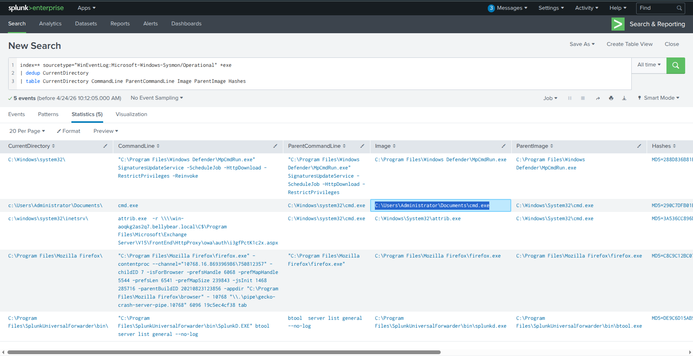
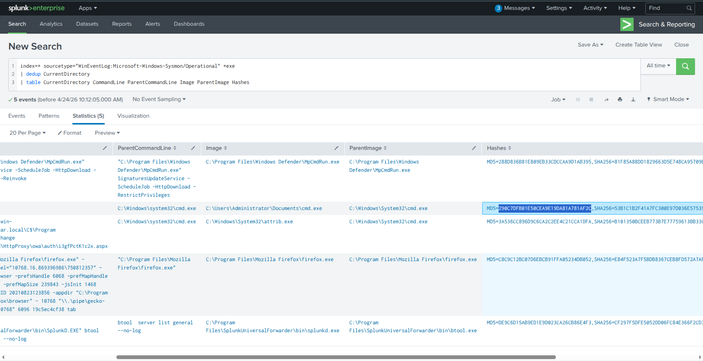
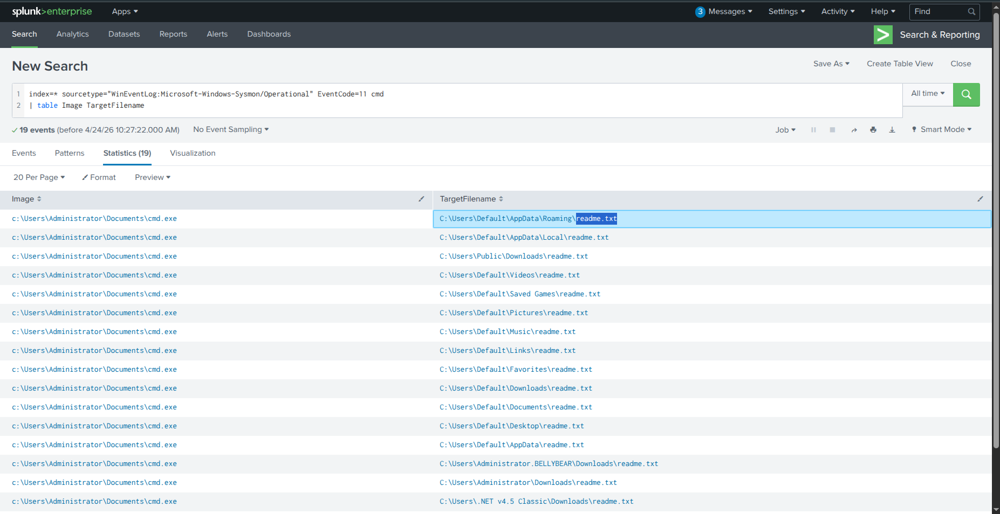
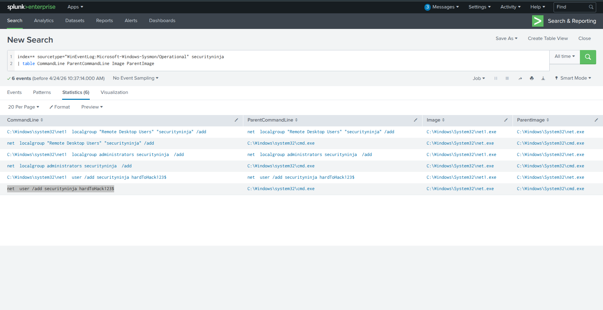
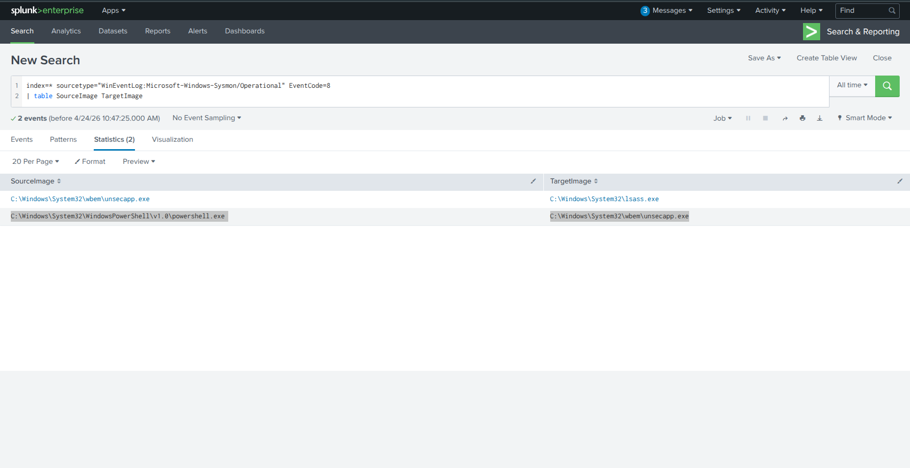
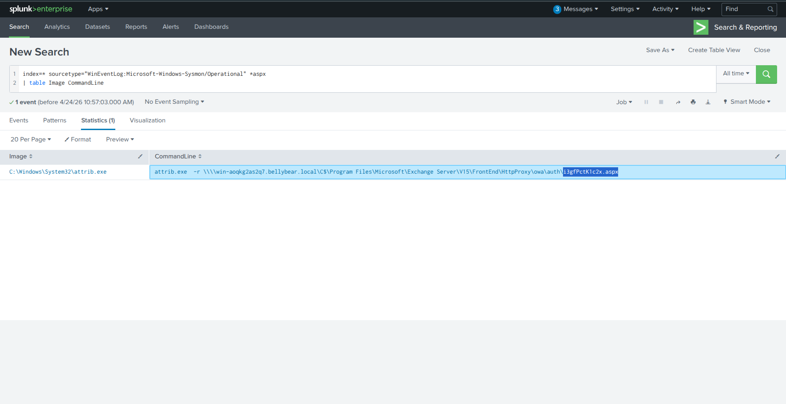
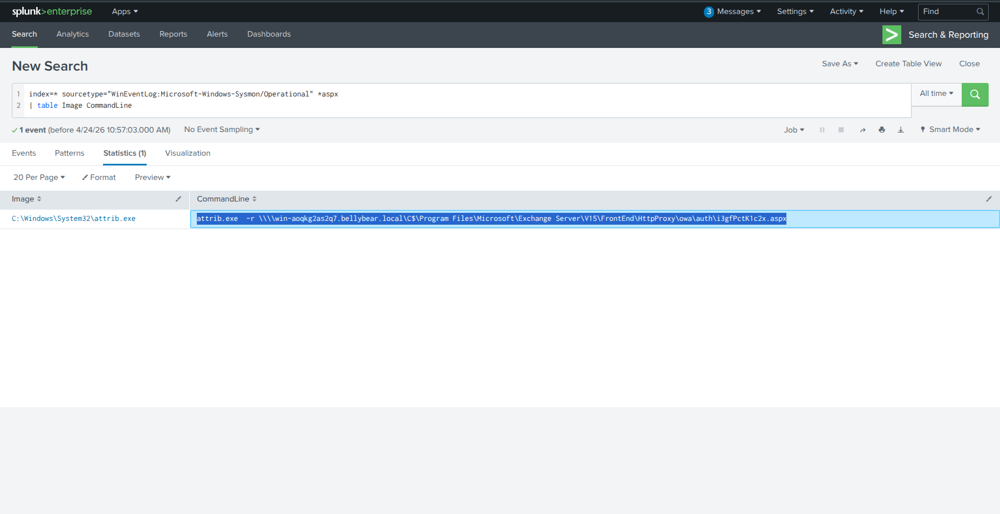

# Conti Ransomware Investigation — CTF Writeup

---

## Scenario Overview

Employees reported inability to access Outlook, and the Exchange system administrator lost access to the Exchange Admin Center. Unusual `readme.txt` files were discovered across the Exchange server. Initial triage confirmed a ransomware attack attributed to the **Conti** ransomware group. Logs were ingested into Splunk for full forensic investigation.

---

## Attack Summary

The threat actors exploited a chain of vulnerabilities against the Microsoft Exchange server, deployed a web shell for persistent remote access, created a backdoor administrator account, performed process injection into `lsass.exe` for credential dumping, and finally executed the Conti ransomware payload — encrypting files and distributing ransom notes across all user directories.

---

## Question 1 — What is the location of the ransomware?

### Splunk Query

```spl
index=* sourcetype="WinEventLog:Microsoft-Windows-Sysmon/Operational" *exe
| dedup CurrentDirectory
| table CurrentDirectory CommandLine ParentCommandLine Image ParentImage Hashes
```

### Investigation

Searching for executable file activity in Sysmon logs and deduplicating by directory reveals the working directory from which the ransomware payload was launched. The binary was disguised as `cmd.exe` and placed inside the Administrator's Documents folder — a location that blends in with normal system activity.

### Answer

```
C:\Users\Administrator\Documents\cmd.exe
```



---

## Question 2 — What is the Sysmon Event ID for the related file creation event?

### Investigation

Sysmon uses standardized Event IDs for different system activities. File creation events — such as the ransomware dropping `readme.txt` ransom notes across the filesystem — are captured by a specific Sysmon event ID dedicated to tracking new file creation on disk.

### Answer

```
11
```

---

## Question 3 — What is the MD5 hash of the ransomware?

### Splunk Query

```spl
index=* sourcetype="WinEventLog:Microsoft-Windows-Sysmon/Operational" *exe
| dedup CurrentDirectory
| table CurrentDirectory Image Hashes
```

### Investigation

Sysmon process creation events (Event ID 1) include a `Hashes` field containing MD5, SHA1, and SHA256 values of the executed binary. Filtering for the ransomware executable and extracting the hash field confirms the file identity and allows for VirusTotal lookup.

### Answer

```
290C7DFB01E50CEA9E19DA81A781AF2C
```


---

## Question 4 — What file was saved to multiple folder locations?

### Splunk Query

```spl
index=* sourcetype="WinEventLog:Microsoft-Windows-Sysmon/Operational" EventCode=11 cmd
| table Image TargetFilename
```

### Investigation

Using Sysmon Event ID 11 (FileCreate) and filtering for activity originating from the ransomware process reveals which file was being written repeatedly across the system. The ransomware distributed its ransom note to every accessible user directory — Desktop, Documents, Downloads, and more — to maximize visibility to the victim.

### Answer

```
readme.txt
```


---

## Question 5 — What was the command the attacker used to add a new user?

### Splunk Query

```spl
index=* sourcetype="WinEventLog:Microsoft-Windows-Sysmon/Operational" securityninja
| table CommandLine ParentCommandLine Image ParentImage
```

### Investigation

Searching for the backdoor account name `securityninja` in Sysmon process creation logs reveals the full command-line sequence executed by the attacker. The attacker ran three commands in sequence to create the account and grant it full administrative and RDP access:

```
net user /add securityninja hardToHack123$
net localgroup administrators securityninja /add
net localgroup "Remote Desktop Users" securityninja /add
```

### Answer

```
net user /add securityninja hardToHack123$
```


---

## Question 6 — What are the migrated and original process images?

### Splunk Query

```spl
index=* sourcetype="WinEventLog:Microsoft-Windows-Sysmon/Operational" EventCode=8
| table SourceImage TargetImage
```

### Investigation

**Sysmon Event ID 8** captures `CreateRemoteThread` events — the mechanism used during process injection (migration). The attacker migrated from their initial foothold process into `lsass.exe` to gain access to credential material stored in memory.

| Role | Process |
|---|---|
| Original (when attacker got on the system) | `C:\Windows\System32\WindowsPowerShell\v1.0\powershell.exe` |
| Migrated (Target) Process | `C:\Windows\System32\wbem\unsecapp.exe` |

The full injection chain observed in Sysmon Event ID 8:
```
powershell.exe → unsecapp.exe → lsass.exe
```

### Answer

```
C:\Windows\System32\WindowsPowerShell\v1.0\powershell.exe, C:\Windows\System32\wbem\unsecapp.exe
```


---

## Question 7 — What is the process image used for getting the system hashes?

### Investigation

The target of the process injection directly reveals which process was used for credential dumping. `lsass.exe` (Local Security Authority Subsystem Service) stores NTLM hashes and Kerberos tickets in memory. Injecting into this process gives the attacker direct access to all cached credentials without touching disk — a classic in-memory credential dumping technique.

### Answer

```
C:\Windows\System32\lsass.exe
```

---

## Question 8 — What is the web shell deployed by the exploit?

### Splunk Query

```spl
index=* sourcetype="WinEventLog:Microsoft-Windows-Sysmon/Operational" *aspx
| table Image CommandLine
```

### Investigation

Searching for `.aspx` file activity in Sysmon logs reveals the web shell planted by the attacker within the Exchange Server's OWA (Outlook Web Access) authentication directory. Placing the shell here is deliberate — the `/auth/` folder is publicly accessible and served directly by IIS, giving the attacker an internet-facing command execution endpoint.

### Answer

```
i3gfPctK1c2x.aspx
```

Full path:
```
\HttpProxy\owa\auth\i3gfPctK1c2x.aspx
```


---

## Question 9 — What is the command line that executed the web shell?

### Investigation

From the same Sysmon query filtering for `.aspx` activity, the `CommandLine` field reveals that the attacker used `attrib.exe` to modify the file attributes of the web shell — specifically to hide the file and mark it as a system file, making it less visible to administrators browsing the directory.

### Answer

```
attrib.exe  -r \\\\win-aoqkg2as2q7.bellybear.local\C$\Program Files\Microsoft\Exchange Server\V15\FrontEnd\HttpProxy\owa\auth\i3gfPctK1c2x.aspx
```


---

## Question 10 — What three CVEs did this exploit leverage?

### Investigation

The attack chain against the Microsoft Exchange server utilized a combination of known vulnerabilities. Cross-referencing the attack behavior (FortiGate VPN exploitation + SMBGhost for lateral movement) with threat intelligence reports on Conti TTPs identifies the three CVEs used in ascending order:

| CVE | Description |
|---|---|
| `CVE-2018-13374` | Fortinet FortiOS — Improper Access Control |
| `CVE-2018-13379` | Fortinet FortiOS SSL VPN — Path Traversal (credential exposure) |
| `CVE-2020-0796` | SMBGhost — Windows SMBv3 Remote Code Execution |

### Answer

```
CVE-2018-13374, CVE-2018-13379, CVE-2020-0796
```

---

## Full Attack Chain Reconstruction

```
[1] Initial Access
    └─ Exploited CVE-2018-13379 (FortiGate VPN Path Traversal)
    └─ Leaked VPN credentials → remote access to network
    └─ CVE-2018-13374 + CVE-2020-0796 used for further exploitation

[2] Web Shell Deployment
    └─ Planted: i3gfPctK1c2x.aspx
    └─ Path: \HttpProxy\owa\auth\
    └─ Hidden with: attrib.exe +s +h i3gfPctK1c2x.aspx

[3] Persistence — Backdoor Account
    └─ net user /add securityninja hardToHack123$
    └─ Added to: Administrators + Remote Desktop Users

[4] Defense Evasion & Credential Access
    └─ Process injection (Sysmon Event ID 8)
    └─ Source: unsecapp.exe → Target: lsass.exe
    └─ System hashes dumped from lsass memory

[5] Ransomware Execution
    └─ Payload: C:\Users\Administrator\Documents\cmd.exe
    └─ MD5: 290C7DFB01E50CEA9E19DA81A781AF2C
    └─ readme.txt dropped across all user directories
    └─ Exchange encrypted → OWA and ECP inaccessible
```

---

## Indicators of Compromise (IOCs)

| Type | Value | Description |
|---|---|---|
| File Path | `C:\Users\Administrator\Documents\cmd.exe` | Ransomware Executable |
| MD5 | `290C7DFB01E50CEA9E19DA81A781AF2C` | Conti Payload Hash |
| SHA-256 | `53b1c1b2f41a7fc300e97d036e57539453ff82001dd3f6abf07f4896b1f9ca22` | Conti Payload Hash |
| Web Shell | `i3gfPctK1c2x.aspx` | Deployed in OWA /auth/ |
| Username | `securityninja` | Backdoor Account |
| Password | `hardToHack123$` | Backdoor Account Credential |
| Ransom Note | `readme.txt` | Distributed across all user directories |
| CVE | `CVE-2018-13374` | FortiOS Improper Access Control |
| CVE | `CVE-2018-13379` | FortiOS VPN Path Traversal |
| CVE | `CVE-2020-0796` | SMBGhost RCE |

---

## Key Splunk Queries Reference

```spl
-- Ransomware location and hash
index=* sourcetype="WinEventLog:Microsoft-Windows-Sysmon/Operational" *exe
| dedup CurrentDirectory
| table CurrentDirectory CommandLine ParentCommandLine Image ParentImage Hashes

-- Ransom note file creation (Sysmon Event ID 11)
index=* sourcetype="WinEventLog:Microsoft-Windows-Sysmon/Operational" EventCode=11 cmd
| table Image TargetFilename

-- Backdoor account creation
index=* sourcetype="WinEventLog:Microsoft-Windows-Sysmon/Operational" securityninja
| table CommandLine ParentCommandLine Image ParentImage

-- Process injection / migration (Sysmon Event ID 8)
index=* sourcetype="WinEventLog:Microsoft-Windows-Sysmon/Operational" EventCode=8
| table SourceImage TargetImage

-- Web shell discovery
index=* sourcetype="WinEventLog:Microsoft-Windows-Sysmon/Operational" *aspx
| table Image CommandLine
```

---

## MITRE ATT&CK Mapping

| Phase | Technique ID | Technique Name |
|---|---|---|
| Initial Access | T1190 | Exploit Public-Facing Application |
| Persistence | T1505.003 | Web Shell |
| Persistence | T1136.001 | Create Account: Local Account |
| Privilege Escalation | T1548 | Abuse Elevation Control Mechanism |
| Defense Evasion | T1564.001 | Hide Artifacts: Hidden Files |
| Defense Evasion | T1055 | Process Injection |
| Credential Access | T1003.001 | LSASS Memory Dumping |
| Impact | T1486 | Data Encrypted for Impact |
| Impact | T1485 | Data Destruction |

---

## Lessons Learned

1. **Patch FortiGate VPN immediately** — CVE-2018-13379 was a known, widely-exploited vulnerability. Unpatched VPN gateways are a top initial access vector for ransomware groups.
2. **Monitor the Exchange /auth/ directory** — Any new `.aspx` file appearing in OWA authentication paths should trigger an immediate P1 alert.
3. **Alert on `lsass.exe` as injection target** — Any `CreateRemoteThread` event targeting `lsass.exe` is a critical indicator of credential dumping and should be blocked by EDR.
4. **Detect mass file creation** — Hundreds of `readme.txt` writes across user directories in a short time window is a strong behavioral ransomware indicator.
5. **Restrict `net user /add` on servers** — Account creation commands on Exchange servers should be blocked or require MFA-protected privileged access workflows.
6. **Offline, immutable backups** — Conti is known to target and destroy accessible backups. Backups must be air-gapped or immutable to survive a ransomware incident.

---

*Writeup produced as part of SOC Analyst training — TryHackMe: Conti*