## Scenario Overview

A newly onboarded customer (Widget LLC) raised concerns about a Finance Department endpoint (`DESKTOP-H1ATIJC`) during December 2021, when the endpoint security product was turned off and no official investigation was conducted. As a SOC Analyst, the task is to sift through Splunk events and identify all malicious activity on the Financial Analyst's workstation.

---

## Environment Baseline

**Primary SPL Query for Baseline:**

```spl
index=*
| stats count by index, host, sourcetype
```

| Index | Host | Sourcetype | Event Count |
|---|---|---|---|
| main | DESKTOP-H1ATIJC | WinEventLog:Microsoft-Windows-Sysmon/Operational | 13,922 |
| main | DESKTOP-H1ATIJC | WinEventLog:Security | 11,860 |
| main | DESKTOP-H1ATIJC | WinEventLog:Application | 1,559 |
| main | DESKTOP-H1ATIJC | WinEventLog:System | 37 |
| **Total** | | | **27,378** |

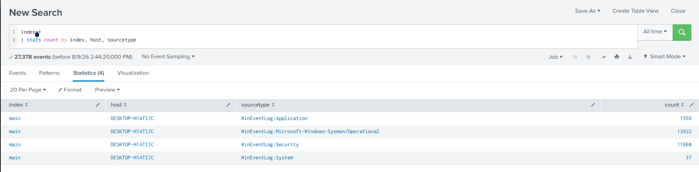

---

## Attack Chain Overview

```
[1] Credential Access
    └─ 11111.exe (NirSoft Web Browser Password Viewer)
    └─ Dumps browser credentials to %TEMP%\fj4ghga23_fsa.txt

[2] Defense Evasion
    └─ IonicLarge.exe (renamed from PalitExplorer.exe)
    └─ Disables Windows Defender via registry (HKLM\SOFTWARE\Policies\Microsoft\Windows Defender)

[3] Command & Control
    └─ IonicLarge.exe → 2[.]56[.]59[.]42 (2x outbound connections)

[4] Anti-Forensics
    └─ taskkill + del: WvmIOrcfsuILdX6SNwIRmGOJ.exe, phcIAmLJMAIMSa9j9MpgJo1m.exe
    └─ del C:\ProgramData\*.dll

[5] Defender Threat Suppression (WMI)
    └─ 4 Threat IDs muted via LOLBin proxy execution
    └─ LOLBins: waitfor.exe, where.exe, calc.exe, notepad.exe

[6] Persistence
    └─ EasyCalc.exe from AppData\Roaming
    └─ NW.js framework: ffmpeg.dll, nw.dll, nw_elf.dll
```

---

## Question 1 — What is the full path of the Web Browser Password Viewer binary?

### SPL Query

```spl
index=main sourcetype="WinEventLog:Microsoft-Windows-Sysmon/Operational" EventCode=1
| dedup Image
| table Image Description Company CommandLine
```

### Investigation

Sysmon **Event ID 1** (Process Creation) logs all executed processes with their full command-line arguments, image path, and PE metadata. Deduplicating by `Image` and reviewing the results, one entry immediately stands out:

| Field | Value |
|---|---|
| Image | `C:\Users\FINANC~1\AppData\Local\Temp\11111.exe` |
| Description | Web Browser Password Viewer |
| Company | NirSoft |
| CommandLine | `C:\Users\FINANC~1\AppData\Local\Temp\11111.exe /stab C:\Users\FINANC~1\AppData\Local\Temp\fj4ghga23_fsa.txt` |

The binary was executed directly from `%TEMP%` using the `/stab` switch to dump browser credentials to a tab-separated output file — a known NirSoft CLI behavior.

**MITRE ATT&CK:** T1555.003 — Credentials from Web Browsers

### Answer

```
C:\Users\FINANC~1\AppData\Local\Temp\11111.exe
```
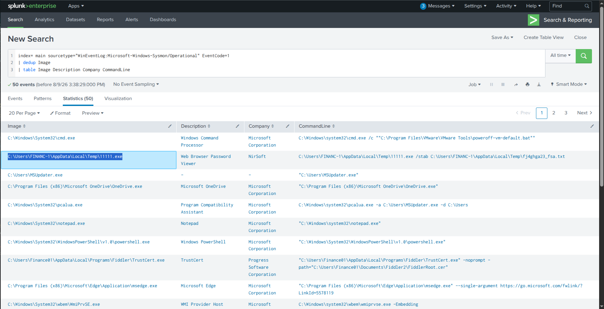

---

## Question 2 — What is listed as the company name?

From the same query results, the `Company` field in the PE metadata:

**MITRE Context:** NirSoft tools are legitimate administrative utilities frequently dual-purposed by attackers to extract cleartext passwords from browser credential stores.

### Answer

```
NirSoft
```
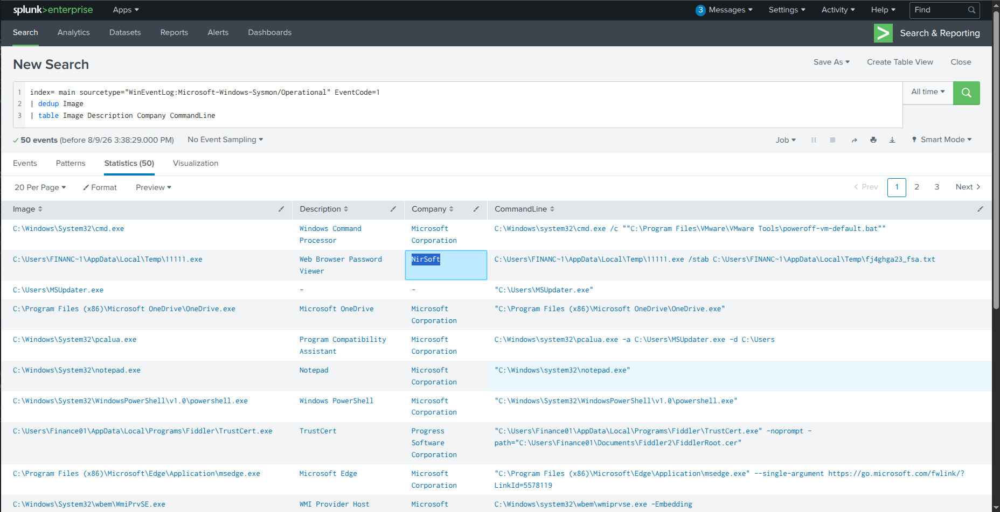

---

## Question 3 — What was the name of the second suspicious binary and its original filename?

### SPL Query

```spl
index=main sourcetype="WinEventLog:Microsoft-Windows-Sysmon/Operational" EventCode=1
CurrentDirectory="C:\\Users\\Finance01\\AppData\\Local\\Temp\\"
| table Image OriginalFileName
```

### Investigation

Filtering Sysmon process creation events specifically for processes executing from the Finance01 Temp directory reveals a second suspicious entry. The `OriginalFileName` field is extracted from the PE header — a discrepancy between the executed name and the original name indicates deliberate **binary renaming/masquerading**:

| Field | Value |
|---|---|
| Image | `C:\Users\Finance01\AppData\Local\Temp\IonicLarge.exe` |
| OriginalFileName | `PalitExplorer.exe` |

The attacker renamed `PalitExplorer.exe` to `IonicLarge.exe` to hinder static analysis and detection rules based on known malicious filenames.

**MITRE ATT&CK:** T1036 — Masquerading: Match Legitimate Name or Location

### Answer

```
IonicLarge.exe,PalitExplorer.exe
```
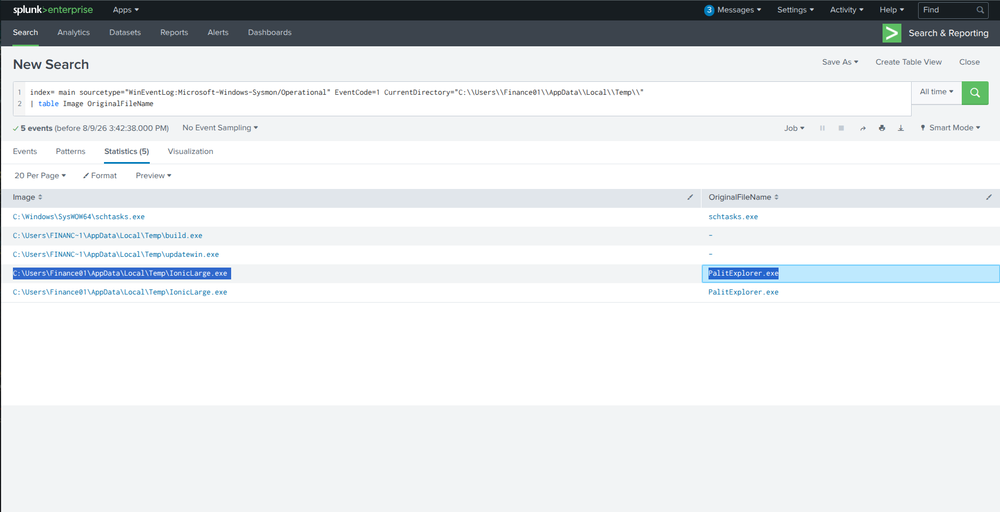

---

## Question 4 — What malicious IP did IonicLarge.exe connect to? (Defanged)

### SPL Query

```spl
index=main sourcetype="WinEventLog:Microsoft-Windows-Sysmon/Operational"
IonicLarge.exe EventCode=3 DestinationIp="2.56.59.42"
```

### Investigation

Sysmon **Event ID 3** (Network Connection) logs all outbound TCP/UDP connections with source process, destination IP, and timestamp. Filtering for `IonicLarge.exe` with Event ID 3 returns two distinct connections:

| Field | Value |
|---|---|
| Event Code | Sysmon Event ID 3 (Network connection) |
| Source Process | `C:\Users\Finance01\AppData\Local\Temp\IonicLarge.exe` |
| PID | `7296` |
| Connection 1 Timestamp | `12/28/2021 08:06:38 PM` |
| Connection 2 Timestamp | `12/28/2021 08:07:44 PM` |
| Destination IP | `2.56.59.42` |

Two distinct outbound C2 callbacks confirm active Command & Control functionality initiated by the masqueraded binary.

**MITRE ATT&CK:** T1071 — Application Layer Protocol / T1095 — Non-Application Layer Protocol

### Answer (Defanged)

```
2[.]56[.]59[.]42
```
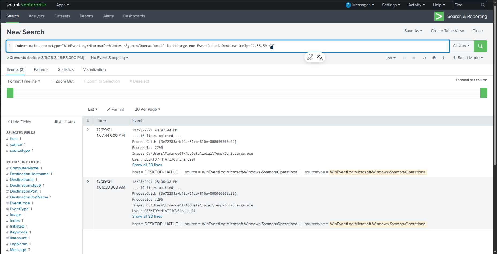

---

## Question 5 — What registry key did IonicLarge.exe modify?

### SPL Query

```spl
index=main sourcetype="WinEventLog:Microsoft-Windows-Sysmon/Operational"
IonicLarge.exe EventCode=12
```

### Investigation

Sysmon **Event ID 12** (Registry object added/deleted) captures registry modifications with the responsible process. Filtering for `IonicLarge.exe` and Event ID 12 at the same timestamp as the C2 connection (`12/28/2021 08:06:38 PM`):

| Field | Value |
|---|---|
| Event Code | Sysmon Event ID 12 |
| Modifying Process | `C:\Users\Finance01\AppData\Local\Temp\IonicLarge.exe` |
| Registry Key Path | `HKLM\SOFTWARE\Policies\Microsoft\Windows Defender` |
| Target Object Modified | `HKLM\SOFTWARE\Policies\Microsoft\Windows Defender\Real-Time Protection` |
| Timestamp | `12/28/2021 08:06:38 PM` |

This finding directly explains the December 2021 endpoint security outage — the malware deliberately modified `Real-Time Protection` registry keys to disable Windows Defender and blind the SOC.

**MITRE ATT&CK:** T1562.001 — Impair Defenses: Disable or Modify Tools

### Answer

```
HKLM\SOFTWARE\Policies\Microsoft\Windows Defender
```
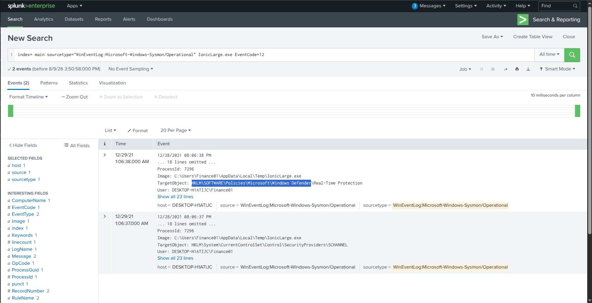

---

## Question 6 — What were the two binaries killed and deleted?

### SPL Query

```spl
index=main sourcetype="WinEventLog:Microsoft-Windows-Sysmon/Operational" "taskkill"
| dedup CommandLine
| table CommandLine
```

### Investigation

Filtering for processes executing `taskkill` commands reveals two anti-forensic cleanup sequences. The attacker used `cmd.exe` to force-kill processes and delete their binaries:

**Command 1:**
```cmd
"C:\Windows\System32\cmd.exe" /c taskkill /im phcIAmLJMAIMSa9j9MpgJo1m.exe /f
& timeout /t 6
& del /f /q "C:\Users\Finance01\Pictures\Adobe Films\phcIAmLJMAIMSa9j9MpgJo1m.exe"
& del C:\ProgramData\*.dll
& exit
```

**Command 2:**
```cmd
"C:\Windows\System32\cmd.exe" /c taskkill /im "WvmIOrcfsuILdX6SNwIRmGOJ.exe" /f
& erase "C:\Users\Finance01\Pictures\Adobe Films\WvmIOrcfsuILdX6SNwIRmGOJ.exe"
& exit
```

| Action | Target |
|---|---|
| Force kill | `phcIAmLJMAIMSa9j9MpgJo1m.exe` |
| File delete | `C:\Users\Finance01\Pictures\Adobe Films\phcIAmLJMAIMSa9j9MpgJo1m.exe` |
| DLL cleanup | `C:\ProgramData\*.dll` (wildcard) |
| Force kill | `WvmIOrcfsuILdX6SNwIRmGOJ.exe` |
| File erase | `C:\Users\Finance01\Pictures\Adobe Films\WvmIOrcfsuILdX6SNwIRmGOJ.exe` |

The wildcard `del C:\ProgramData\*.dll` confirms active cleanup of all dropped DLL artifacts.

**MITRE ATT&CK:** T1070.004 — Indicator Removal: File Deletion

### Answer

```
WvmIOrcfsuILdX6SNwIRmGOJ.exe,phcIAmLJMAIMSa9j9MpgJo1m.exe
```
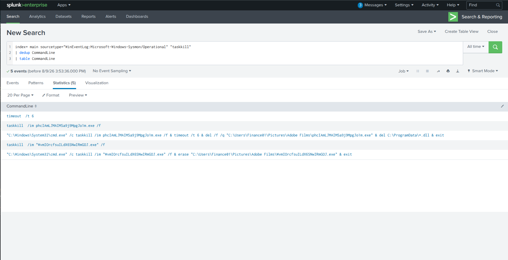

---

## Question 7 — What was the last PowerShell command to change Windows Defender behavior?

### SPL Query

```spl
index=main sourcetype="WinEventLog:Microsoft-Windows-Sysmon/Operational" powershell
| dedup CommandLine
| table _time CommandLine
```

### Investigation

Filtering for PowerShell-related process creation events reveals a structured multi-stage Defender suppression campaign. The attacker systematically muted specific Windows Defender Threat IDs using WMIC — proxied through LOLBins to evade parent-child process detection rules:

| Order | Timestamp | Threat ID | LOLBin Used |
|---|---|---|---|
| 1st | 2021-12-29 01:07:52 | `2147735503` | `waitfor.exe` |
| 2nd | 2021-12-29 01:08:55 | `2147737010` | `where.exe` |
| 3rd | 2021-12-29 01:09:08 | `2147737007` | `calc.exe` |
| 4th | 2021-12-29 01:09:26 | `2147737394` | `notepad.exe` |

All commands set `ThreatIDDefaultAction_Actions=6` (Action Code 6 = **Ignore Threat**).

The last command in the series:

```powershell
powershell WMIC /NAMESPACE:\\root\Microsoft\Windows\Defender PATH MSFT_MpPreference
call Add ThreatIDDefaultAction_Ids=2147737394 ThreatIDDefaultAction_Actions=6 Force=True
```

**MITRE ATT&CK:** T1562.001 — Impair Defenses | T1202 — Indirect Command Execution (LOLBin proxy)

### Answer

```
powershell WMIC /NAMESPACE:\\root\Microsoft\Windows\Defender PATH MSFT_MpPreference call Add ThreatIDDefaultAction_Ids=2147737394 ThreatIDDefaultAction_Actions=6 Force=True
```
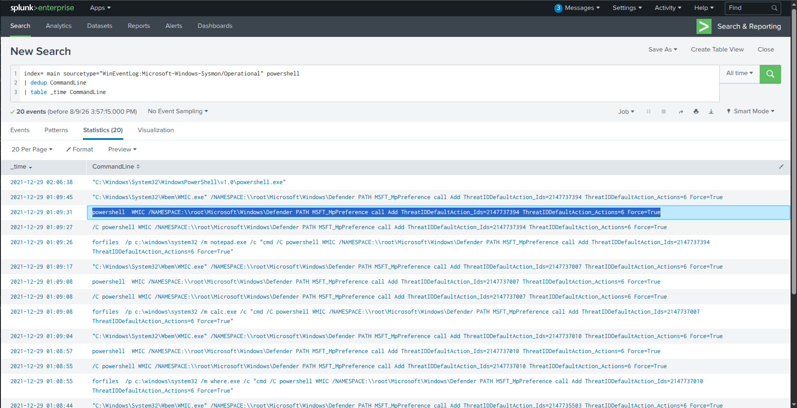

---

## Question 8 — What were the four Threat IDs set in order of execution?

From the same query, ordered chronologically by `_time`:

| Order | Timestamp | Threat ID |
|---|---|---|
| 1st | 2021-12-29 01:07:52 | `2147735503` |
| 2nd | 2021-12-29 01:08:55 | `2147737010` |
| 3rd | 2021-12-29 01:09:08 | `2147737007` |
| 4th | 2021-12-29 01:09:26 | `2147737394` |

### Answer

```
2147735503,2147737010,2147737007,2147737394
```
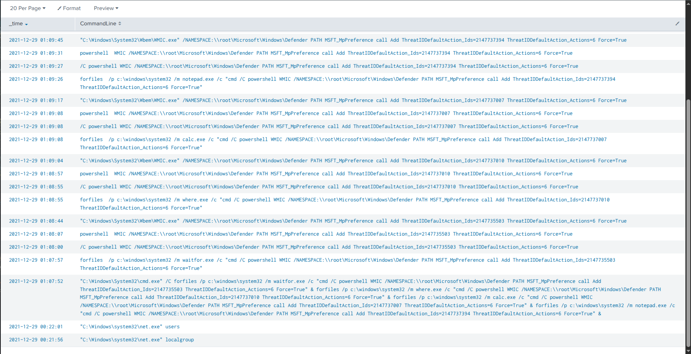

---

## Question 9 — What was the full path of the malicious binary in AppData\Roaming?

### SPL Query

```spl
index=main sourcetype="WinEventLog:Microsoft-Windows-Sysmon/Operational" "AppData\\Roaming"
| dedup Image
| table Image OriginalFileName CommandLine Description Company
```

### Investigation

Reviewing process creation telemetry across alternate AppData locations reveals an executable running from the `AppData\Roaming` directory — a common staging location for user-level payload execution and persistence mechanisms:

| Field | Value |
|---|---|
| Full Path | `C:\Users\Finance01\AppData\Roaming\EasyCalc\EasyCalc.exe` |
| Binary Name | `EasyCalc.exe` |
| Directory | `C:\Users\Finance01\AppData\Roaming\EasyCalc\` |

The attacker disguised the malicious binary as a benign calculator application (`EasyCalc.exe`) — using `AppData\Roaming` for persistence because files there survive user logoff and are commonly auto-executed at logon.

**MITRE ATT&CK:** T1036 — Masquerading | T1547 — Boot or Logon Autostart Execution

### Answer

```
C:\Users\Finance01\AppData\Roaming\EasyCalc\EasyCalc.exe
```
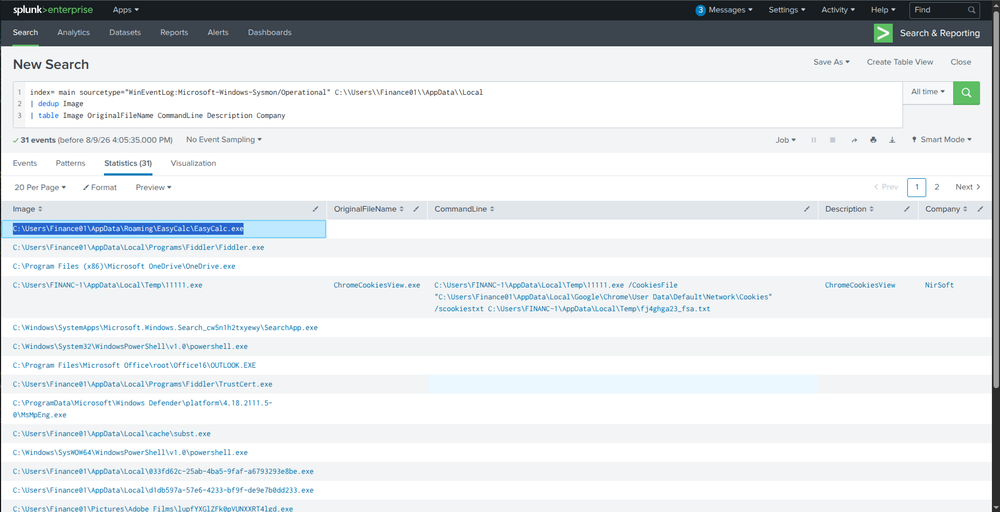

---

## Question 10 — What DLLs were loaded by EasyCalc.exe? (Alphabetical order)

### SPL Query

```spl
index=main sourcetype="WinEventLog:Microsoft-Windows-Sysmon/Operational" EasyCalc.exe
| dedup OriginalFileName
| table OriginalFileName Description
```

### Investigation

Sysmon **Event ID 7** (Image Loaded) captures all DLLs loaded by a process. Filtering for `EasyCalc.exe` and deduplicating by `OriginalFileName` reveals three NW.js (Node-Webkit) framework DLLs:

| OriginalFileName | Description |
|---|---|
| `ffmpeg.dll` | nwjs open source media library |
| `nw.dll` | nwjs (Primary NW.js binary runtime engine) |
| `nw_elf.dll` | nwjs (ELF runtime helper module) |

The presence of NW.js framework DLLs confirms that `EasyCalc.exe` is a **Node.js/Chromium application wrapper** — a technique attackers use to wrap malicious JavaScript/Node code inside standalone Windows executables to evade traditional static signature detection.

**MITRE ATT&CK:** T1036 — Masquerading | T1106 — Native API

### Answer (Alphabetical)

```
ffmpeg.dll,nw.dll,nw_elf.dll
```
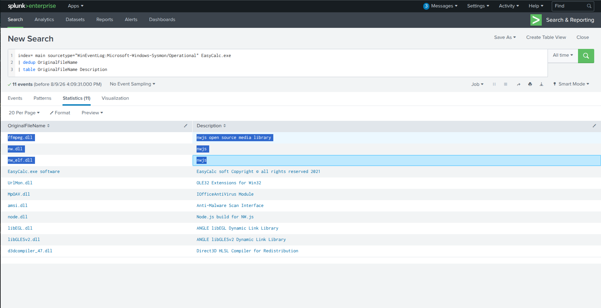

---

## Full Attack Timeline

| Timestamp | Event | MITRE Technique |
|---|---|---|
| Dec 28, 2021 | `11111.exe` executed — NirSoft browser password dump → `fj4ghga23_fsa.txt` | T1555.003 |
| Dec 28, 2021 08:06:38 PM | `IonicLarge.exe` (renamed from PalitExplorer.exe) executed | T1036 |
| Dec 28, 2021 08:06:38 PM | Registry modified: `HKLM\SOFTWARE\Policies\Microsoft\Windows Defender` | T1562.001 |
| Dec 28, 2021 08:06:38 PM | C2 connection 1 → `2.56.59.42` | T1071 |
| Dec 28, 2021 08:07:44 PM | C2 connection 2 → `2.56.59.42` | T1071 |
| Dec 28, 2021 | `taskkill` + `del`: WvmIOrcfsuILdX6SNwIRmGOJ.exe, phcIAmLJMAIMSa9j9MpgJo1m.exe, `*.dll` | T1070.004 |
| Dec 29, 2021 01:07:52 | Threat ID `2147735503` suppressed via `waitfor.exe` → WMIC | T1562.001 |
| Dec 29, 2021 01:08:55 | Threat ID `2147737010` suppressed via `where.exe` → WMIC | T1562.001 |
| Dec 29, 2021 01:09:08 | Threat ID `2147737007` suppressed via `calc.exe` → WMIC | T1562.001 |
| Dec 29, 2021 01:09:26 | Threat ID `2147737394` suppressed via `notepad.exe` → WMIC | T1562.001 |
| Dec 2021 | `EasyCalc.exe` executed from `AppData\Roaming\EasyCalc\` | T1547 |

---

## Indicators of Compromise (IOCs)

| Type | Value | Description |
|---|---|---|
| File | `C:\Users\FINANC~1\AppData\Local\Temp\11111.exe` | NirSoft browser password viewer |
| File | `C:\Users\Finance01\AppData\Local\Temp\IonicLarge.exe` | Renamed malware (PalitExplorer.exe) |
| File | `C:\Users\Finance01\AppData\Roaming\EasyCalc\EasyCalc.exe` | NW.js malware (persistence) |
| File | `C:\Users\Finance01\Pictures\Adobe Films\WvmIOrcfsuILdX6SNwIRmGOJ.exe` | Deleted malicious binary |
| File | `C:\Users\Finance01\Pictures\Adobe Films\phcIAmLJMAIMSa9j9MpgJo1m.exe` | Deleted malicious binary |
| File | `C:\Users\FINANC~1\AppData\Local\Temp\fj4ghga23_fsa.txt` | Dumped browser credentials |
| IP | `2[.]56[.]59[.]42` | C2 server (2x connections) |
| Registry | `HKLM\SOFTWARE\Policies\Microsoft\Windows Defender` | Defender disabled |
| Registry | `HKLM\SOFTWARE\Policies\Microsoft\Windows Defender\Real-Time Protection` | RT Protection disabled |
| DLL | `ffmpeg.dll`, `nw.dll`, `nw_elf.dll` | NW.js framework (EasyCalc.exe) |

---

## Key Splunk Queries Reference

```spl
-- Environment baseline
index=*
| stats count by index, host, sourcetype

-- Q1-Q2: Browser password viewer + company name
index=main sourcetype="WinEventLog:Microsoft-Windows-Sysmon/Operational" EventCode=1
| dedup Image
| table Image Description Company CommandLine

-- Q3: Renamed binary in Temp
index=main sourcetype="WinEventLog:Microsoft-Windows-Sysmon/Operational" EventCode=1
CurrentDirectory="C:\\Users\\Finance01\\AppData\\Local\\Temp\\"
| table Image OriginalFileName

-- Q4: C2 outbound connections
index=main sourcetype="WinEventLog:Microsoft-Windows-Sysmon/Operational"
IonicLarge.exe EventCode=3 DestinationIp="2.56.59.42"

-- Q5: Registry modification (Defender)
index=main sourcetype="WinEventLog:Microsoft-Windows-Sysmon/Operational"
IonicLarge.exe EventCode=12

-- Q6: Process termination + file deletion
index=main sourcetype="WinEventLog:Microsoft-Windows-Sysmon/Operational" "taskkill"
| dedup CommandLine
| table CommandLine

-- Q7-Q8: PowerShell Defender suppression (ordered by time)
index=main sourcetype="WinEventLog:Microsoft-Windows-Sysmon/Operational" powershell
| dedup CommandLine
| table _time CommandLine

-- Q9: Malicious binary in AppData\Roaming
index=main sourcetype="WinEventLog:Microsoft-Windows-Sysmon/Operational" "AppData\\Roaming"
| dedup Image
| table Image OriginalFileName CommandLine Description Company

-- Q10: DLLs loaded by EasyCalc.exe
index=main sourcetype="WinEventLog:Microsoft-Windows-Sysmon/Operational" EasyCalc.exe
| dedup OriginalFileName
| table OriginalFileName Description
```

---

## MITRE ATT&CK Mapping

| Phase | Technique ID | Technique Name | Evidence |
|---|---|---|---|
| Credential Access | T1555.003 | Credentials from Web Browsers | 11111.exe (NirSoft) |
| Defense Evasion | T1036 | Masquerading | IonicLarge.exe (renamed from PalitExplorer.exe) |
| Command & Control | T1071 | Application Layer Protocol | IonicLarge.exe → 2.56.59.42 |
| Defense Evasion | T1562.001 | Impair Defenses: Disable/Modify Tools | Registry + WMIC Threat ID suppression |
| Defense Evasion | T1202 | Indirect Command Execution | LOLBin proxy (waitfor, where, calc, notepad) |
| Defense Evasion | T1070.004 | Indicator Removal: File Deletion | taskkill + del commands |
| Persistence | T1547 | Boot or Logon Autostart Execution | EasyCalc.exe in AppData\Roaming |
| Defense Evasion | T1106 | Native API | NW.js framework DLLs |

---

## Lessons Learned

1. **Monitor process execution from %TEMP% and AppData** — Legitimate applications almost never execute from user Temp or AppData\Roaming directories. Alert on any process creation (Sysmon Event ID 1) from these paths.
2. **Alert on PE metadata mismatches** — When `Image` name differs from `OriginalFileName` in Sysmon logs, it's a definitive masquerading indicator. Build a SIEM rule for `Image != OriginalFileName`.
3. **Monitor registry writes to Windows Defender paths** — Any process writing to `HKLM\SOFTWARE\Policies\Microsoft\Windows Defender\` outside of legitimate admin tools should trigger an immediate P1 alert.
4. **Detect LOLBin-based command proxying** — `notepad.exe`, `calc.exe`, `waitfor.exe`, and `where.exe` spawning PowerShell or WMIC is highly anomalous. Baseline legitimate parent-child process relationships.
5. **Alert on NirSoft tools on non-admin endpoints** — NirSoft utilities have no legitimate use on Finance Department workstations. Block or alert on their execution via application whitelisting.
6. **Investigate DLL cleanup with wildcards** — `del C:\ProgramData\*.dll` is a strong anti-forensic indicator. Alert on wildcard deletion commands executed from non-administrative processes.

---

*Writeup produced as part of SOC Analyst training — TryHackMe: New Hire Old Artifacts*