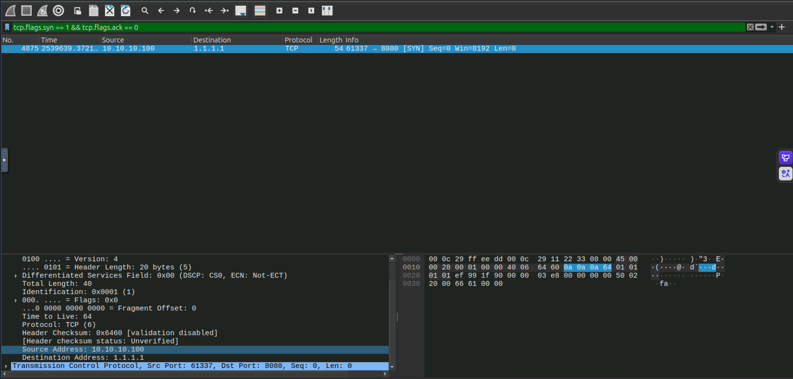
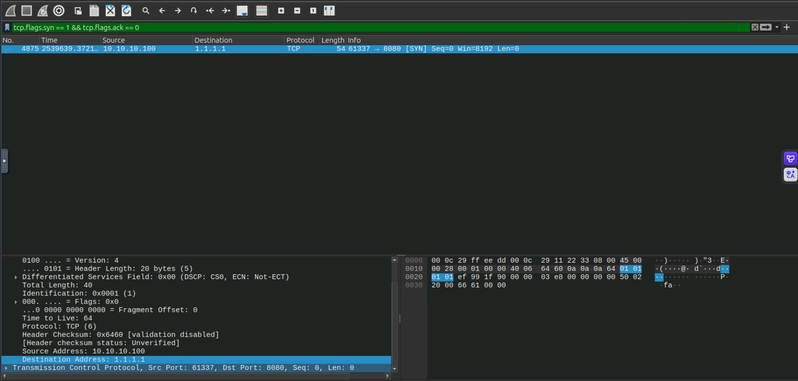
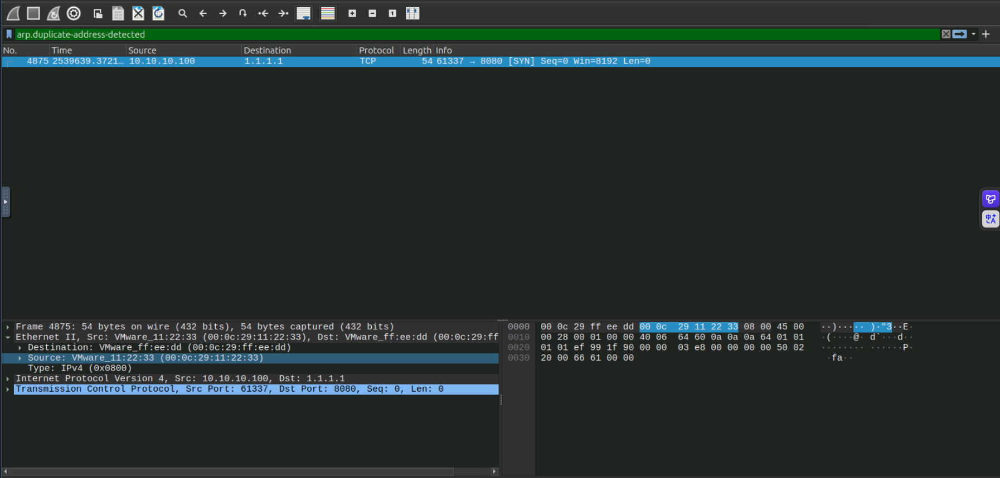
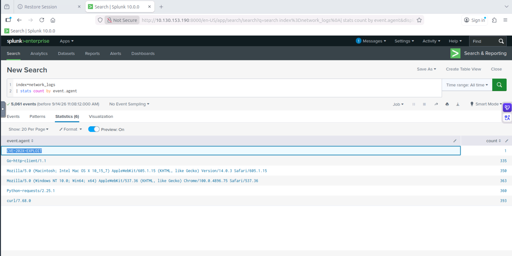
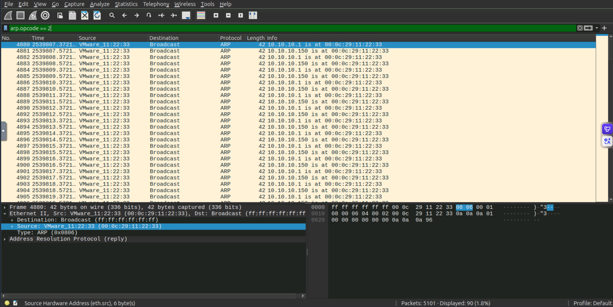
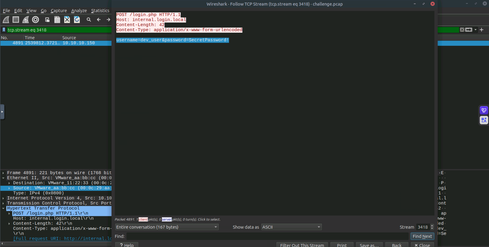
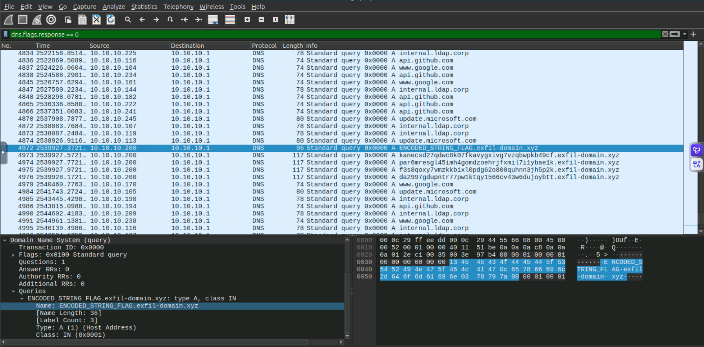

# The Crown Jewel — CTF Writeup

---

## Scenario Overview

An MSSP monitoring alert flagged a **Reverse Shell Outbound Connection** from Imperium Labs' internal network. The company hosts sensitive GitLab and Jira servers containing proprietary source code and project data — the "Crown Jewels." Analysis of the PCAP and Splunk logs revealed a multi-stage attack: ARP spoofing for MITM positioning, Jira exploitation via a known CVE, credential theft, C2 establishment, and DNS-based data exfiltration.

---

## Attack Chain Overview

```
[1] MITM Positioning
    └─ ARP Spoofing: 00:0c:29:11:22:33 impersonates 10.10.10.1 (gateway)
    └─ 90 ARP reply packets observed

[2] Reconnaissance & Exploitation
    └─ Non-standard User-Agent targeting Jira: CVE-202X-EXPLOIT
    └─ Attacker identifies Jira vulnerability

[3] Credential Theft
    └─ POST request intercepted: username=dev_user&password=SecretPassword!

[4] C2 Establishment
    └─ Reverse shell: 10.10.10.100 → 1.1.1.1:8080

[5] Data Exfiltration
    └─ Protocol: DNS tunneling
    └─ Attacker domain: exfil-domain.xyz
```

---

## Question 1 — From which internal IP did the suspicious connection originate?

### Wireshark Filter

```
tcp.flags.syn == 1 && tcp.flags.ack == 0
```

### Investigation

Filtering for TCP SYN packets (connection initiation) reveals all outbound connection attempts from the internal network. Among the results, one internal IP stands out — initiating an outbound connection to an external IP on a non-standard port consistent with a reverse shell callback:

```
Source IP: 10.10.10.100 (internal)
Destination: 1.1.1.1:8080 (external C2)
TCP Flags: SYN (connection initiation)
```

**MITRE ATT&CK:** T1571 — Non-Standard Port (reverse shell over 8080)

### Answer

```
10.10.10.100
```


---

## Question 2 — What outbound connection was detected as a C2 channel?

### Wireshark Filter

```
tcp.flags.syn == 1 && tcp.flags.ack == 0
```

### Investigation

From the same SYN packet analysis, the destination of the outbound reverse shell connection identifies the C2 server. Following the TCP stream confirms sustained bidirectional communication — interactive shell commands sent from the C2 server to the compromised host:

```
C2 Destination: 1.1.1.1
C2 Port: 8080
```

Port 8080 is a commonly used alternate HTTP port that often passes through firewall rules allowing web traffic — a deliberate choice to evade simple port-based filtering.

**MITRE ATT&CK:** T1095 — Non-Application Layer Protocol | T1571 — Non-Standard Port

### Answer

```
1.1.1.1:8080
```


---

## Question 3 — Which MAC address is impersonating the gateway 10.10.10.1?

### Wireshark Filter

```
arp.duplicate-address-detected
```

### Investigation

Filtering for `arp.duplicate-address-detected` flags the rogue MAC address on the network. Frame 4875 confirms the malicious device:

```
Frame 4875:
Ethernet Source: 00:0c:29:11:22:33 (VMware_11:22:33)
IP Source: 10.10.10.100
Destination IP: 1.1.1.1
TCP: 61337 → 8080 [SYN]
```

The MAC address `00:0c:29:11:22:33` is the rogue device that is:
1. **Performing ARP spoofing** — sending 90 unsolicited ARP replies to poison internal hosts' ARP caches
2. **Initiating the reverse shell** — the same MAC/IP originates the C2 connection to `1.1.1.1:8080`

The OUI `00:0c:29` identifies this as a **VMware virtual machine** — the attacker's rogue device deployed on the internal network segment.

**MITRE ATT&CK:** T1557.002 — Adversary-in-the-Middle: ARP Cache Poisoning

### Answer

```
00:0c:29:11:22:33
```


---

## Question 4 — What is the non-standard User-Agent hitting the Jira instance?

### Splunk Query

```spl
index=network_logs
| stats count by event.agent
```

### Investigation

Querying Splunk for all User-Agent strings (`event.agent`) hitting the Jira server and sorting by count reveals an anomalous User-Agent string that does not match any legitimate browser or Jira integration client:

```
User-Agent: CVE-202X-EXPLOIT
```

Legitimate Jira traffic would show browser User-Agents (`Mozilla/5.0 ...`) or Jira-specific API clients. A User-Agent string referencing a CVE identifier is a tool fingerprint — the attacker's exploitation tool embeds the CVE name in its User-Agent header, which is a common characteristic of automated vulnerability exploitation frameworks.

**MITRE ATT&CK:** T1190 — Exploit Public-Facing Application | T1036 — Masquerading

### Answer

```
CVE-202X-EXPLOIT
```


---

## Question 5 — How many ARP spoofing attacks were observed in the PCAP?

### Wireshark Filter

```
arp.opcode == 2
```

### Investigation

**ARP Opcode 2** = ARP Reply packets. In a legitimate network, ARP replies should only occur in response to ARP requests. Filtering for ARP replies from the rogue MAC address (`00:0c:29:11:22:33`) claiming to be the gateway counts the total number of ARP poisoning packets sent:

```
Total ARP Reply packets (opcode == 2): 90
```

90 unsolicited ARP replies constitute a sustained ARP cache poisoning campaign — the attacker continuously broadcast fake ARP replies to prevent victims' ARP caches from expiring and reverting to the legitimate gateway MAC.

**MITRE ATT&CK:** T1557.002 — ARP Cache Poisoning

### Answer

```
90
```


---

## Question 6 — What is the payload containing the plaintext credentials found in the POST request?

### Wireshark Filter

```
http.request.method == "POST"
```

### Investigation

Filtering for HTTP POST requests and following the TCP stream reveals the intercepted credential submission. Because the attacker positioned themselves as MITM via ARP spoofing, they were able to intercept the unencrypted HTTP POST containing the Jira login form data:

```
POST /login HTTP/1.1
Host: internal.login.local
Content-Type: application/x-www-form-urlencoded

username=dev_user&password=SecretPassword!
```

The credentials were transmitted in **plaintext** — confirming the Jira instance was not enforcing HTTPS for authentication, which enabled the MITM credential theft to succeed.

**MITRE ATT&CK:** T1557 — Adversary-in-the-Middle | T1552.001 — Unsecured Credentials: Credentials In Files

### Answer

```
username=dev_user&password=SecretPassword!
```


---

## Question 7 — What domain was used for data exfiltration?

### Wireshark Filter

```
dns.flags.response == 0
```

### Investigation

Filtering for DNS query packets reveals a clear pattern anomaly. Among the normal DNS traffic (api.github.com, www.google.com, internal.ldap.corp, update.microsoft.com), one host stands out — `10.10.10.200` sending repeated DNS queries with unusually long subdomain labels to a single attacker-controlled domain:

```
Frame 4972: 10.10.10.200 → 10.10.10.1
  Query: ENCODED_STRING_FLAG.exfil-domain.xyz

Frame 4973: 10.10.10.200 → 10.10.10.1
  Query: kanecsd27qdwc8k07fkavygxivg7vzqbwpkb49cf.exfil-domain.xyz

Frame 4974: 10.10.10.200 → 10.10.10.1
  Query: par6mresgl45imh4gomdzoehrjfxmil7i1ybae1k.exfil-domain.xyz

Frame 4975: 10.10.10.200 → 10.10.10.1
  Query: f3s8qoxy7vmzkkbixl0pdg62o800quhnn3jh5p2k.exfil-domain.xyz

Frame 4976: 10.10.10.200 → 10.10.10.1
  Query: da2997gdupntr77pw1ktqy1566cv43w6dujoybtt.exfil-domain.xyz
```

The DNS tunneling signature is clear:
- All queries originate from **`10.10.10.200`** (not the initially compromised `10.10.10.100`)
- Subdomain labels are 40+ character random-looking strings — Base64/hex encoded stolen data chunks
- All queries target the same parent domain `exfil-domain.xyz`
- The expanded packet detail confirms: `Name: ENCODED_STRING_FLAG.exfil-domain.xyz`

**MITRE ATT&CK:** T1048.003 — Exfiltration Over Alternative Protocol: DNS

### Answer

```
exfil-domain.xyz
```


---

## Question 8 — Which protocol was used for data exfiltration?

### Investigation

From the DNS query analysis in Question 7, all exfiltration traffic was conducted over **DNS** — specifically by encoding stolen data in subdomain names of the attacker-controlled domain `exfil-domain.xyz`. The pattern of high-frequency DNS queries with unusually long subdomain labels is the defining network signature of DNS tunneling.

**DNS Tunneling Exfiltration Mechanism:**

```
Data (plaintext) → Base64 encode → Split into chunks
Each chunk becomes a DNS query label:
  aGVsbG8gd29ybGQ=.exfil-domain.xyz → DNS query sent
Attacker DNS server logs all queries → reconstructs stolen data
```

**MITRE ATT&CK:** T1071.004 — Application Layer Protocol: DNS | T1048.003 — Exfiltration Over Alternative Protocol

### Answer

```
DNS
```

---

## Full Attack Timeline

| Order | Phase | Event |
|---|---|---|
| 1 | MITM Setup | `00:0c:29:11:22:33` sends 90 ARP replies claiming to be `10.10.10.1` |
| 2 | ARP Poisoning | Internal hosts update ARP cache — traffic redirected through attacker |
| 3 | Reconnaissance | `CVE-202X-EXPLOIT` User-Agent targets Jira instance |
| 4 | Exploitation | Attacker exploits Jira vulnerability (CVE-202X) |
| 5 | Credential Theft | POST request intercepted: `username=dev_user&password=SecretPassword!` |
| 6 | Access | Attacker authenticates to Jira/GitLab with stolen credentials |
| 7 | C2 Establishment | Reverse shell: `10.10.10.100` → `1.1.1.1:8080` |
| 8 | Exfiltration | DNS tunneling to `exfil-domain.xyz` — Crown Jewel data exfiltrated |

---

## Indicators of Compromise (IOCs)

| Type | Value | Description |
|---|---|---|
| IP | `10.10.10.100` | Compromised internal host (reverse shell source) |
| IP | `10.10.10.200` | Host performing DNS exfiltration |
| IP | `10.10.10.1` | Legitimate gateway (impersonated) |
| IP | `1.1.1.1` | C2 server |
| Port | `8080/TCP` | Reverse shell C2 port |
| MAC | `00:0c:29:11:22:33` | Rogue MITM device (VMware) |
| User-Agent | `CVE-202X-EXPLOIT` | Jira exploitation tool fingerprint |
| Credential | `dev_user:SecretPassword!` | Stolen Jira credentials |
| Domain | `exfil-domain.xyz` | Attacker DNS exfiltration domain |
| Count | `90` | ARP poisoning packets observed |

---

## Wireshark Filters Reference

```
-- Q1-Q2: Outbound C2 connection (reverse shell)
tcp.flags.syn == 1 && tcp.flags.ack == 0

-- Q3: ARP spoofing / duplicate address detection
arp.duplicate-address-detected

-- Q5: Count ARP reply packets (opcode 2)
arp.opcode == 2

-- Q6: POST credential capture
http.request.method == "POST"

-- Q7-Q8: DNS exfiltration queries
dns.flags.response == 0
```

## Splunk Query Reference

```spl
-- Q4: Non-standard User-Agent identification
index=network_logs
| stats count by event.agent
```

---

## MITRE ATT&CK Mapping

| Phase | Technique ID | Technique Name |
|---|---|---|
| Initial Access | T1190 | Exploit Public-Facing Application (Jira) |
| Collection | T1557.002 | ARP Cache Poisoning (MITM) |
| Credential Access | T1552.001 | Unsecured Credentials (plaintext POST) |
| Credential Access | T1557 | Adversary-in-the-Middle (credential interception) |
| Defense Evasion | T1036 | Masquerading (CVE User-Agent) |
| Command & Control | T1095 | Non-Application Layer Protocol (reverse shell) |
| Command & Control | T1571 | Non-Standard Port (C2 on 8080) |
| Exfiltration | T1048.003 | Exfiltration Over Alternative Protocol: DNS |
| Exfiltration | T1071.004 | Application Layer Protocol: DNS Tunneling |

---

## Recommendations

1. **Enforce HTTPS for all internal applications** — Jira credentials were captured in plaintext because HTTP was used. All internal web applications handling authentication must enforce TLS/HTTPS.
2. **Deploy Dynamic ARP Inspection (DAI)** — Enable DAI on all managed switches to validate ARP packets against a DHCP snooping binding table, preventing ARP cache poisoning attacks.
3. **Patch Jira immediately** — The `CVE-202X-EXPLOIT` User-Agent identifies a known Jira vulnerability being actively exploited. Apply the vendor patch or WAF rule immediately.
4. **Rotate `dev_user` credentials** — The captured credentials `dev_user:SecretPassword!` must be treated as fully compromised. Force immediate rotation and audit all Jira/GitLab access under this account.
5. **Block `exfil-domain.xyz` at DNS level** — Add the attacker's exfiltration domain to the DNS blocklist and investigate all historical DNS queries to this domain to assess data exposure scope.
6. **Inspect DNS traffic for tunneling patterns** — Deploy DNS monitoring that alerts on unusually long subdomain labels, high-frequency DNS queries to single domains, or DNS queries with Base64-like patterns in subdomain names.
7. **Block outbound port 8080 to unknown hosts** — The reverse shell used port 8080. Enforce strict egress filtering that allows only known, approved destinations on commonly allowed ports.
8. **Network segmentation** — Jira and GitLab servers storing source code should be on isolated network segments with strict east-west traffic controls, preventing lateral access even after initial compromise.

---

*Writeup produced as part of SOC Analyst training — TryHackMe: The Crown Jewel*