# The Silent Transfer — CTF Writeup

---

## Scenario Overview

TSS Operations was engaged by Helios Software Group following a Snort alert detecting suspicious encrypted outbound C2 traffic from an internal developer workstation. The firewall showed follow-on connections inconsistent with normal development activity. The workstation was isolated, and the investigation aimed to reconstruct the full attack chain: how it started, whether internal movement occurred, and whether data was exfiltrated.

**Evidence Files:**
- `snort_alerts.log` — Snort IDS detection output
- `zeek_logs/` — Zeek connection, DNS, TLS, HTTP, file, and notice logs
- `investigation.pcap` — Packet capture for packet-level validation
- `fortigate_traffic.log` — Firewall traffic logs
- `references/` — Local threat intelligence and MITRE ATT&CK reference material

---

## Attack Chain Overview

```
[1] Initial Access (Dropper Delivery)
    └─ DNS: cdn-updates.microsoftservice.net → 194.165.16.78
    └─ HTTP GET: /update/winservice-patch-4891.exe

[2] C2 Establishment
    └─ 10.14.30.88:51000 → 194.165.16.56:443 (SSL)
    └─ JA4: t13d190900_9dc949149365_97f8aa674fd9

[3] C2 Command Execution
    └─ HTTP JSON: {"cmd":"d2hvYW1p"}
    └─ Decoded: whoami (T1033 - User Discovery)

[4] Internal SMB Discovery
    └─ 10.14.30.88 → 23 unique internal hosts (port 445)

[5] Lateral Movement (RDP)
    └─ 10.14.30.88 → 10.14.0.12:3389

[6] Exfiltration
    └─ DNS: backup.corpfiles-sync.com (from 10.14.0.12)
    └─ File: Q4-Finance-Backup-2025.zip → 185.213.154.201
```

---

## Question 1 — Which internal IP address originated the C2 traffic around 03:47 UTC?

### Command

```bash
grep "03:4" snort_alerts.log
```

### Investigation

Executing a time-based grep against the Snort alert log to isolate events around the 03:47 UTC window. The raw detection evidence returned:

```
11/14-03:47:22.543210 [**] [1:2023476:4] ET TROJAN Possible Cobalt Strike Beacon CnC Activity
- GET Checkin [**] [Classification: A Network Trojan was detected] [Priority: 1]
{TCP} 10.14.30.88:51088 -> 194.165.16.56:443
```

The Snort alert confirms repeated Cobalt Strike C2 beaconing originating from the internal developer workstation.

| Field | Value |
|---|---|
| Affected Workstation | `10.14.30.88` |
| External C2 IP | `194.165.16.56` |
| C2 Port | `443/TCP` |

### Answer

```
10.14.30.88
```
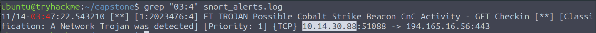

---

## Question 2 — Which domain was used to deliver the initial dropper?

### Commands

```bash
# Step 1: Identify DNS queries from the compromised host
zeek-cut ts id.orig_h id.resp_h query answers < zeek_logs/dns.log | grep "10.14.30.88"

# Step 2: Correlate with HTTP file transfer
zeek-cut ts id.orig_h host uri resp_mime_types < zeek_logs/http.log | grep "10.14.30.88"
```

### Investigation

**DNS Resolution Evidence:**

```
1763081100.000000  10.14.30.88  10.14.0.53  cdn-updates.microsoftservice.net  194.165.16.78
```

**HTTP File Transfer Evidence:**

```
1763081220.000000  10.14.30.88  194.165.16.78  /update/winservice-patch-4891.exe  application/x-dosexec
```

The domain `cdn-updates.microsoftservice.net` is a **typosquatted domain** impersonating Microsoft's CDN infrastructure. The DNS query resolved to `194.165.16.78`, from which the executable dropper was immediately downloaded 120 seconds later.

| Field | Value |
|---|---|
| Delivery Domain | `cdn-updates.microsoftservice.net` |
| Delivery Server IP | `194.165.16.78` |
| Downloaded Payload | `winservice-patch-4891.exe` |

### Answer

```
cdn-updates.microsoftservice.net
```
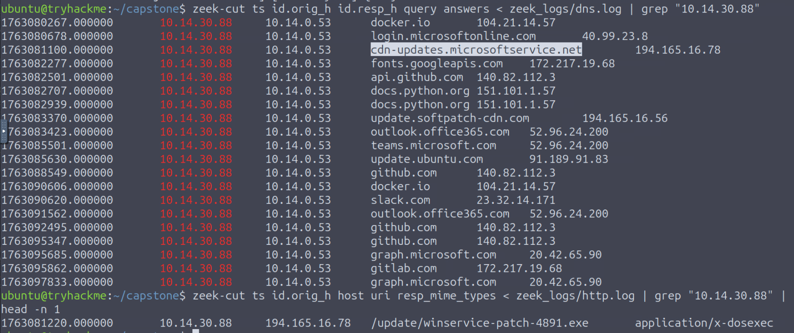

---

## Question 3 — What is the SHA256 hash of the downloaded dropper?

### Command

```bash
zeek-cut tx_hosts rx_hosts filename mime_type sha256 < zeek_logs/files.log \
    | grep "winservice-patch-4891.exe"
```

### Investigation

Zeek's `files.log` automatically computes cryptographic hashes for all file transfers observed in network traffic. The output:

```
194.165.16.78  10.14.30.88  winservice-patch-4891.exe  application/x-dosexec
7f3b2e1a9c8d4f5e6b7c8d9e0f1a2b3c4d5e6f7a8b9c0d1e2f3a4b5c6d7e8f90
```

| Field | Value |
|---|---|
| Filename | `winservice-patch-4891.exe` |
| MIME Type | `application/x-dosexec` |
| SHA256 | `7f3b2e1a9c8d4f5e6b7c8d9e0f1a2b3c4d5e6f7a8b9c0d1e2f3a4b5c6d7e8f90` |

### Answer

```
7f3b2e1a9c8d4f5e6b7c8d9e0f1a2b3c4d5e6f7a8b9c0d1e2f3a4b5c6d7e8f90
```
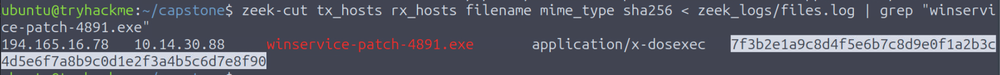

---

## Question 4 — What source port did the compromised workstation use for its first C2 connection?

### Command

```bash
zeek-cut ts id.orig_h id.orig_p id.resp_h id.resp_p service < zeek_logs/conn.log \
    | grep "10.14.30.88" | grep "194.165.16.56" | head -n 5
```

### Investigation

Filtering Zeek connection logs for traffic between the compromised workstation and the C2 server reveals the sequential ephemeral port allocation:

```
1763083380.000000  10.14.30.88  51000  194.165.16.56  443  ssl
1763083442.385990  10.14.30.88  51001  194.165.16.56  443  ssl
```

The first outbound C2 connection used source port **51000** — a non-standard high ephemeral port chosen outside the typical OS-assigned range, potentially hardcoded by the malware to aid in traffic pattern identification and session tracking.

### Answer

```
51000
```
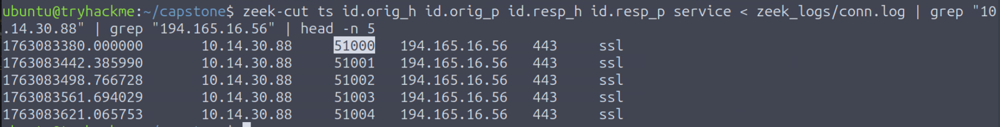

---

## Question 5 — What JA4 fingerprint identifies the C2 client?

### Command

```bash
zeek-cut id.orig_h id.resp_h ja4 < zeek_logs/ssl.log \
    | grep "194.165.16.56" | head -n 5
```

### Investigation

The JA4 fingerprint is derived from TLS Client Hello parameters including TLS version, cipher suites, extensions, and signature algorithms. Unlike User-Agent strings (which can be spoofed at the application layer), JA4 fingerprints are derived from TLS stack behavior — making them harder to forge and valuable for C2 beacon identification even over encrypted channels.

```
10.14.30.88  194.165.16.56  t13d190900_9dc949149365_97f8aa674fd9
```

This fingerprint matches known **Cobalt Strike HTTP/S beacon** TLS profiles documented in threat intelligence feeds.

### Answer

```
t13d190900_9dc949149365_97f8aa674fd9
```
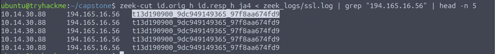

---

## Question 6 — How many unique internal IPs were contacted during SMB discovery?

### Commands

```bash
# Method 1: zeek-cut with awk filtering
zeek-cut id.orig_h id.resp_h id.resp_p < zeek_logs/conn.log \
    | grep "10.14.30.88" | awk '$3==445' | awk '{print $2}' \
    | grep "^10\." | sort -u | wc -l

# Method 2: TShark validation
tshark -r investigation.pcap \
    -Y "ip.src == 10.14.30.88 && tcp.port == 445" \
    -T fields -e ip.dst | sort -u | wc -l

# Method 3: Zui / Brim query
id.orig_h == 10.14.30.88 id.resp_p == 445 | count() by id.resp_h
```

### Investigation

Post-C2 establishment, the compromised workstation initiated automated SMB connections (port 445/TCP) across the internal network — a classic **network service discovery** pattern used to enumerate accessible file shares and identify lateral movement targets. All three analysis methods returned the same result: **23 unique internal destination hosts** were contacted.

### Answer

```
23
```
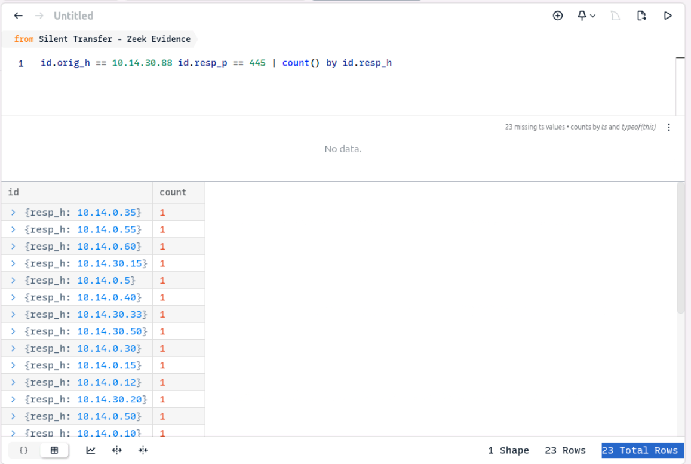

---

## Question 7 — What is the destination IP of the RDP lateral movement?

### Commands

```bash
# Method 1: TShark
tshark -r investigation.pcap \
    -Y "ip.src == 10.14.30.88 && tcp.port == 3389" \
    -T fields -e ip.dst | sort -u

# Method 2: zeek-cut with awk
zeek-cut id.orig_h id.resp_h id.resp_p service < zeek_logs/conn.log \
    | grep "10.14.30.88" | awk '$3==3389' | sort -u
```

### Investigation

Following the SMB discovery sweep, a single RDP session (port 3389/TCP) was initiated to a specific internal server. Both analysis methods confirmed a single unique destination:

```
10.14.0.12
```

The attacker selectively targeted this server — likely identified during the SMB enumeration phase as a high-value asset (potentially a file server or domain controller based on its subnet placement in `10.14.0.0/24`).

### Answer

```
10.14.0.12
```
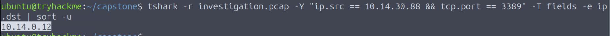

---

## Question 8 — Which domain did the server resolve before the large outbound transfer?

### Command

```bash
tshark -r investigation.pcap \
    -Y "dns.flags.response == 0 && ip.src == 10.14.0.12" \
    -T fields -e dns.qry.name
```

### Investigation

After the attacker established a foothold on `10.14.0.12` via RDP from the compromised workstation, DNS queries originated **from the pivot server** — indicating the attacker was now operating through it. The DNS query immediately preceding the large outbound transfer:

```
backup.corpfiles-sync.com
```

This domain is a **typosquatted fake backup infrastructure domain** designed to disguise data exfiltration traffic as routine backup synchronization activity.

### Answer

```
backup.corpfiles-sync.com
```
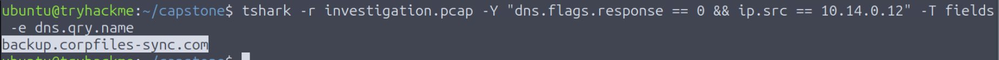

---

## Question 9 — What is the SHA256 hash of the exfiltrated archive?

### Command

```bash
zeek-cut tx_hosts rx_hosts filename mime_type sha256 < zeek_logs/files.log \
    | grep -E "\.zip|\.tar|\.gz|\.7z|\.rar"
```

### Investigation

Searching Zeek's `files.log` for compressed archive file transfers confirms a large outbound data transfer from the pivot server to an external endpoint:

```
10.14.0.12  185.213.154.201  Q4-Finance-Backup-2025.zip  application/zip
a3f8e2c1d4b7a9e0f2c3d5e6f7a8b9c0d1e2f3a4b5c6d7e8f9a0b1c2d3e4f5a6
```

| Field | Value |
|---|---|
| Exfiltrated File | `Q4-Finance-Backup-2025.zip` |
| MIME Type | `application/zip` |
| Destination IP | `185.213.154.201` |
| SHA256 | `a3f8e2c1d4b7a9e0f2c3d5e6f7a8b9c0d1e2f3a4b5c6d7e8f9a0b1c2d3e4f5a6` |

The filename `Q4-Finance-Backup-2025.zip` strongly suggests the attacker specifically targeted and exfiltrated sensitive quarterly financial data.

### Answer

```
a3f8e2c1d4b7a9e0f2c3d5e6f7a8b9c0d1e2f3a4b5c6d7e8f9a0b1c2d3e4f5a6
```
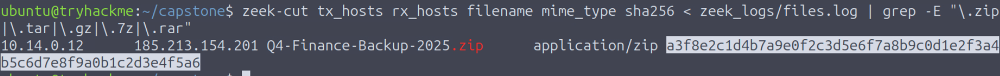

---

## Question 10 — What command did the attacker issue to the compromised workstation?

### Commands

```bash
# Step 1: Isolate C2 traffic in Wireshark
# Filter: ip.addr == 194.165.16.56
# Follow TCP Stream 23

# Step 2: Decode the Base64 command
echo "d2hvYW1p" | base64 -d
```

### Investigation

Inspecting the application-layer contents of the HTTP-based C2 traffic (TCP Stream 23), the C2 server responded with a JSON payload:

```json
{
  "status": "ok",
  "cmd": "d2hvYW1p",
  "interval": 60
}
```

**HTTP Request context:**
```
GET /api/v2/checkHost HTTP/1.1
Host: update.softpatch-cdn.com
```
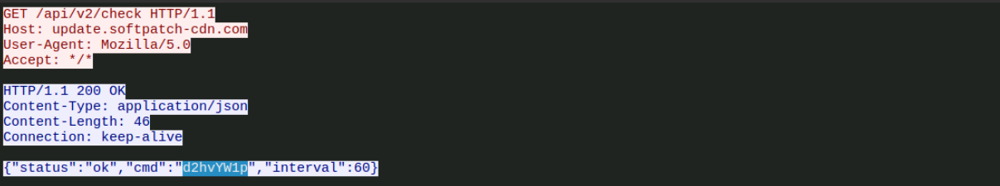

Decoding the Base64 command value:

```bash
echo "d2hvYW1p" | base64 -d
# Output: whoami
```

**Analysis:** The C2 server embedded encoded commands within standard HTTP JSON responses — a classic Cobalt Strike HTTP beacon technique that disguises C2 instructions as legitimate API responses. The `whoami` command indicates the attacker's initial attempt to determine the execution context and user privileges on the compromised host.

**MITRE ATT&CK:** T1033 — System Owner/User Discovery

### Answer

```
whoami
```
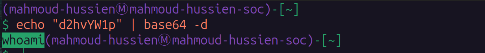

---

## Full Attack Timeline

| Timestamp (Epoch) | Source | Destination | Event |
|---|---|---|---|
| 1763081100 | `10.14.30.88` | `cdn-updates.microsoftservice.net` | DNS resolution → `194.165.16.78` |
| 1763081220 | `10.14.30.88` | `194.165.16.78:80` | HTTP GET `/update/winservice-patch-4891.exe` |
| 1763083380 | `10.14.30.88:51000` | `194.165.16.56:443` | First C2 SSL connection established |
| C2 Phase | `194.165.16.56` | `10.14.30.88` | JSON C2 command: `d2hvYW1p` → `whoami` |
| Post-C2 | `10.14.30.88` | 23 internal hosts:445 | SMB network discovery sweep |
| Post-Discovery | `10.14.30.88` | `10.14.0.12:3389` | RDP lateral movement |
| Post-RDP | `10.14.0.12` | `backup.corpfiles-sync.com` | DNS resolution for exfiltration domain |
| Exfiltration | `10.14.0.12` | `185.213.154.201` | `Q4-Finance-Backup-2025.zip` transferred |
| Nov 14, 03:47 | `10.14.30.88:51088` | `194.165.16.56:443` | Snort C2 beacon alert triggered |

---

## Indicators of Compromise (IOCs)

| Type | Value | Description |
|---|---|---|
| IP | `10.14.30.88` | Compromised developer workstation |
| IP | `10.14.0.12` | Compromised internal server (RDP pivot) |
| IP | `194.165.16.78` | Dropper delivery server |
| IP | `194.165.16.56` | Cobalt Strike C2 server |
| IP | `185.213.154.201` | Data exfiltration endpoint |
| Port | `51000/TCP` | Initial C2 ephemeral source port |
| Domain | `cdn-updates.microsoftservice.net` | Typosquatted delivery domain |
| Domain | `update.softpatch-cdn.com` | C2 HTTP Host header domain |
| Domain | `backup.corpfiles-sync.com` | Fake backup exfiltration domain |
| File | `winservice-patch-4891.exe` | Initial dropper payload |
| File | `Q4-Finance-Backup-2025.zip` | Exfiltrated financial archive |
| SHA256 | `7f3b2e1a9c8d4f5e6b7c8d9e0f1a2b3c4d5e6f7a8b9c0d1e2f3a4b5c6d7e8f90` | Dropper hash |
| SHA256 | `a3f8e2c1d4b7a9e0f2c3d5e6f7a8b9c0d1e2f3a4b5c6d7e8f9a0b1c2d3e4f5a6` | Exfiltrated archive hash |
| JA4 | `t13d190900_9dc949149365_97f8aa674fd9` | Cobalt Strike C2 TLS fingerprint |
| Command | `whoami` (Base64: `d2hvYW1p`) | Attacker-issued C2 command |

---

## Commands Reference

```bash
# Q1: Identify source of C2 alerts
grep "03:4" snort_alerts.log

# Q2: DNS and HTTP analysis for dropper delivery
zeek-cut ts id.orig_h id.resp_h query answers < zeek_logs/dns.log | grep "10.14.30.88"
zeek-cut ts id.orig_h host uri resp_mime_types < zeek_logs/http.log | grep "10.14.30.88"

# Q3: SHA256 hash of dropper
zeek-cut tx_hosts rx_hosts filename mime_type sha256 < zeek_logs/files.log \
    | grep "winservice-patch-4891.exe"

# Q4: First C2 source port
zeek-cut ts id.orig_h id.orig_p id.resp_h id.resp_p service < zeek_logs/conn.log \
    | grep "10.14.30.88" | grep "194.165.16.56" | head -n 5

# Q5: JA4 TLS fingerprint
zeek-cut id.orig_h id.resp_h ja4 < zeek_logs/ssl.log \
    | grep "194.165.16.56" | head -n 5

# Q6: SMB discovery count (multiple methods)
zeek-cut id.orig_h id.resp_h id.resp_p < zeek_logs/conn.log \
    | grep "10.14.30.88" | awk '$3==445' | awk '{print $2}' \
    | grep "^10\." | sort -u | wc -l

tshark -r investigation.pcap \
    -Y "ip.src == 10.14.30.88 && tcp.port == 445" \
    -T fields -e ip.dst | sort -u | wc -l

# Zui/Brim query:
id.orig_h == 10.14.30.88 id.resp_p == 445 | count() by id.resp_h

# Q7: RDP lateral movement destination
tshark -r investigation.pcap \
    -Y "ip.src == 10.14.30.88 && tcp.port == 3389" \
    -T fields -e ip.dst | sort -u

zeek-cut id.orig_h id.resp_h id.resp_p service < zeek_logs/conn.log \
    | grep "10.14.30.88" | awk '$3==3389' | sort -u

# Q8: DNS from pivot server before exfiltration
tshark -r investigation.pcap \
    -Y "dns.flags.response == 0 && ip.src == 10.14.0.12" \
    -T fields -e dns.qry.name

# Q9: Exfiltrated archive hash
zeek-cut tx_hosts rx_hosts filename mime_type sha256 < zeek_logs/files.log \
    | grep -E "\.zip|\.tar|\.gz|\.7z|\.rar"

# Q10: Decode C2 command
# Wireshark filter: ip.addr == 194.165.16.56 → Follow TCP Stream 23
echo "d2hvYW1p" | base64 -d
```

---

## MITRE ATT&CK Mapping

| Phase | Technique ID | Technique Name |
|---|---|---|
| Initial Access | T1566.002 | Phishing: Spearphishing Link |
| Initial Access | T1583.001 | Acquire Infrastructure: Domains (typosquatting) |
| Execution | T1204.002 | User Execution: Malicious File |
| Defense Evasion | T1036.005 | Masquerading: Match Legitimate Domain Name |
| Defense Evasion | T1573.001 | Encrypted Channel: Symmetric Cryptography (TLS) |
| Command & Control | T1071.001 | Web Protocols (HTTP JSON beaconing) |
| Command & Control | T1132.001 | Data Encoding: Standard Encoding (Base64 commands) |
| Discovery | T1033 | System Owner/User Discovery (`whoami`) |
| Discovery | T1046 | Network Service Discovery (SMB sweep — 23 hosts) |
| Lateral Movement | T1021.001 | Remote Services: Remote Desktop Protocol (RDP) |
| Exfiltration | T1048.002 | Exfiltration Over Encrypted Channel |
| Exfiltration | T1560.001 | Archive Collected Data: Archive via Utility |

---

## Recommendations

1. **Block typosquatted domains at DNS level** — `cdn-updates.microsoftservice.net` and `backup.corpfiles-sync.com` follow predictable typosquatting patterns. Deploy DNS filtering (Cisco Umbrella, Infoblox) with lookalike domain detection.
2. **Alert on JA4 fingerprint matches** — Deploy JA4 fingerprint-based detection rules for known Cobalt Strike profiles (`t13d190900_9dc949149365_97f8aa674fd9`) in the SIEM.
3. **Restrict outbound RDP** — Workstations should never initiate RDP connections to internal servers. Enforce network segmentation and alert on workstation-to-server RDP.
4. **Monitor SMB sweep patterns** — A single host contacting 23 internal IPs on port 445 within a short window is a definitive lateral movement indicator. Set a SIEM rule for `SMB_SWEEP: src_host contacts >5 unique dst:445 in 60s`.
5. **Credential hygiene on developer workstations** — Developer workstations with broad network access are high-value targets. Enforce least-privilege, MFA, and endpoint monitoring (EDR).
6. **Immutable financial data backups** — `Q4-Finance-Backup-2025.zip` should never be accessible from a network-reachable share. Enforce data classification and restrict access to financial archives to authorized personnel only.

---

*Writeup produced as part of SOC Analyst training — TryHackMe: The Silent Transfer*