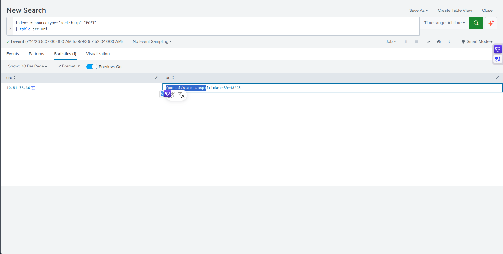
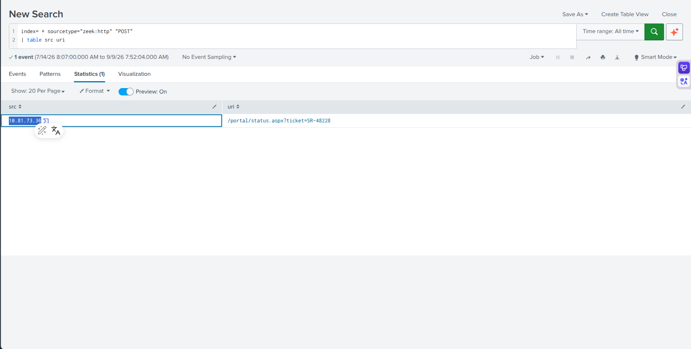
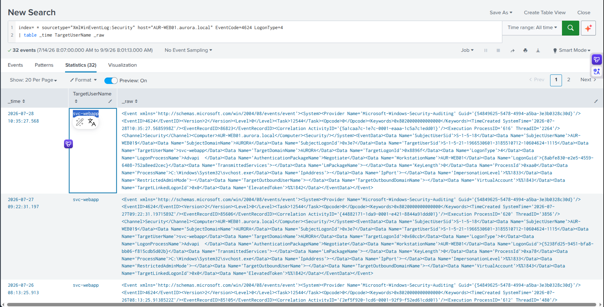
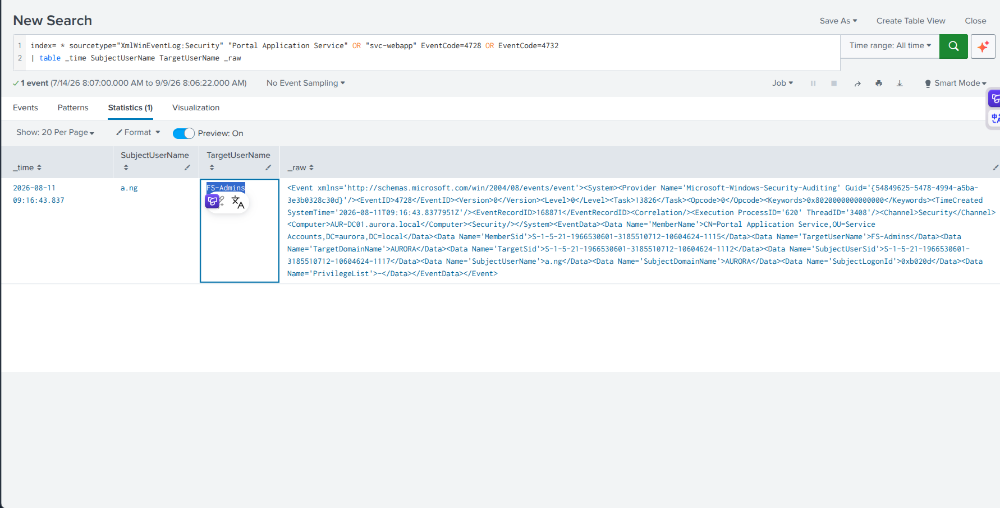
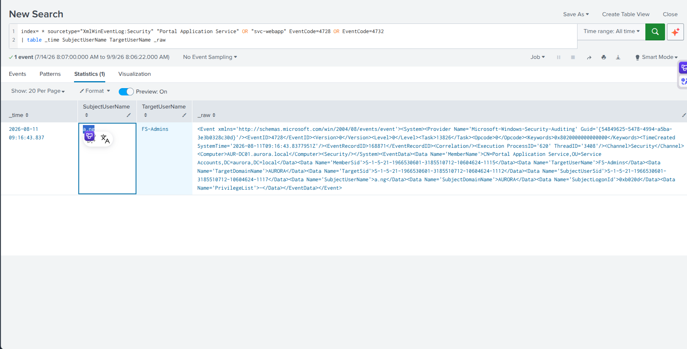
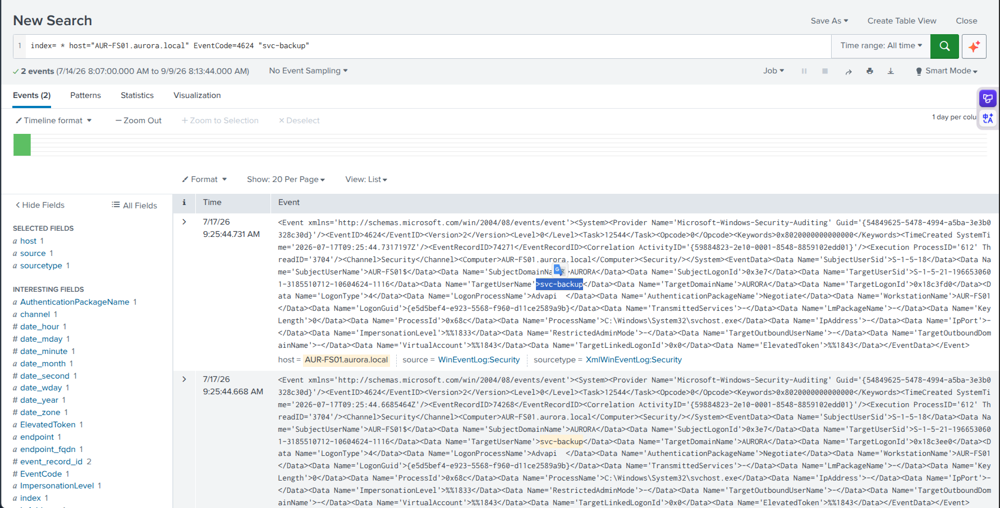
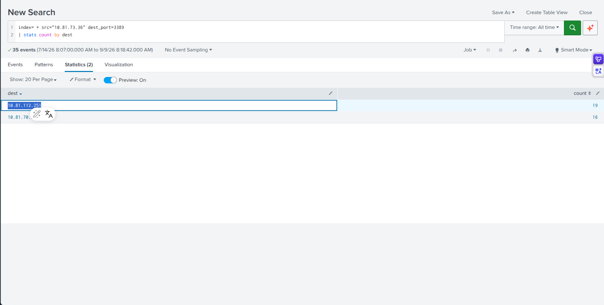
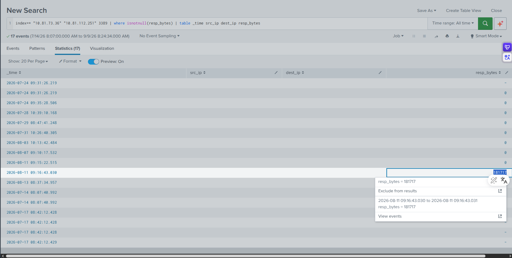

## Scenario Overview

Aurora Retail Group escalated unusual authentication activity tied to a trusted service account (`svc-webapp`) normally associated with predictable customer-portal operations. Suspicious portal requests, endpoint telemetry, and outbound network traffic indicated a wider compromise. TSS was engaged to reconstruct the full incident from Splunk evidence — from initial portal exploitation through lateral movement to data staging.

---

## Attack Chain Overview

```
[1] Initial Access
    └─ POST /portal/status.aspx from 10.81.73.36
    └─ Web shell / exploitation on AUR-WEB01

[2] Credential / Account Abuse
    └─ svc-webapp: Batch logon (LogonType 4) on AUR-WEB01
    └─ Indicates automated execution context

[3] Privilege Escalation
    └─ svc-webapp added to FS-Admins group by a.ng
    └─ Event ID 4728/4732

[4] Lateral Movement (RDP)
    └─ svc-webapp: LogonType 10 on AUR-FS01
    └─ RDP from 10.81.73.36 → 10.81.112.251

[5] Staging / Exfiltration
    └─ 181,717 bytes returned from AUR-FS01
    └─ Sustained RDP session vs. reset attempts
```

---

## Question 1 — What URI path was requested in the suspicious POST?

### Splunk Query

```spl
index=* sourcetype="zeek:http" "POST"
| table src uri
```

### Investigation

Filtering Zeek HTTP logs for POST requests reveals the unusual portal request that initiated the incident. Among the HTTP POST entries, one stands out as anomalous — a request to an `.aspx` status endpoint that is not associated with normal customer-portal operations:

```
Source IP: 10.81.73.36
Method: POST
URI: /portal/status.aspx
```

`.aspx` files on a web server can serve as web shells when planted by an attacker — a POST to a `status.aspx` page outside of normal application flow is a strong indicator of web shell interaction.

**MITRE ATT&CK:** T1505.003 — Server Software Component: Web Shell

### Answer

```
/portal/status.aspx
```


---

## Question 2 — Which source IP submitted the suspicious POST request?

### Investigation

From the same Zeek HTTP log entry identified in Question 1, the `src` field records the originating IP address of the suspicious POST request:

```
src: 10.81.73.36
```

This IP becomes the primary attacker pivot point for all subsequent correlation across network and endpoint logs.

### Answer

```
10.81.73.36
```


---

## Question 3 — Which non-system account received a batch logon shortly before the request?

### Splunk Query

```spl
index=* sourcetype="XmlWinEventLog:Security" host="AUR-WEB01.aurora.local"
EventCode=4624 LogonType=4
| table _time TargetUserName _raw
```

### Investigation

Windows **Event ID 4624** (Successful Logon) with **LogonType 4** (Batch) is generated when a process is authenticated to run as a specific account in a scheduled or batch execution context. Filtering for batch logons on the web server `AUR-WEB01` in the window preceding the suspicious POST:

```
EventCode: 4624
LogonType: 4 (Batch)
TargetUserName: svc-webapp
Host: AUR-WEB01.aurora.local
```

**Why batch logon matters:** A service account receiving a batch logon on a web server immediately before a suspicious web request indicates that the web shell execution context was running under the `svc-webapp` service account — confirming that the attacker's POST commands executed with that account's privileges.

**MITRE ATT&CK:** T1078.003 — Valid Accounts: Local Accounts (Service Accounts)

### Answer

```
svc-webapp
```


---

## Question 4 — What Windows logon type was recorded for that batch logon?

### Investigation

From the same Event ID 4624 log entry identified in Question 3, the `LogonType` field value:

**Windows Logon Type Reference:**

| Type | Name | Description |
|---|---|---|
| 2 | Interactive | Local console logon |
| 3 | Network | SMB, net use |
| 4 | **Batch** | Scheduled tasks, batch scripts |
| 5 | Service | Windows service start |
| 10 | RemoteInteractive | RDP session |

LogonType **4** (Batch) confirms automated execution — consistent with web shell or scheduled task-triggered command execution under the service account.

### Answer

```
4
```

---

## Question 5 — Which privileged group was modified involving the Portal Application Service account?

### Splunk Query

```spl
index=* "Portal Application Service" OR "svc-webapp" EventCode=4728 OR EventCode=4732
| table _time TargetUserName GroupName _raw
```

### Investigation

Windows **Event ID 4728** (Member Added to Security-Enabled Global Group) and **Event ID 4732** (Member Added to Security-Enabled Local Group) capture group membership changes. Filtering for events involving the service account:

```
EventCode: 4728 / 4732
TargetUserName: svc-webapp
GroupName: FS-Admins
```

The `FS-Admins` group name suggests file server administrative privileges — adding `svc-webapp` to this group grants the account elevated access to file server resources, enabling the lateral movement and data access steps that follow.

**MITRE ATT&CK:** T1098 — Account Manipulation

### Answer

```
FS-Admins
```


---

## Question 6 — Which user performed the group-membership change?

### Splunk Query

```spl
index=* EventCode=4728 OR EventCode=4732 "FS-Admins"
| table _time SubjectUserName TargetUserName _raw
```

### Investigation

The `SubjectUserName` field in Event ID 4728/4732 records the account that performed the group modification. This field identifies **who added** `svc-webapp` to `FS-Admins`:

```
SubjectUserName: a.ng
```

**Significance:** `a.ng` is a named user account — not a service account or system process. This indicates either:
1. The attacker compromised `a.ng`'s account to perform the privilege escalation, or
2. `a.ng` is an insider threat actor.

This is a key escalation event that bridges the initial web shell compromise with privileged access to the file server.

**MITRE ATT&CK:** T1078.002 — Valid Accounts: Domain Accounts

### Answer

```
a.ng
```


---

## Question 7 — Which non-built-in account generated both network and remote-interactive logons on the file server?

### Splunk Query

```spl
index=* host="AUR-FS01.aurora.local" EventCode=4624 "svc-webapp"
```

### Investigation

After `svc-webapp` was added to `FS-Admins`, the account immediately began generating logon events on the file server `AUR-FS01`. Reviewing the logon events for this account:

| LogonType | Value | Event |
|---|---|---|
| Network | 3 | SMB/network access to file server |
| RemoteInteractive | 10 | RDP session to file server |

The same account generated **both** logon types — confirming both automated network access (file enumeration/staging) and interactive RDP access (hands-on operation) to the file server.

**MITRE ATT&CK:** T1021.001 — Remote Services: Remote Desktop Protocol | T1021.002 — SMB/Windows Admin Shares

### Answer

```
svc-webapp
```


---

## Question 8 — Which LogonType identifies the remote-interactive session?

### Investigation

From the `AUR-FS01` logon events for `svc-webapp`, the remote-interactive session is identified by its LogonType value:

```
LogonType: 10 (RemoteInteractive / RDP)
```

LogonType 10 is exclusively generated by Remote Desktop Protocol (RDP) sessions — confirming that the attacker established an interactive RDP session to the file server, enabling hands-on data access and staging.

### Answer

```
10
```

---

## Question 9 — Which destination IP is associated with the sustained RDP connection?

### Splunk Query

```spl
index=* src="10.81.73.36" dest_port=3389
| stats count by dest
```

### Investigation

Using the attacker's initial source IP (`10.81.73.36`) as a pivot point and filtering for RDP traffic (port 3389), the query reveals multiple destination IPs. The results show:

- Some destinations with **very low event counts** — these are immediately reset connections (TCP RST), indicating port scans or failed RDP attempts
- One destination with a **significantly higher event count** — indicating a sustained, established RDP session

```
Destination with sustained connection: 10.81.112.251
```

`10.81.112.251` = `AUR-FS01` — confirming the RDP lateral movement to the file server.

**MITRE ATT&CK:** T1021.001 — Remote Services: RDP

### Answer

```
10.81.112.251
```


---

## Question 10 — What resp_bytes value records data returned from the destination?

### Splunk Query

```spl
index=* "10.81.73.36" "10.81.112.251" 3389
| where isnotnull(resp_bytes)
| table _time src_ip dest_ip resp_bytes
```

### Investigation

Correlating the sustained RDP session between the attacker IP and the file server, the `resp_bytes` field in the Zeek connection log records the total data volume returned **from the file server to the attacker**. This value represents the amount of data transferred back to `10.81.73.36`:

```
resp_bytes: 181717
```

**Significance:** 181,717 bytes (~177 KB) returned from the file server to the attacker across the RDP session — consistent with **data staging and exfiltration** of file server content (customer data, business records, or configuration files).

**MITRE ATT&CK:** T1048 — Exfiltration Over Alternative Protocol | T1005 — Data from Local System

### Answer

```
181717
```


---

## Full Attack Timeline

| Order | Timestamp | Host | Event |
|---|---|---|---|
| 1 | Pre-incident | AUR-WEB01 | Web shell planted at `/portal/status.aspx` |
| 2 | T+0 | AUR-WEB01 | POST `/portal/status.aspx` from `10.81.73.36` |
| 3 | T+0 (before POST) | AUR-WEB01 | `svc-webapp` batch logon (Event 4624, LogonType 4) |
| 4 | Post-POST | AUR-WEB01 | Attacker executes commands via web shell as `svc-webapp` |
| 5 | Post-exploitation | AD | `a.ng` adds `svc-webapp` to `FS-Admins` group (Event 4728/4732) |
| 6 | Post-group-change | AUR-FS01 | `svc-webapp` network logon (LogonType 3) to file server |
| 7 | Post-group-change | AUR-FS01 | `svc-webapp` RDP logon (LogonType 10) to file server |
| 8 | RDP Phase | Network | `10.81.73.36` → `10.81.112.251:3389` (sustained session) |
| 9 | RDP Phase | AUR-FS01 | 181,717 bytes returned → data staging/exfiltration |

---

## Indicators of Compromise (IOCs)

| Type | Value | Description |
|---|---|---|
| IP | `10.81.73.36` | Attacker source IP |
| IP | `10.81.112.251` | AUR-FS01 (RDP lateral movement target) |
| Host | `AUR-WEB01.aurora.local` | Compromised web server |
| Host | `AUR-FS01.aurora.local` | Compromised file server |
| URI | `/portal/status.aspx` | Web shell endpoint |
| Account | `svc-webapp` | Compromised service account |
| Account | `a.ng` | Account used for group modification |
| Group | `FS-Admins` | Privileged group abused |
| LogonType | `4` (Batch) | Automated execution via web shell |
| LogonType | `10` (RDP) | Lateral movement to file server |
| Data | `181,717 bytes` | Data volume returned from file server |

---

## Splunk Queries Reference

```spl
-- Q1-Q2: Suspicious POST request and source IP
index=* sourcetype="zeek:http" "POST"
| table src uri

-- Q3-Q4: Batch logon on web server
index=* sourcetype="XmlWinEventLog:Security" host="AUR-WEB01.aurora.local"
EventCode=4624 LogonType=4
| table _time TargetUserName _raw

-- Q5: Group membership change involving svc-webapp
index=* "Portal Application Service" OR "svc-webapp" EventCode=4728 OR EventCode=4732
| table _time TargetUserName GroupName _raw

-- Q6: Who performed the FS-Admins group change
index=* EventCode=4728 OR EventCode=4732 "FS-Admins"
| table _time SubjectUserName TargetUserName _raw

-- Q7-Q8: Logon types on file server
index=* host="AUR-FS01.aurora.local" EventCode=4624 "svc-webapp"

-- Q9: RDP destination from attacker IP
index=* src="10.81.73.36" dest_port=3389
| stats count by dest

-- Q10: Data volume on sustained RDP session
index=* "10.81.73.36" "10.81.112.251" 3389
| where isnotnull(resp_bytes)
| table _time src_ip dest_ip resp_bytes
```

---

## MITRE ATT&CK Mapping

| Phase | Technique ID | Technique Name |
|---|---|---|
| Initial Access | T1190 | Exploit Public-Facing Application |
| Persistence | T1505.003 | Web Shell (`/portal/status.aspx`) |
| Execution | T1059 | Command and Scripting Interpreter (web shell) |
| Privilege Escalation | T1098 | Account Manipulation (FS-Admins group) |
| Defense Evasion | T1078.003 | Valid Accounts: Service Accounts (svc-webapp) |
| Credential Access | T1078.002 | Valid Accounts: Domain Accounts (a.ng) |
| Lateral Movement | T1021.001 | Remote Services: RDP |
| Lateral Movement | T1021.002 | SMB/Windows Admin Shares (LogonType 3) |
| Collection | T1005 | Data from Local System (AUR-FS01) |
| Exfiltration | T1048 | Exfiltration Over Alternative Protocol |

---

## Recommendations

1. **Remove `svc-webapp` from `FS-Admins` immediately** — The service account should have the minimum permissions required for portal operations only. File server admin rights are excessive.
2. **Disable and rotate `svc-webapp` credentials** — The account was actively abused. Rotate all credentials and audit every system where this account has been used.
3. **Investigate `a.ng`'s account** — Determine whether `a.ng` performed the group change voluntarily or whether their account was compromised. Pull all recent authentication and activity logs for this account.
4. **Remove or restrict `/portal/status.aspx`** — Investigate whether this file was planted by the attacker or is a legitimate application file. If planted, remove it and audit the web server for other unauthorized files.
5. **Block `10.81.73.36` at perimeter** — The attacker IP should be blocked at all network boundaries immediately.
6. **Restrict RDP access to file servers** — `AUR-FS01` should not be directly RDP-accessible from web-tier machines or external IPs. Enforce jump server requirements for all RDP access to internal servers.
7. **Enable `FS-Admins` group change alerting** — Any addition to privileged groups (especially those with file server admin rights) should trigger an immediate SIEM alert for review.
8. **Assess customer data exposure** — With `svc-webapp` having portal access and 181 KB transferred from the file server, assess whether customer PII or payment data was exfiltrated and consider regulatory notification requirements.

---

*Writeup produced as part of SOC Analyst training — TryHackMe: Trusted By Default*